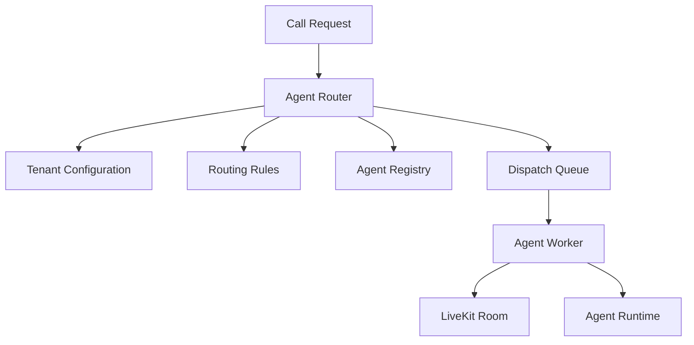
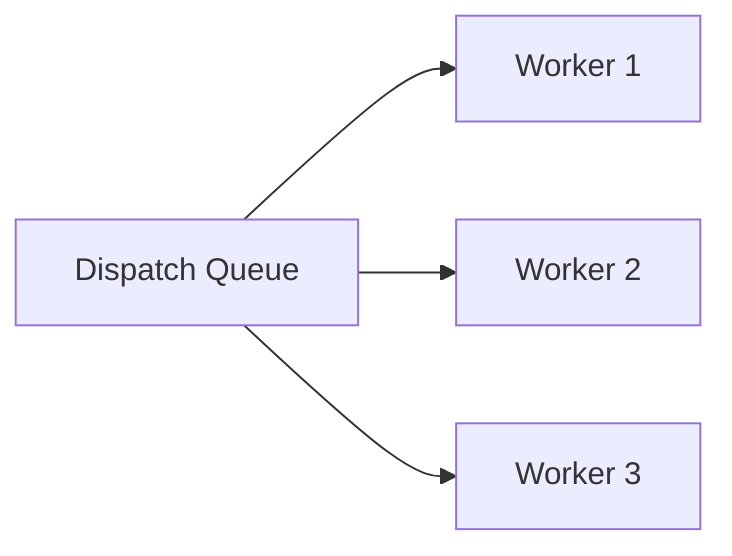

# Agent Dispatch and Routing Architecture

**Document Version:** 1.0
**Project:** AI Voice Agent SaaS Platform
**Phase:** 04 - LiveKit Voice Platform
**Status:** Draft
**Last Updated:** 2026-07-23

---

# 1. Overview

This document defines the agent dispatch and routing architecture for the AI Voice Agent SaaS platform.

Agent dispatch determines:

* Which AI agent handles a call
* Which worker executes the session
* Which tenant configuration applies
* Which workflow should run

The routing layer connects incoming communication requests with the correct AI agent runtime.

---

# 2. Dispatch Architecture



---

# 3. Routing Responsibilities

The routing service handles:

```text
Agent Routing

├── Tenant Identification

├── Phone Number Mapping

├── Agent Selection

├── Worker Assignment

├── Priority Handling

└── Failover
```

---

# 4. Routing Flow

```text
Incoming Call

↓

Identify Tenant

↓

Load Agent Configuration

↓

Evaluate Routing Rules

↓

Select Agent

↓

Dispatch Worker

↓

Join LiveKit Room
```

---

# 5. Tenant-Based Routing

Every request belongs to a tenant.

Example:

```text
Phone Number

↓

Tenant Mapping

↓

Tenant Agent

↓

Voice Configuration
```

---

# 6. Phone Number Mapping

Inbound numbers map to agents:

```text
+1 555 1000

↓

Tenant A

↓

Customer Support Agent


+1 555 2000

↓

Tenant B

↓

Sales Agent
```

---

# 7. Agent Registry

The registry stores available agents.

```text
Agent Registry

├── Agent ID

├── Tenant ID

├── Purpose

├── Status

├── Version

└── Configuration
```

---

# 8. Agent Selection Rules

Rules may include:

```text
Routing Rules

├── Business Hours

├── Language

├── Customer Type

├── Department

├── Campaign

└── Priority
```

---

# 9. Example Routing Decision

Input:

```json
{
 "phone":"+15551000",
 "language":"en",
 "purpose":"billing"
}
```

Decision:

```text
Tenant A

↓

Billing Agent

↓

Worker Pool 2
```

---

# 10. Dispatch Queue

The queue manages:

* Pending calls
* Worker availability
* Priority
* Retry handling

Architecture:

```text
Call Request

↓

Queue

↓

Available Worker
```

---

# 11. Worker Assignment

Worker selection considers:

```text
Worker Selection

├── Availability

├── Current Load

├── Region

├── Model Capability

└── Health Status
```

---

# 12. Load Balancing

Example:



---

# 13. Agent Version Management

Agents support versions:

```text
Sales Agent

v1

↓

v2

↓

v3
```

Allows:

* Testing
* Rollbacks
* Gradual deployment

---

# 14. Dynamic Agent Selection

Future capability:

```text
Customer Intent

↓

AI Router

↓

Best Agent
```

Example:

```text
"Need refund"

↓

Billing Agent


"Need appointment"

↓

Scheduling Agent
```

---

# 15. Fallback Routing

If agent unavailable:

```text
Primary Agent

↓

Failure

↓

Backup Agent

↓

Human Transfer
```

---

# 16. Human Escalation Routing

Flow:

```text
AI Agent

↓

Escalation Required

↓

Human Queue

↓

Live Agent
```

---

# 17. Dispatch State Model

```text
DISPATCH_CREATED

↓

ROUTING

↓

AGENT_SELECTED

↓

WORKER_ASSIGNED

↓

SESSION_STARTED

↓

COMPLETED
```

---

# 18. Database Model

Recommended tables:

```text
agent_registry

agent_versions

routing_rules

agent_assignments

dispatch_requests

worker_status
```

---

# 19. Redis Usage

Redis stores:

```text
Active Routing State

├── Available Workers

├── Active Sessions

├── Agent Status

└── Queue State
```

---

# 20. Security

Routing validates:

* Tenant ownership
* Agent permissions
* API authorization
* Tool access

---

# 21. Observability

Monitor:

```text
Routing Metrics

├── Dispatch Time

├── Queue Length

├── Failed Assignments

├── Worker Utilization

└── Routing Accuracy
```

---

# 22. Failure Handling

Examples:

## No Worker Available

```text
Queue Request

↓

Wait

↓

Retry

↓

Fallback
```

---

## Agent Configuration Failure

```text
Invalid Agent

↓

Use Previous Version

↓

Alert Admin
```

---

# 23. Production Deployment

```text
API Gateway

↓

Routing Service

↓

Dispatch Queue

↓

Agent Workers

↓

LiveKit
```

---

# 24. Future Enhancements

Future capabilities:

* AI-based routing
* Predictive agent selection
* Skill-based routing
* Geographic routing
* Cost-aware routing

---

# 25. Related Documents

| Document                          | Purpose           |
| --------------------------------- | ----------------- |
| 15_LiveKit_Agent_Worker_Design.md | Worker runtime    |
| 08_Voice_Agent_Session_Model.md   | Session lifecycle |
| 11_Call_State_Management.md       | Call states       |
| 30_OpenAPI_Specs                  | API contracts     |

---

# 26. Conclusion

Agent Dispatch and Routing provides the intelligence layer that connects communication requests with the correct AI execution environment.

It enables:

* Multi-agent support
* Multi-tenant operation
* Dynamic scaling
* Reliable voice automation

---

**End of Document**
