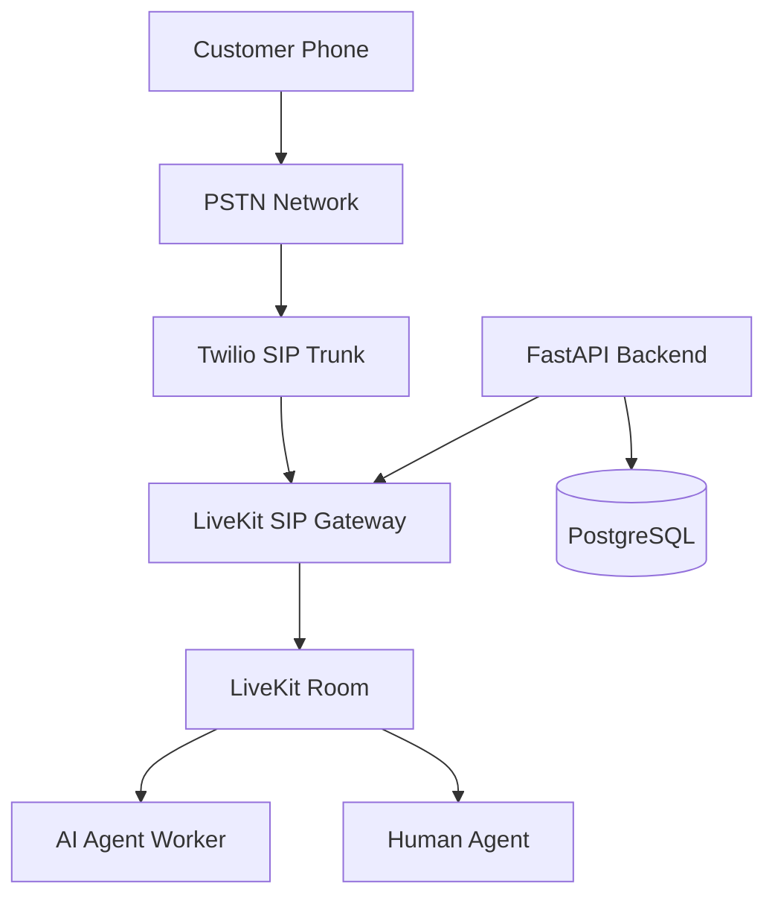

# LiveKit SIP Integration Architecture

**Document Version:** 1.0
**Project:** AI Voice Agent SaaS Platform
**Phase:** 04 - LiveKit Voice Platform
**Status:** Draft
**Last Updated:** 2026-07-23

---

# 1. Overview

This document defines the SIP integration architecture between telephony providers and the LiveKit Voice Agent platform.

The SIP layer connects traditional telephone networks with the real-time AI voice infrastructure.

Supported communication paths:

* Inbound PSTN calls
* Outbound AI calls
* SIP trunk connectivity
* Call routing
* Transfer to human agents

---

# 2. SIP Integration Architecture



---

# 3. SIP Responsibilities

The SIP integration layer manages:

```text
SIP Layer

├── Call Origination

├── Call Termination

├── SIP Signaling

├── RTP Media

├── Number Routing

├── Caller Identity

└── Transfer Handling
```

---

# 4. Inbound Call Flow

```text
Customer Calls Business Number

↓

PSTN Network

↓

Twilio SIP Trunk

↓

LiveKit SIP Gateway

↓

Create LiveKit Room

↓

Dispatch AI Agent

↓

Conversation Starts
```

---

# 5. Outbound Call Flow

```text
Campaign System

↓

Backend API

↓

Twilio SIP

↓

Customer Phone

↓

LiveKit Room

↓

AI Agent
```

---

# 6. SIP Components

## SIP Trunk Provider

Responsibilities:

* Telephone connectivity
* Number management
* Call termination
* Carrier routing

Example:

```text
Twilio

↓

SIP Trunk

↓

LiveKit
```

---

## LiveKit SIP Gateway

Responsibilities:

* SIP registration
* Call routing
* Media bridging
* Room creation

---

# 7. SIP Call Session Model

Relationship:

```text
Phone Call

↓

SIP Session

↓

LiveKit Room

↓

Agent Session
```

---

# 8. SIP Metadata Handling

Important metadata:

```json
{
 "call_id":"call_123",
 "from":"+15550001",
 "to":"+15550002",
 "direction":"inbound"
}
```

Used for:

* Routing
* Analytics
* Billing
* Customer lookup

---

# 9. Number Management

Phone numbers map to tenants:

```text
Phone Number

↓

Tenant

↓

Agent Configuration

↓

Routing Rules
```

Example:

```text
+1 555 1000

↓

Company A

↓

Support Agent
```

---

# 10. SIP Headers

Important headers:

```text
X-Request-ID

X-Correlation-ID

X-Call-ID

X-Tenant-ID

X-Agent-ID
```

Purpose:

* Tracing
* Debugging
* Security

---

# 11. Media Flow

SIP media:

```text
Caller Audio

↓

RTP Stream

↓

SIP Gateway

↓

WebRTC Audio Track

↓

AI Agent
```

---

# 12. Codec Support

Common voice codecs:

```text
G.711

G.722

Opus
```

Recommended:

```text
Opus/WebRTC

for AI conversations
```

---

# 13. SIP Transfer Architecture

AI to human transfer:

```text
AI Agent

↓

Transfer Request

↓

SIP REFER

↓

Human Endpoint

↓

Conversation Continues
```

---

# 14. Call Routing Rules

Routing decisions:

```text
Routing Engine

├── Phone Number

├── Tenant

├── Business Hours

├── Language

├── Agent Type

└── Priority
```

---

# 15. SIP Failure Handling

Common failures:

```text
SIP Error

↓

Retry

↓

Fallback Route

↓

Notify System
```

Examples:

* Busy
* Timeout
* Invalid number
* Carrier failure

---

# 16. Security Model

Protect:

* SIP credentials
* Call metadata
* Audio streams
* Tenant routing

Controls:

* Authentication
* Encryption
* Access policies
* Audit logs

---

# 17. Database Model

Recommended tables:

```text
sip_connections

sip_numbers

sip_sessions

call_routes

carrier_configs

sip_events
```

---

# 18. Webhook Integration

SIP events trigger:

```text
Call Started

↓

Webhook

↓

Backend

↓

Update Call State
```

Events:

```text
SIP_CONNECTED

SIP_FAILED

SIP_DISCONNECTED

SIP_TRANSFERRED
```

---

# 19. Billing Integration

Track:

```text
SIP Usage

├── Call Duration

├── Carrier Cost

├── Recording Cost

└── AI Processing Cost
```

---

# 20. Monitoring

Metrics:

```text
SIP Metrics

├── Connection Success

├── Failed Calls

├── Setup Time

├── Audio Quality

└── Carrier Errors
```

---

# 21. Multi-Tenant Architecture

Each tenant has:

```text
Tenant

├── Phone Numbers

├── SIP Configuration

├── Agents

├── Routing Rules

└── Billing
```

---

# 22. Deployment Architecture

```text
Cloud Load Balancer

↓

Voice Backend

↓

LiveKit SIP Gateway

↓

Agent Workers
```

---

# 23. Future Enhancements

Future capabilities:

* Multiple carriers
* Automatic carrier selection
* International routing
* Advanced fraud detection
* Voice quality optimization

---

# 24. Related Documents

| Document                                      | Purpose         |
| --------------------------------------------- | --------------- |
| 16_Agent_Dispatch_and_Routing_Architecture.md | Agent selection |
| 10_Realtime_Media_Pipeline.md                 | Audio transport |
| 11_Call_State_Management.md                   | Call lifecycle  |
| 30_OpenAPI_Specs                              | API definitions |

---

# 25. Conclusion

LiveKit SIP Integration provides the bridge between traditional telephony and modern AI voice infrastructure.

It enables:

* PSTN connectivity
* AI phone agents
* Global calling
* Enterprise voice automation

---

**End of Document**
