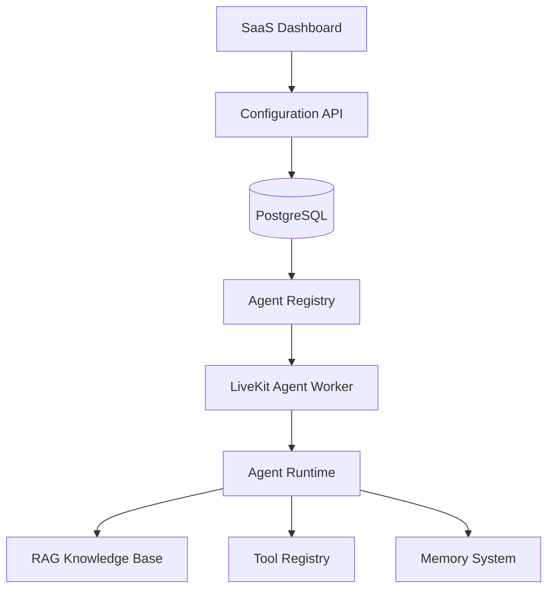

# Voice Agent Configuration Model

**Document Version:** 1.0
**Project:** AI Voice Agent SaaS Platform
**Phase:** 04 - LiveKit Voice Platform
**Status:** Draft
**Last Updated:** 2026-07-23

---

# 1. Overview

This document defines the configuration model used to create, customize, deploy, and manage AI voice agents.

The configuration system allows each SaaS tenant to create multiple AI agents such as:

* Sales Agent
* Customer Support Agent
* Receptionist Agent
* Appointment Booking Agent
* Medical Assistant Agent
* Lead Qualification Agent

---

# 2. Configuration Architecture



---

# 3. Agent Configuration Layers

An agent is composed of:

```text id="q3v9rh"
Agent Configuration

├── Identity

├── Behavior

├── Voice

├── Model

├── Knowledge

├── Tools

├── Memory

├── Security

└── Analytics
```

---

# 4. Agent Identity

Defines:

```text id="0z6m5m"
Agent Identity

├── Agent ID

├── Name

├── Description

├── Purpose

├── Tenant ID

└── Version
```

Example:

```json id="2gq9bh"
{
 "agent_id":"support_agent",
 "name":"Customer Support Assistant",
 "version":"1.0"
}
```

---

# 5. Agent Behavior Configuration

Controls:

* Personality
* Conversation style
* Rules
* Restrictions

Example:

```json id="p7yn2g"
{
 "tone":"professional",
 "style":"friendly",
 "language":"english"
}
```

---

# 6. System Prompt Configuration

Each agent has a managed prompt:

```text id="7nhh14"
System Instructions

↓

Agent Role

↓

Business Rules

↓

Response Guidelines

↓

Safety Rules
```

---

# 7. Voice Configuration

Controls:

```text id="39j1h6"
Voice Settings

├── Provider

├── Voice ID

├── Language

├── Speed

├── Pitch

├── Emotion

└── Style
```

Example:

```json id="g9v6av"
{
 "provider":"elevenlabs",
 "voice_id":"voice_123",
 "language":"en-US"
}
```

---

# 8. Model Configuration

Defines AI models:

```text id="2az5v0"
Model Configuration

├── STT Model

├── LLM Model

├── TTS Model

├── Temperature

├── Max Tokens

└── Context Window
```

---

# 9. RAG Knowledge Configuration

Each agent can connect to knowledge sources.

Architecture:

```text id="qv5k9f"
Agent

↓

Knowledge Base

↓

Document Collection

↓

Vector Search

↓

LLM Context
```

---

# 10. Knowledge Settings

Configuration:

```json id="x4h8d1"
{
 "knowledge_base":"support_docs",
 "retrieval_limit":5,
 "similarity_threshold":0.75
}
```

---

# 11. Tool Configuration

Agents can access tools:

Examples:

```text id="7xk2we"
Tools

├── CRM Lookup

├── Calendar Booking

├── Database Query

├── Payment API

└── Email Service
```

---

# 12. Tool Permission Model

Each tool defines:

```text id="1mt8eu"
Tool

├── Name

├── Description

├── Input Schema

├── Permission

└── Execution Policy
```

---

# 13. Memory Configuration

Memory options:

```text id="k5z7cw"
Memory

├── Disabled

├── Session Memory

├── Customer Memory

└── Long-Term Memory
```

---

# 14. Conversation Settings

Controls:

```text id="g7g0h4"
Conversation

├── Greeting

├── Timeout

├── Interruptions

├── Silence Detection

└── Max Duration
```

---

# 15. Transfer Configuration

Defines human escalation:

```text id="m5pk9c"
Transfer Rules

├── Customer Request

├── Negative Sentiment

├── Complex Request

└── Business Rule
```

---

# 16. Agent Lifecycle

```text id="r5x2n8"
DRAFT

↓

TESTING

↓

ACTIVE

↓

PAUSED

↓

ARCHIVED
```

---

# 17. Agent Versioning

Support:

```text id="4z0t6k"
Agent v1

↓

Agent v2

↓

Agent v3
```

Benefits:

* Rollback
* Testing
* A/B experiments

---

# 18. Database Model

Recommended tables:

```text id="9xm6sz"
agents

agent_versions

agent_prompts

agent_voice_configs

agent_model_configs

agent_tools

agent_knowledge_links

agent_settings
```

---

# 19. API Configuration Flow

```text id="w8f6jh"
Admin Creates Agent

↓

Save Configuration

↓

Validate Settings

↓

Publish Version

↓

Worker Loads Configuration
```

---

# 20. Runtime Loading

At call start:

```text id="0o9j3h"
Call Arrives

↓

Identify Agent

↓

Load Configuration

↓

Initialize Runtime

↓

Start Conversation
```

---

# 21. Multi-Tenant Isolation

Every configuration includes:

```json id="e4s3q1"
{
 "tenant_id":"tenant_001"
}
```

Rules:

* Tenant cannot access another tenant agent
* Knowledge bases are isolated
* Tools are permission controlled

---

# 22. Configuration Validation

Validate:

* Required fields
* Model availability
* Voice availability
* Tool permissions
* Knowledge connections

---

# 23. Security

Protect:

* Prompts
* API keys
* Tool credentials
* Knowledge documents

---

# 24. Analytics Integration

Track:

```text id="6k5q2m"
Agent Metrics

├── Calls Handled

├── Success Rate

├── Cost

├── Latency

└── Customer Rating
```

---

# 25. Future Enhancements

Future capabilities:

* No-code agent builder
* Agent templates marketplace
* AI-generated configurations
* Automatic optimization

---

# 26. Related Documents

| Document                                      | Purpose           |
| --------------------------------------------- | ----------------- |
| 15_LiveKit_Agent_Worker_Design.md             | Runtime execution |
| 16_Agent_Dispatch_and_Routing_Architecture.md | Routing           |
| 03_RAG_Knowledge_Platform.md                  | Knowledge system  |
| 29_Database_Schema                            | Database design   |

---

# 27. Conclusion

The Voice Agent Configuration Model provides the foundation for creating customizable AI voice agents.

It enables:

* Multi-agent SaaS operation
* Tenant customization
* Dynamic runtime behavior
* Enterprise voice automation

---

**End of Document**
