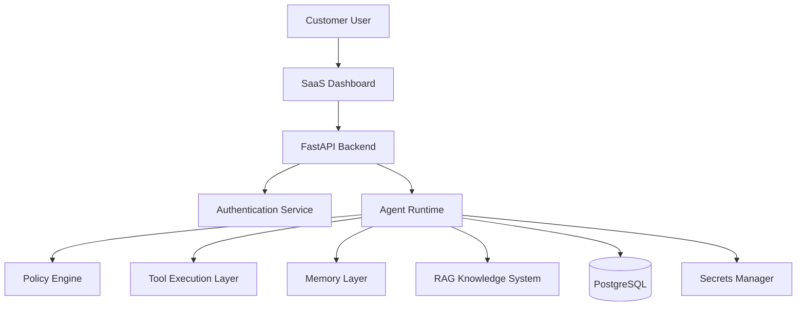

# Agent Runtime Security Model

**Document Version:** 1.0
**Project:** AI Voice Agent SaaS Platform
**Phase:** 04 - LiveKit Voice Platform
**Status:** Draft
**Last Updated:** 2026-07-23

---

# 1. Overview

This document defines the security architecture for the AI Agent Runtime.

The Agent Runtime is responsible for executing AI conversations, accessing customer data, calling external tools, and processing voice interactions.

Security must protect:

* Tenant data
* Customer conversations
* Agent configurations
* Knowledge bases
* Tool integrations
* API credentials

---

# 2. Security Architecture



---

# 3. Security Principles

The runtime follows:

```text id="qv8m3x"
Security Principles

├── Least Privilege

├── Tenant Isolation

├── Zero Trust

├── Secure Defaults

├── Audit Everything

└── Defense In Depth
```

---

# 4. Runtime Security Boundaries

```text id="m9c2ad"
Tenant Boundary

↓

Agent Boundary

↓

Session Boundary

↓

Tool Boundary

↓

Data Boundary
```

Each layer enforces access control.

---

# 5. Authentication Model

Components authenticate using:

* JWT tokens
* Service credentials
* Signed requests
* Short-lived tokens

Flow:

```text id="8s5y0q"
Request

↓

Authenticate

↓

Validate Identity

↓

Create Session

↓

Allow Access
```

---

# 6. Authorization Model

Authorization uses:

```text id="5w8r7p"
RBAC

+

Permission Policies

+

Tenant Rules
```

Example roles:

```text id="3y0x4h"
Tenant Admin

Agent Manager

Supervisor

Developer

Viewer
```

---

# 7. Tenant Isolation

Every runtime request includes:

```json id="v0f5k6"
{
 "tenant_id":"tenant_001",
 "agent_id":"agent_123",
 "session_id":"session_456"
}
```

Rules:

* Never trust client tenant ID
* Validate ownership
* Enforce database filtering

---

# 8. Agent Isolation

Agents must not access:

* Other tenant agents
* Unauthorized prompts
* Restricted tools
* Private knowledge bases

---

# 9. Session Security

Every call session contains:

```text id="g8n2c4"
Session Context

├── Session ID

├── Tenant ID

├── Agent ID

├── User Identity

├── Permissions

└── Expiration
```

---

# 10. Tool Execution Security

Tools are controlled through:

```text id="f4z9mx"
Tool Gateway

↓

Permission Check

↓

Input Validation

↓

Execution

↓

Result Filtering
```

---

# 11. Tool Permission Example

```json id="j2f6s8"
{
 "tool":"create_booking",
 "allowed":true,
 "tenant":"tenant_001"
}
```

---

# 12. Prompt Security

Protect against:

* Prompt injection
* System prompt leakage
* Unauthorized instructions

Controls:

```text id="3m8d6w"
User Input

↓

Sanitization

↓

Policy Check

↓

LLM
```

---

# 13. RAG Security

Knowledge retrieval must enforce:

```text id="k4v1s7"
User Request

↓

Tenant Filter

↓

Permission Filter

↓

Vector Search

↓

Context Injection
```

---

# 14. Memory Security

Memory access:

```text id="p8h3y5"
Customer Memory

belongs to

Customer Identity

+

Tenant
```

Prevent:

* Cross-customer data exposure
* Unauthorized retrieval

---

# 15. Secrets Management

Never store:

* API keys
* Tokens
* Passwords

inside:

* Code
* Database tables
* Agent prompts

Use:

```text id="h7n5r2"
Secrets Manager

↓

Runtime Injection

↓

Temporary Access
```

---

# 16. Data Encryption

Protect data using:

## In Transit

* TLS
* Secure WebSocket
* Encrypted SIP/WebRTC

## At Rest

* Database encryption
* Object storage encryption
* Backup encryption

---

# 17. Audit Logging

Record:

```text id="m6w2x9"
Security Events

├── Login

├── Agent Changes

├── Tool Usage

├── Data Access

├── Permission Changes

└── Failures
```

---

# 18. Runtime Monitoring

Monitor:

```text id="n4q7k1"
Security Metrics

├── Failed Authentication

├── Suspicious Requests

├── Tool Abuse

├── Data Access

└── Policy Violations
```

---

# 19. Rate Limiting

Protect:

* APIs
* Tools
* Agent sessions
* Knowledge retrieval

Example:

```text id="r5d8p3"
Tenant Request Limit

↓

100 requests/minute
```

---

# 20. Abuse Prevention

Detect:

* Excessive calls
* Automated abuse
* Invalid requests
* Credential misuse

---

# 21. Runtime Failure Handling

Security failures:

```text id="x8v3z0"
Violation Detected

↓

Block Action

↓

Log Event

↓

Notify System

↓

Continue Safely
```

---

# 22. Compliance Considerations

Support:

* Audit trails
* Data retention rules
* Customer data deletion
* Access reporting

---

# 23. Deployment Security

Production environment:

```text id="c7m5q9"
Container

↓

Network Policy

↓

Secret Injection

↓

Runtime Isolation
```

---

# 24. Security Testing

Required tests:

```text id="y5p2n6"
Security Testing

├── Authentication Tests

├── Authorization Tests

├── Prompt Injection Tests

├── Tool Abuse Tests

├── Data Isolation Tests

└── Penetration Testing
```

---

# 25. Future Enhancements

Future capabilities:

* AI security monitoring
* Automated threat detection
* Policy learning
* Runtime sandboxing

---

# 26. Related Documents

| Document                              | Purpose             |
| ------------------------------------- | ------------------- |
| 18_Voice_Agent_Configuration_Model.md | Agent configuration |
| 15_LiveKit_Agent_Worker_Design.md     | Runtime execution   |
| 40_Security_Threat_Model              | Security analysis   |
| 37_Observability                      | Monitoring          |

---

# 27. Conclusion

The Agent Runtime Security Model ensures that AI voice agents operate safely in a multi-tenant SaaS environment.

It provides:

* Secure execution
* Tenant isolation
* Controlled tool access
* Enterprise-grade protection

---

**End of Document**
