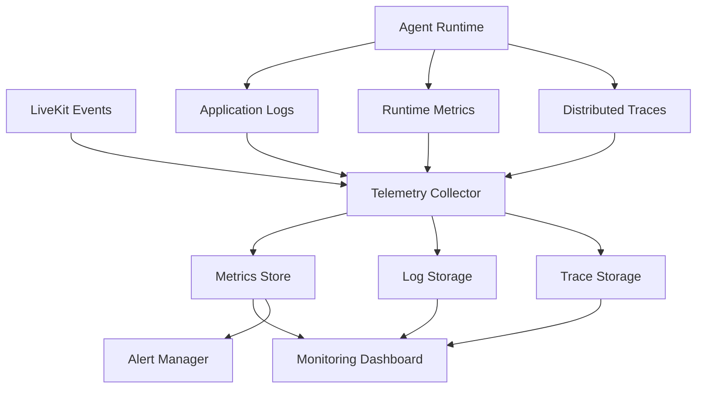

# Agent Runtime Observability Architecture

**Document Version:** 1.0
**Project:** AI Voice Agent SaaS Platform
**Phase:** 04 - LiveKit Voice Platform
**Status:** Draft
**Last Updated:** 2026-07-23

---

# 1. Overview

This document defines the observability architecture for the AI Agent Runtime.

Observability provides visibility into:

* Agent execution
* Voice pipeline performance
* Model behavior
* Tool execution
* Call quality
* System reliability

The goal is to make every AI conversation measurable, debuggable, and optimizable.

---

# 2. Observability Architecture



---

# 3. Observability Goals

The system must answer:

```text id="8z7k2p"
What happened?

↓

Logs


Why did it happen?

↓

Traces


How often?

↓

Metrics


What should we do?

↓

Alerts
```

---

# 4. Three Pillars of Observability

```text id="7n4x8c"
Observability

├── Logs

├── Metrics

└── Distributed Traces
```

---

# 5. Logging Architecture

Logs capture:

```text id="4p2m8v"
Agent Logs

├── Session Start

├── User Input

├── Model Calls

├── Tool Calls

├── Errors

├── State Changes

└── Shutdown
```

---

# 6. Structured Logging

All logs use structured format:

```json id="n6r2wx"
{
 "timestamp":"2026-07-23T10:00:00Z",
 "service":"agent-worker",
 "tenant_id":"tenant_001",
 "call_id":"call_123",
 "event":"tool_execution"
}
```

---

# 7. Required Log Context

Every log should include:

```text id="9h3q2d"
Context

├── Request ID

├── Correlation ID

├── Tenant ID

├── Agent ID

├── Session ID

└── Call ID
```

---

# 8. Metrics Architecture

Important metrics:

```text id="u5w9qm"
Agent Metrics

├── Active Sessions

├── Calls Per Minute

├── Response Latency

├── Token Usage

├── Tool Success Rate

└── Error Rate
```

---

# 9. Voice Pipeline Metrics

Track:

```text id="k8d3v0"
Voice Metrics

├── STT Latency

├── TTS Latency

├── Audio Drop Rate

├── Silence Detection

├── Interruptions

└── End-to-End Delay
```

---

# 10. LLM Metrics

Measure:

```text id="w2m7qx"
LLM Metrics

├── Request Count

├── Token Usage

├── Response Time

├── Error Rate

├── Context Size

└── Cost
```

---

# 11. RAG Metrics

LangChain RAG monitoring:

```text id="p4y8nz"
RAG Metrics

├── Retrieval Time

├── Documents Retrieved

├── Similarity Score

├── Context Size

├── Answer Quality

└── Missing Knowledge
```

---

# 12. Tool Execution Metrics

Track:

```text id="c9m4vk"
Tool Metrics

├── Tool Name

├── Execution Time

├── Success Rate

├── Validation Errors

└── External API Failures
```

---

# 13. Distributed Tracing

Trace a complete call:

```text id="z8q2hy"
Customer Call

↓

SIP Gateway

↓

LiveKit Room

↓

Agent Worker

↓

STT

↓

LLM

↓

Tool

↓

TTS

↓

Customer Response
```

---

# 14. Trace Example

```text id="x6p3qd"
Trace ID:

trace_123


Spans:

SIP Connection

Agent Initialization

Speech Recognition

LLM Generation

Tool Execution

Speech Output
```

---

# 15. Health Monitoring

Services expose:

```text id="q5n8zr"
Health Checks

├── API Status

├── Worker Status

├── Database Status

├── Redis Status

├── LiveKit Status

└── External Services
```

---

# 16. Alerting Rules

Critical alerts:

```text id="v7m2hs"
Alerts

├── Agent Crash

├── High Latency

├── Call Failure Spike

├── Database Failure

├── Queue Backlog

└── API Errors
```

---

# 17. SLA Monitoring

Track:

```text id="a9k4pw"
SLA Metrics

├── Availability

├── Call Success Rate

├── Response Time

├── Recovery Time

└── Error Budget
```

---

# 18. Multi-Tenant Observability

Every metric includes:

```json id="d5x8n2"
{
 "tenant_id":"tenant_001",
 "metric":"call_latency"
}
```

Allows:

* Tenant dashboards
* Usage tracking
* Billing metrics

---

# 19. Cost Observability

Track AI costs:

```text id="h6r1pz"
Cost Metrics

├── STT Minutes

├── TTS Characters

├── LLM Tokens

├── Storage Usage

└── Compute Usage
```

---

# 20. Debugging Workflow

Example:

```text id="f8k3vq"
Customer Reports Issue

↓

Find Call ID

↓

Search Logs

↓

View Trace

↓

Identify Failure

↓

Fix Problem
```

---

# 21. Production Stack Recommendation

Recommended stack:

```text id="x3v7nm"
OpenTelemetry

↓

Prometheus

↓

Grafana

↓

Loki

↓

Tempo
```

---

# 22. Security Considerations

Observability data must protect:

* Customer information
* Voice transcripts
* API credentials
* Internal prompts

Controls:

* Data masking
* Access control
* Retention policies

---

# 23. Database Tables

Recommended:

```text id="k7m2v9"
system_metrics

agent_execution_logs

trace_records

alert_events

usage_metrics
```

---

# 24. Future Enhancements

Future capabilities:

* AI-powered incident analysis
* Automatic root cause detection
* Predictive scaling
* Self-healing agents

---

# 25. Related Documents

| Document                           | Purpose             |
| ---------------------------------- | ------------------- |
| 19_Agent_Runtime_Security_Model.md | Runtime security    |
| 15_LiveKit_Agent_Worker_Design.md  | Worker architecture |
| 37_Observability                   | Platform monitoring |
| 38_Runbooks                        | Operations          |

---

# 26. Conclusion

Agent Runtime Observability provides the visibility required to operate a production AI voice platform.

It enables:

* Faster debugging
* Better reliability
* Cost optimization
* Enterprise operations

---

**End of Document**
