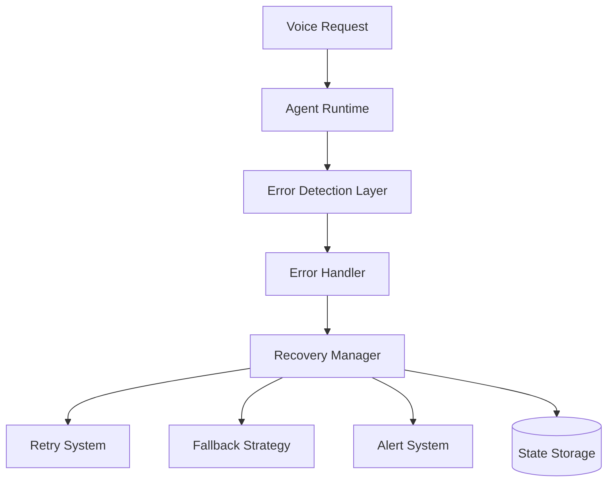

# Agent Runtime Error Handling and Recovery Architecture

**Document Version:** 1.0
**Project:** AI Voice Agent SaaS Platform
**Phase:** 04 - LiveKit Voice Platform
**Status:** Draft
**Last Updated:** 2026-07-23

---

# 1. Overview

This document defines the error handling and recovery architecture for the AI Agent Runtime.

A production voice AI system must continue operating despite failures in:

* Telephony
* LiveKit sessions
* AI models
* RAG retrieval
* External tools
* Databases
* Network connections

The recovery system ensures:

* Graceful degradation
* Automatic recovery
* Data preservation
* Minimal customer impact

---

# 2. Error Handling Architecture



---

# 3. Error Handling Principles

The runtime follows:

```text
Error Principles

├── Detect Early

├── Fail Safely

├── Recover Automatically

├── Preserve State

├── Notify Operators

└── Learn From Failures
```

---

# 4. Error Categories

```text
Runtime Errors

├── Communication Errors

├── AI Model Errors

├── Tool Errors

├── Data Errors

├── Configuration Errors

├── Security Errors

└── Infrastructure Errors
```

---

# 5. Error Lifecycle

```text
ERROR_DETECTED

↓

CLASSIFIED

↓

RECOVERY_ATTEMPTED

↓

RECOVERED

OR

FAILED

↓

ESCALATED
```

---

# 6. Error Classification

Each error contains:

```json
{
 "error_id":"err_123",
 "type":"LLM_TIMEOUT",
 "severity":"HIGH",
 "call_id":"call_456",
 "timestamp":"2026-07-23T10:00:00Z"
}
```

---

# 7. Severity Levels

## Critical

Examples:

* Worker crash
* Database unavailable
* Security violation

Action:

```text
Immediate Alert

+

Recovery
```

---

## High

Examples:

* Model timeout
* Tool failure
* SIP failure

Action:

```text
Retry

+

Fallback
```

---

## Medium

Examples:

* Slow response
* Temporary API failure

Action:

```text
Retry
```

---

## Low

Examples:

* Logging failure
* Analytics delay

Action:

```text
Background Recovery
```

---

# 8. Retry Strategy

Retries use:

* Exponential backoff
* Maximum attempts
* Timeout limits

Example:

```text
Attempt 1

↓

1 second


Attempt 2

↓

5 seconds


Attempt 3

↓

30 seconds
```

---

# 9. LLM Failure Recovery

Failure:

```text
LLM Timeout
```

Recovery:

```text
Primary Model

↓

Retry

↓

Secondary Model

↓

Fallback Response
```

---

# 10. STT Failure Recovery

Failure:

```text
Speech Recognition Error
```

Recovery:

```text
Restart STT Session

↓

Request Repeat

↓

Continue Conversation
```

---

# 11. TTS Failure Recovery

Failure:

```text
Voice Generation Error
```

Recovery:

```text
Primary Voice

↓

Backup Voice Provider

↓

Text Response Fallback
```

---

# 12. RAG Failure Recovery

Failure:

```text
Knowledge Search Failed
```

Recovery:

```text
Retry Retrieval

↓

Use Cached Knowledge

↓

Use General Model Knowledge

↓

Notify
```

---

# 13. Tool Failure Recovery

Example:

```text
Calendar API Failed
```

Flow:

```text
Tool Error

↓

Retry

↓

Alternative Method

↓

Inform User
```

---

# 14. LiveKit Failure Recovery

Failures:

* Room disconnect
* Participant dropped
* Media failure

Recovery:

```text
Detect Disconnect

↓

Save Session State

↓

Reconnect

↓

Resume Conversation
```

---

# 15. SIP Failure Recovery

Examples:

* Carrier unavailable
* Number unreachable
* Network failure

Recovery:

```text
Primary Route

↓

Backup Route

↓

Failure Message

↓

Log Event
```

---

# 16. State Preservation

Before recovery:

Save:

```text
Session State

├── Conversation History

├── Agent State

├── User Intent

├── Tool Results

└── Memory Updates
```

---

# 17. Circuit Breaker Pattern

Protect external services:

```text
Normal

↓

Failure Count Increases

↓

Circuit Open

↓

Stop Requests

↓

Test Recovery

↓

Close Circuit
```

---

# 18. Dead Letter Queue

Failed events:

```text
Event Failure

↓

Retry Attempts Exhausted

↓

Dead Letter Queue

↓

Manual Review
```

---

# 19. Human Escalation Recovery

When AI cannot recover:

```text
AI Failure

↓

Transfer Decision

↓

Human Agent

↓

Continue Conversation
```

---

# 20. Error Logging

Every error stores:

```text
Error Record

├── Error Type

├── Stack Trace

├── Call ID

├── Agent ID

├── Tenant ID

├── Recovery Action

└── Resolution
```

---

# 21. Monitoring Integration

Errors generate:

* Metrics
* Logs
* Traces
* Alerts

Example:

```text
LLM Failures Spike

↓

Alert

↓

Investigation
```

---

# 22. Database Model

Recommended tables:

```text
error_events

error_recovery_actions

failed_jobs

dead_letter_events

incident_records
```

---

# 23. Security Handling

Security-related errors:

Examples:

* Unauthorized tool access
* Invalid token
* Prompt injection

Response:

```text
Block Action

↓

Log Incident

↓

Alert Security Team
```

---

# 24. Testing Strategy

Test:

```text
Failure Testing

├── Network Failure

├── Model Timeout

├── Worker Crash

├── Database Failure

├── Tool Failure

└── Recovery Testing
```

---

# 25. Future Enhancements

Future capabilities:

* AI incident diagnosis
* Automatic remediation
* Predictive failure detection
* Self-healing agents

---

# 26. Related Documents

| Document                          | Purpose        |
| --------------------------------- | -------------- |
| 20_Agent_Runtime_Observability.md | Monitoring     |
| 15_LiveKit_Agent_Worker_Design.md | Worker runtime |
| 11_Call_State_Management.md       | Session state  |
| 40_Security_Threat_Model          | Security       |

---

# 27. Conclusion

The Agent Runtime Error Handling and Recovery Architecture ensures reliable AI voice operations.

It provides:

* Fault tolerance
* Automatic recovery
* Better customer experience
* Production reliability

---

**End of Document**
