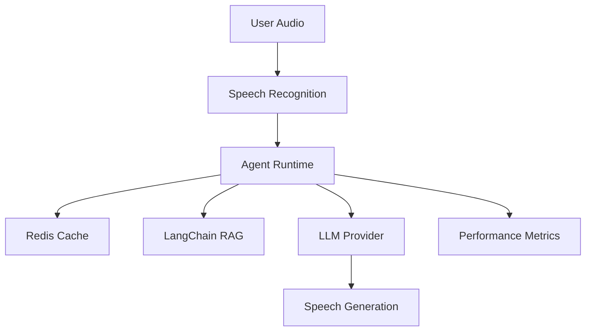

# Agent Runtime Performance Optimization Architecture

**Document Version:** 1.0
**Project:** AI Voice Agent SaaS Platform
**Phase:** 04 - LiveKit Voice Platform
**Status:** Draft
**Last Updated:** 2026-07-23

---

# 1. Overview

This document defines the performance optimization strategy for the AI Agent Runtime.

The objective is to provide:

* Low-latency conversations
* Natural voice interaction
* Efficient AI processing
* Reduced infrastructure cost
* High concurrent call capacity

Voice AI performance depends on optimizing:

* Audio pipeline latency
* Model response time
* Retrieval speed
* Tool execution
* Worker resources

---

# 2. Performance Architecture



---

# 3. Performance Goals

Target objectives:

```text id="5x8p0a"
Voice Response

Target:

< 800ms response latency


RAG Retrieval:

< 200ms


Tool Execution:

< 500ms
```

---

# 4. Latency Breakdown

A voice response consists of:

```text id="r9m2kq"
User Speech

↓

STT Processing

↓

Intent Detection

↓

Memory Retrieval

↓

RAG Search

↓

LLM Generation

↓

TTS Generation

↓

Audio Playback
```

---

# 5. Real-Time Audio Optimization

Optimize:

* Audio chunk size
* Streaming processing
* Codec selection
* Network latency

Recommended:

```text id="6n7p2m"
Streaming Audio

+

Incremental Processing

+

Early Response Generation
```

---

# 6. STT Optimization

Strategies:

```text id="3j9x7d"
STT Optimization

├── Streaming Recognition

├── Smaller Models

├── Voice Activity Detection

├── Language Detection

└── Audio Preprocessing
```

---

# 7. LLM Optimization

Techniques:

```text id="0f5k8v"
LLM Optimization

├── Model Selection

├── Prompt Optimization

├── Context Reduction

├── Streaming Output

└── Response Caching
```

---

# 8. Model Routing Strategy

Use different models:

```text id="x4w9nc"
Simple Request

↓

Fast Model


Complex Request

↓

Advanced Model
```

Benefits:

* Lower cost
* Faster response
* Better quality

---

# 9. Prompt Optimization

Reduce:

* Unnecessary instructions
* Duplicate context
* Large history

Strategy:

```text id="2m7y4q"
Full History

↓

Summarization

↓

Relevant Context
```

---

# 10. RAG Performance Optimization

LangChain RAG optimization:

```text id="h7v3q9"
Query

↓

Embedding Cache

↓

Vector Search

↓

Re-ranking

↓

Context Compression
```

---

# 11. Vector Database Optimization

Improve retrieval:

* Proper embeddings
* Index optimization
* Metadata filtering
* Chunk optimization

Example:

```text id="9p2v6z"
Tenant Filter

+

Document Filter

+

Similarity Search
```

---

# 12. Redis Performance Layer

Redis handles:

```text id="6w1r8s"
Fast Data

├── Session State

├── Conversation Cache

├── Agent Configuration

├── Retrieval Cache

└── Rate Limits
```

---

# 13. Memory Optimization

Avoid sending unnecessary history.

Architecture:

```text id="k8m4x2"
Recent Messages

↓

Short Memory


Old Conversation

↓

Summary Memory
```

---

# 14. Tool Execution Optimization

Improve:

* API connection reuse
* Parallel execution
* Timeout handling
* Result caching

Example:

```text id="4n7q0h"
Multiple Independent Tools

↓

Execute Parallel

↓

Combine Results
```

---

# 15. Agent Worker Optimization

Worker improvements:

```text id="p3x8m5"
Worker

├── Async Processing

├── Connection Pooling

├── Resource Limits

├── Efficient Memory Usage

└── Fast Startup
```

---

# 16. Horizontal Scaling

Scale workers:

```text id="q5v9c1"
Calls Increase

↓

Add Workers

↓

Distribute Sessions
```

---

# 17. Resource Management

Monitor:

```text id="m8z2f6"
Resources

├── CPU

├── Memory

├── Network

├── GPU

└── Connections
```

---

# 18. Caching Strategy

Cache:

```text id="t7k3q4"
Cache Layer

├── Agent Config

├── Prompts

├── Embeddings

├── Knowledge Results

└── Tool Results
```

---

# 19. Database Optimization

Improve:

* Indexing
* Connection pooling
* Query optimization
* Read replicas

---

# 20. Concurrency Management

Handle:

```text id="n6x8p4"
Concurrent Calls

↓

Worker Pool

↓

Load Balancer

↓

Agent Instances
```

---

# 21. Performance Monitoring

Track:

```text id="v3q7m8"
Performance Metrics

├── End-to-End Latency

├── STT Latency

├── LLM Latency

├── TTS Latency

├── RAG Latency

└── Tool Latency
```

---

# 22. Cost Optimization

Monitor:

```text id="b8m5q1"
Cost Drivers

├── Tokens

├── Audio Minutes

├── Storage

├── Compute

└── API Usage
```

---

# 23. Load Testing

Test scenarios:

```text id="w5q9k2"
Load Tests

├── 10 Calls

├── 100 Calls

├── 1000 Calls

├── Peak Traffic

└── Failure Recovery
```

---

# 24. Performance Benchmarks

Example targets:

| Component       | Target |
| --------------- | ------ |
| STT             | <300ms |
| RAG Retrieval   | <200ms |
| LLM First Token | <500ms |
| TTS Start       | <300ms |
| Total Response  | <800ms |

---

# 25. Future Enhancements

Future improvements:

* Edge agent deployment
* Local model inference
* GPU acceleration
* Predictive scaling
* Adaptive model selection

---

# 26. Related Documents

| Document                                        | Purpose     |
| ----------------------------------------------- | ----------- |
| 20_Agent_Runtime_Observability.md               | Monitoring  |
| 21_Agent_Runtime_Error_Handling_and_Recovery.md | Reliability |
| 03_RAG_Knowledge_Platform.md                    | Retrieval   |
| 35_CI_CD                                        | Deployment  |

---

# 27. Conclusion

Performance optimization ensures the AI Voice Agent platform delivers natural, fast, and scalable conversations.

It enables:

* Low latency voice interaction
* Higher concurrency
* Lower operating cost
* Enterprise scalability

---

**End of Document**
