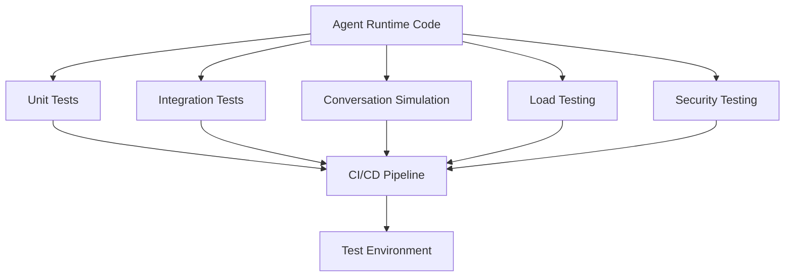

# Agent Runtime Testing Strategy

**Document Version:** 1.0
**Project:** AI Voice Agent SaaS Platform
**Phase:** 04 - LiveKit Voice Platform
**Status:** Draft
**Last Updated:** 2026-07-23

---

# 1. Overview

This document defines the testing strategy for the AI Agent Runtime.

The testing framework ensures that voice agents operate correctly across:

* Real-time conversations
* AI workflows
* RAG retrieval
* Tool execution
* Memory handling
* Telephony integration
* Multi-tenant environments

The goal is production-grade reliability and predictable behavior.

---

# 2. Testing Architecture



---

# 3. Testing Levels

```text id="m8p3z5"
Testing Strategy

├── Unit Testing

├── Integration Testing

├── End-to-End Testing

├── Performance Testing

├── Security Testing

└── Production Validation
```

---

# 4. Unit Testing

Tests individual components:

```text id="r7x2q9"
Components

├── Agent Logic

├── Prompt Processing

├── Memory Manager

├── Tool Functions

├── State Transitions

└── Validation Rules
```

Example:

```python
def test_agent_intent_detection():
    result = detect_intent("book appointment")
    assert result == "booking"
```

---

# 5. Agent Workflow Testing

Validate LangGraph workflows:

```text id="w6m4n1"
Input

↓

State Transition

↓

Tool Decision

↓

Final Response
```

Tests:

* Correct node execution
* State updates
* Error handling
* Recovery paths

---

# 6. LangChain RAG Testing

Test:

```text id="p5k8v2"
Question

↓

Retriever

↓

Documents

↓

Context

↓

Answer
```

Validate:

* Retrieval accuracy
* Metadata filtering
* Tenant isolation
* Hallucination prevention

---

# 7. Voice Pipeline Testing

Test:

```text id="q3m9x6"
Audio Input

↓

STT

↓

LLM

↓

TTS

↓

Audio Output
```

Measure:

* Recognition accuracy
* Response latency
* Voice quality

---

# 8. LiveKit Integration Testing

Validate:

```text id="h2v7k9"
LiveKit Room

↓

Agent Worker

↓

Audio Track

↓

Conversation

↓

Disconnect
```

Tests:

* Room creation
* Agent joining
* Audio streaming
* Participant events
* Recording events

---

# 9. SIP Testing

Test:

```text id="z8n4m6"
PSTN Call

↓

SIP Gateway

↓

LiveKit

↓

Agent
```

Scenarios:

* Incoming call
* Outgoing call
* Transfer
* Failure handling

---

# 10. Tool Testing

Validate:

```text id="c6p9r3"
Agent Decision

↓

Tool Call

↓

External API

↓

Result
```

Test:

* Correct parameters
* Authorization
* Error handling
* Timeout behavior

---

# 11. Memory Testing

Validate:

```text id="n5x8q2"
Conversation

↓

Memory Storage

↓

Future Retrieval
```

Test:

* Session memory
* Customer memory
* Expiration
* Isolation

---

# 12. Multi-Tenant Testing

Required tests:

```text id="v4m7k1"
Tenant A

Cannot Access

Tenant B Data
```

Validate:

* Database filters
* RAG isolation
* Agent permissions
* API security

---

# 13. Conversation Simulation Testing

Create automated conversations:

Example:

```text id="s3q8n5"
Customer:

"I need to book an appointment"


Expected:

Agent collects details

↓

Calls booking tool

↓

Confirms appointment
```

---

# 14. Regression Testing

Every change must verify:

* Existing agents still work
* Previous workflows remain stable
* APIs are compatible

---

# 15. Performance Testing

Measure:

```text id="x7m2p8"
Performance Tests

├── Response Latency

├── Concurrent Calls

├── Worker Capacity

├── RAG Speed

└── Cost Per Call
```

---

# 16. Load Testing

Scenarios:

```text id="t9q4k6"
10 Concurrent Calls

↓

100 Calls

↓

1000 Calls
```

Measure:

* CPU
* Memory
* Latency
* Failures

---

# 17. Failure Testing

Test:

```text id="b5n8x3"
Failures

├── LLM Timeout

├── STT Failure

├── TTS Failure

├── Database Failure

├── Redis Failure

└── Worker Crash
```

---

# 18. Security Testing

Validate:

```text id="p8m3q7"
Security

├── Authentication

├── Authorization

├── Prompt Injection

├── Data Leakage

└── Tool Abuse
```

---

# 19. Automated Testing Pipeline

```text id="d7x2m9"
Developer Commit

↓

Run Tests

↓

Build Container

↓

Deploy Test Environment

↓

Execute Validation

↓

Production Release
```

---

# 20. Test Data Management

Use:

```text id="k9m4v6"
Test Data

├── Synthetic Calls

├── Sample Customers

├── Fake Knowledge Bases

└── Mock Tools
```

---

# 21. Monitoring Production Quality

Production tests:

```text id="f3q8n2"
Production

↓

Monitor Calls

↓

Analyze Failures

↓

Improve Agent
```

---

# 22. Quality Metrics

Track:

```text id="m6x1q8"
Quality Metrics

├── Task Completion Rate

├── Correct Answers

├── Customer Satisfaction

├── Transfer Rate

└── Error Rate
```

---

# 23. Test Environment Architecture

```text id="y5k8p3"
Development

↓

Testing

↓

Staging

↓

Production
```

---

# 24. Recommended Testing Tools

Backend:

* pytest
* FastAPI TestClient

AI:

* LangChain evaluation tools
* LLM evaluation frameworks

Infrastructure:

* Locust
* k6
* OpenTelemetry

---

# 25. Future Enhancements

Future capabilities:

* AI-generated test cases
* Automated conversation grading
* Continuous agent evaluation
* Self-improving test suites

---

# 26. Related Documents

| Document                                        | Purpose          |
| ----------------------------------------------- | ---------------- |
| 21_Agent_Runtime_Error_Handling_and_Recovery.md | Recovery         |
| 22_Agent_Runtime_Performance_Optimization.md    | Performance      |
| 20_Agent_Runtime_Observability.md               | Monitoring       |
| 36_Test_Strategy                                | Platform testing |

---

# 27. Conclusion

The Agent Runtime Testing Strategy ensures that AI voice agents remain reliable, secure, and scalable.

It provides:

* Automated validation
* Quality assurance
* Performance confidence
* Production readiness

---

**End of Document**
