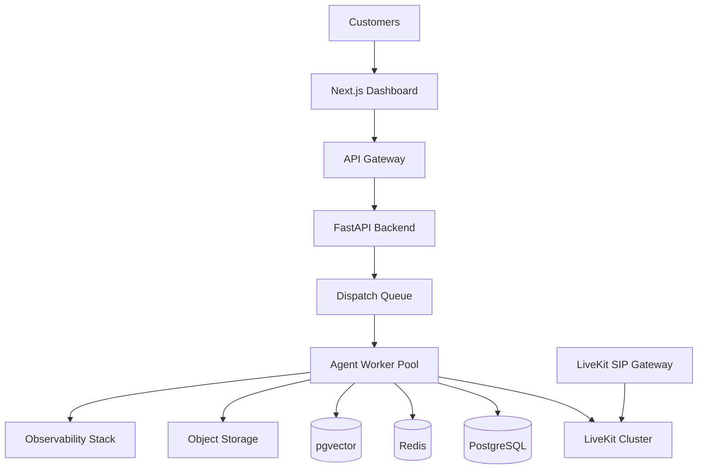

# Agent Runtime Deployment Architecture

**Document Version:** 1.0
**Project:** AI Voice Agent SaaS Platform
**Phase:** 04 - LiveKit Voice Platform
**Status:** Draft
**Last Updated:** 2026-07-23

---

# 1. Overview

This document defines the production deployment architecture for the AI Agent Runtime.

The deployment architecture provides:

* High availability
* Horizontal scaling
* Secure execution
* Automated deployment
* Operational visibility

The Agent Runtime is deployed as a distributed service capable of handling thousands of concurrent voice sessions.

---

# 2. Deployment Architecture



---

# 3. Deployment Components

```text
Agent Platform

├── API Services

├── Agent Workers

├── LiveKit Infrastructure

├── Data Services

├── Message Queue

├── Observability

└── Security Services
```

---

# 4. Container Architecture

All services run as containers:

```text
Docker Container

↓

Service Image

↓

Runtime Environment

↓

Production Deployment
```

---

# 5. Agent Worker Deployment

Each worker runs:

```text
Agent Worker Container

├── LiveKit SDK

├── STT Client

├── LLM Client

├── TTS Client

├── LangGraph Runtime

├── LangChain Runtime

├── Memory Manager

└── Tool Executor
```

---

# 6. Kubernetes Deployment Model

Recommended production model:

```text
Kubernetes Cluster

├── API Pods

├── Worker Pods

├── LiveKit Pods

├── Redis Pods

├── Database Services

└── Monitoring Pods
```

---

# 7. Agent Worker Scaling

Workers scale based on:

```text
Scaling Signals

├── Active Calls

├── CPU Usage

├── Memory Usage

├── Queue Length

└── Response Latency
```

Example:

```text
100 Calls

↓

20 Agent Workers


1000 Calls

↓

200 Agent Workers
```

---

# 8. Auto Scaling Strategy

```text
Low Traffic

↓

Minimum Workers


High Traffic

↓

Increase Workers


Traffic Drops

↓

Scale Down
```

---

# 9. Deployment Environments

The platform uses:

```text
Environment

├── Local Development

├── Development Server

├── Staging

└── Production
```

---

# 10. Configuration Management

Configuration sources:

```text
Environment Variables

+

Secrets Manager

+

Database Configuration
```

---

# 11. Secret Management

Sensitive values:

* API keys
* SIP credentials
* Database passwords
* Cloud credentials

Stored in:

```text
Secrets Manager

↓

Runtime Injection
```

---

# 12. Network Architecture

Recommended isolation:

```text
Internet

↓

Load Balancer

↓

Application Network

↓

Private Services

↓

Database Layer
```

---

# 13. Service Communication

Communication methods:

```text
Frontend → API

HTTPS


Service → Service

gRPC / REST


Events

Message Queue
```

---

# 14. Deployment Pipeline

```text
Developer

↓

Git Repository

↓

CI Pipeline

↓

Build Image

↓

Security Scan

↓

Deploy

↓

Health Check

↓

Production
```

---

# 15. Zero Downtime Deployment

Strategy:

```text
Old Version Running

↓

Deploy New Version

↓

Health Check

↓

Traffic Switch

↓

Remove Old Version
```

---

# 16. Agent Version Deployment

Support:

```text
Agent Version 1

↓

Agent Version 2

↓

Gradual Rollout
```

Allows:

* A/B testing
* Rollback
* Safe releases

---

# 17. Database Deployment

Database services:

```text
PostgreSQL

├── Core Data

├── Conversation Data

├── Agent Configurations

└── Analytics
```

---

# 18. Redis Deployment

Redis manages:

```text
Redis

├── Sessions

├── Cache

├── Queue State

├── Rate Limits

└── Worker State
```

---

# 19. Disaster Recovery

Recovery strategy:

```text
Failure

↓

Detect

↓

Restore

↓

Restart Services

↓

Validate
```

---

# 20. Backup Strategy

Backup:

* Database snapshots
* Configuration backups
* Knowledge documents
* Call metadata

---

# 21. Security Deployment Controls

Production security:

```text
Security Layer

├── TLS

├── Network Policies

├── Secrets Management

├── Access Control

└── Audit Logging
```

---

# 22. Observability Deployment

Monitoring stack:

```text
OpenTelemetry

↓

Prometheus

↓

Grafana

↓

Logs

↓

Alerts
```

---

# 23. Cost Optimization

Optimize:

* Worker utilization
* Model selection
* Storage lifecycle
* Compute resources

---

# 24. Multi-Region Deployment

Future architecture:

```text
Region US

↓

Agent Workers


Region EU

↓

Agent Workers


Global Router

↓

Nearest Region
```

---

# 25. Production Readiness Checklist

Before launch:

```text
✓ Health Checks

✓ Monitoring

✓ Backups

✓ Security Review

✓ Load Testing

✓ Failure Testing

✓ Rollback Plan
```

---

# 26. Related Documents

| Document                                        | Purpose               |
| ----------------------------------------------- | --------------------- |
| 15_LiveKit_Agent_Worker_Design.md               | Worker runtime        |
| 20_Agent_Runtime_Observability.md               | Monitoring            |
| 21_Agent_Runtime_Error_Handling_and_Recovery.md | Recovery              |
| 35_CI_CD                                        | Deployment automation |

---

# 27. Conclusion

The Agent Runtime Deployment Architecture provides a scalable foundation for running enterprise AI voice agents.

It enables:

* Reliable production deployment
* Automatic scaling
* Secure execution
* High availability

---

**End of Document**
