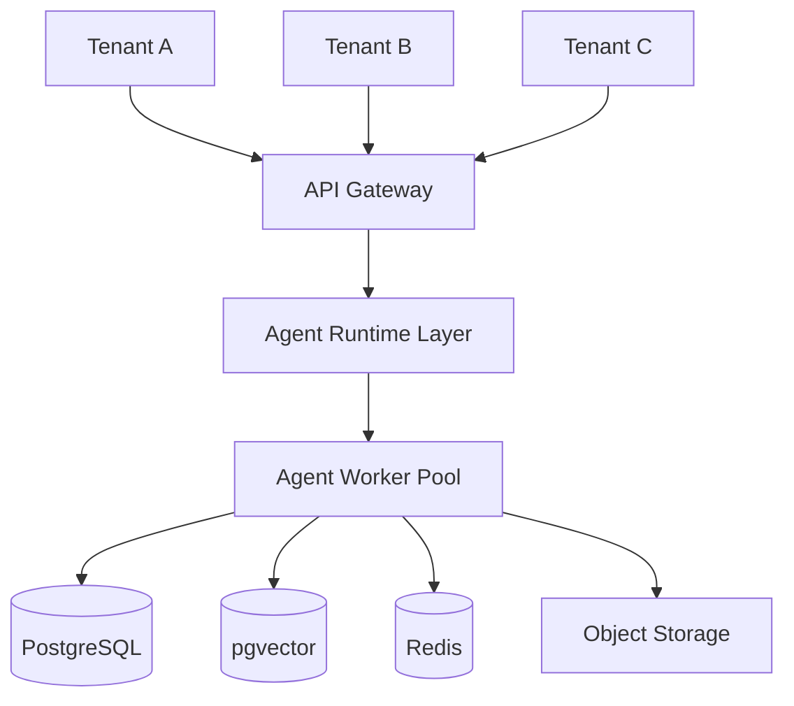

# Agent Runtime Multi-Tenant Architecture

**Document Version:** 1.0
**Project:** AI Voice Agent SaaS Platform
**Phase:** 04 - LiveKit Voice Platform
**Status:** Draft
**Last Updated:** 2026-07-23

---

# 1. Overview

This document defines the multi-tenant architecture for the AI Agent Runtime.

The SaaS platform allows multiple organizations to create and operate their own AI voice agents while sharing the same infrastructure.

The architecture ensures:

* Complete tenant isolation
* Secure data separation
* Independent agent configuration
* Tenant-specific knowledge bases
* Tenant-level billing and analytics

---

# 2. Multi-Tenant Architecture



---

# 3. Tenant Isolation Model

The platform uses logical isolation:

```text
Tenant Isolation

├── Application Isolation

├── Database Isolation

├── Knowledge Isolation

├── Memory Isolation

├── Tool Isolation

└── Billing Isolation
```

---

# 4. Tenant Context

Every request carries tenant context:

```json
{
 "tenant_id":"tenant_001",
 "agent_id":"agent_support",
 "session_id":"session_123"
}
```

The runtime validates this context before processing.

---

# 5. Tenant Resolution Flow

```text
Incoming Request

↓

Authentication

↓

Identify Tenant

↓

Load Tenant Configuration

↓

Validate Permissions

↓

Start Agent Session
```

---

# 6. Database Isolation

Recommended approach:

## Shared Database + Tenant Keys

Example:

```sql
agents

id

tenant_id

name

configuration
```

Every table includes:

```text
tenant_id
```

---

# 7. PostgreSQL Row Level Security

PostgreSQL RLS enforces:

```text
Tenant A

CAN READ

Tenant A Data


Tenant A

CANNOT READ

Tenant B Data
```

---

# 8. Vector Database Isolation

RAG data is separated using metadata filtering.

Example:

```json
{
 "tenant_id":"tenant_001",
 "document":"pricing.pdf"
}
```

Search:

```text
Query

↓

Tenant Filter

↓

Vector Similarity Search

↓

Relevant Documents
```

---

# 9. Agent Configuration Isolation

Each tenant manages:

```text
Tenant

├── Agents

├── Prompts

├── Voices

├── Models

├── Tools

└── Knowledge Bases
```

---

# 10. Runtime Isolation

Agent Workers receive:

```json
{
 "tenant_id":"tenant_001",
 "agent_config":"support_v2"
}
```

The worker loads only authorized configuration.

---

# 11. Memory Isolation

Memory architecture:

```text
Tenant

↓

Customer

↓

Conversation

↓

Memory Store
```

Example:

```text
Tenant A Customer Memory

Cannot be accessed by

Tenant B Agent
```

---

# 12. Redis Isolation

Redis keys include tenant namespace:

Example:

```text
tenant_001:session:123

tenant_002:session:456
```

---

# 13. Tool Isolation

Tools are tenant scoped.

Example:

```text
Tenant A

Allowed:

CRM API


Tenant B

Allowed:

Booking API
```

---

# 14. Tenant-Specific Agents

A tenant can create:

```text
Company A

├── Sales Agent

├── Support Agent

└── Reception Agent


Company B

├── Booking Agent

└── FAQ Agent
```

---

# 15. Tenant Resource Limits

Control:

```text
Tenant Limits

├── Concurrent Calls

├── API Requests

├── Storage

├── Knowledge Documents

└── AI Usage
```

---

# 16. Tenant Billing Isolation

Track usage:

```text
Tenant

↓

Calls

↓

AI Tokens

↓

Storage

↓

Monthly Invoice
```

---

# 17. Tenant Analytics

Each tenant receives:

```text
Analytics

├── Calls

├── Success Rate

├── Costs

├── Agent Performance

└── Customer Feedback
```

---

# 18. Security Boundaries

Security checks:

```text
Request

↓

Tenant Validation

↓

Authorization

↓

Resource Access

↓

Execution
```

---

# 19. Cross-Tenant Attack Prevention

Prevent:

* Data leakage
* Prompt exposure
* Memory mixing
* Knowledge contamination

Controls:

* RLS
* Authorization middleware
* Metadata filtering
* Audit logs

---

# 20. Tenant Lifecycle

```text
REGISTERED

↓

CONFIGURED

↓

ACTIVE

↓

SUSPENDED

↓

DELETED
```

---

# 21. Tenant Provisioning Flow

```text
New Customer Signup

↓

Create Tenant

↓

Create Default Configuration

↓

Assign Resources

↓

Enable Agents
```

---

# 22. Tenant Deletion

Deletion process:

```text
Delete Request

↓

Verify Ownership

↓

Export Data

↓

Remove Resources

↓

Confirm Deletion
```

---

# 23. Observability Per Tenant

Metrics include:

```json
{
 "tenant_id":"tenant_001",
 "calls":100,
 "cost":25.50
}
```

---

# 24. Deployment Considerations

Production options:

## Shared Infrastructure

Lower cost:

```text
Many Tenants

↓

Shared Workers
```

## Dedicated Infrastructure

Enterprise option:

```text
Large Tenant

↓

Dedicated Workers
```

---

# 25. Future Enhancements

Future capabilities:

* Dedicated AI clusters
* Tenant-specific models
* Regional isolation
* Enterprise private deployments

---

# 26. Related Documents

| Document                                    | Purpose             |
| ------------------------------------------- | ------------------- |
| 18_Voice_Agent_Configuration_Model.md       | Agent configuration |
| 19_Agent_Runtime_Security_Model.md          | Security model      |
| 24_Agent_Runtime_Deployment_Architecture.md | Deployment          |
| 29_Database_Schema                          | Data model          |

---

# 27. Conclusion

The Agent Runtime Multi-Tenant Architecture enables a secure SaaS platform where thousands of organizations can run independent AI voice agents on shared infrastructure.

It provides:

* Strong isolation
* Secure data access
* Scalable operations
* Enterprise readiness

---

**End of Document**
