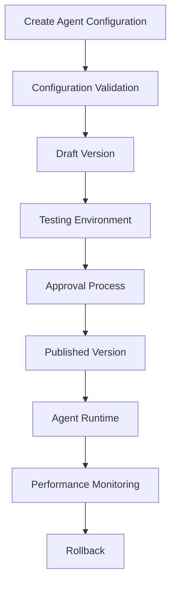

# Agent Runtime Configuration Lifecycle

**Document Version:** 1.0
**Project:** AI Voice Agent SaaS Platform
**Phase:** 04 - LiveKit Voice Platform
**Status:** Draft
**Last Updated:** 2026-07-23

---

# 1. Overview

This document defines the lifecycle management process for AI Agent Runtime configurations.

Agent configuration changes affect:

* Conversation behavior
* AI model selection
* Voice settings
* Tools
* Knowledge retrieval
* Memory behavior

A controlled lifecycle ensures safe changes, testing, deployment, and rollback.

---

# 2. Configuration Lifecycle Architecture



---

# 3. Configuration Lifecycle States

```text id="k2m7q9"
DRAFT

↓

VALIDATED

↓

TESTING

↓

APPROVED

↓

PUBLISHED

↓

ACTIVE

↓

DEPRECATED

↓

ARCHIVED
```

---

# 4. Configuration Creation

A tenant creates:

```text id="n4v8cx"
Agent Configuration

├── Identity

├── Prompt

├── Voice

├── Model

├── Tools

├── Knowledge

└── Memory Settings
```

---

# 5. Configuration Validation

Before activation:

Validate:

```text id="p6x9m2"
Validation

├── Required Fields

├── Model Availability

├── Voice Availability

├── Tool Permissions

├── Knowledge Connection

└── Security Rules
```

---

# 6. Configuration Versioning

Every change creates a version:

Example:

```text id="q5m8vz"
Support Agent

v1.0

↓

v1.1

↓

v2.0
```

---

# 7. Version Metadata

Example:

```json id="c8n4r6"
{
 "agent_id":"support_agent",
 "version":"2.0",
 "created_by":"admin",
 "status":"testing"
}
```

---

# 8. Development Workflow

```text id="a7k2x5"
Developer/Admin

↓

Modify Configuration

↓

Save Draft

↓

Validate

↓

Test
```

---

# 9. Testing Workflow

Testing validates:

```text id="z6q1m9"
Configuration

↓

Simulation Calls

↓

Quality Evaluation

↓

Performance Check

↓

Approval
```

---

# 10. Approval Process

Production changes require:

```text id="u5p8n3"
Review

↓

Approval

↓

Publish
```

Enterprise tenants may require:

* Multiple approvers
* Change records
* Audit trail

---

# 11. Publishing Configuration

When published:

```text id="x9m3q7"
Published Version

↓

Agent Registry

↓

Runtime Availability
```

---

# 12. Runtime Configuration Loading

At call start:

```text id="h4v7p2"
Incoming Call

↓

Identify Tenant

↓

Identify Agent

↓

Load Active Version

↓

Initialize Runtime
```

---

# 13. Configuration Cache

For performance:

```text id="m7q2x9"
Database

↓

Redis Cache

↓

Agent Worker
```

Cache contains:

* Agent settings
* Prompt templates
* Tool permissions
* Model configuration

---

# 14. Configuration Updates

Update process:

```text id="e8p4k6"
New Configuration

↓

Invalidate Cache

↓

Notify Workers

↓

Load New Version
```

---

# 15. Hot Reload Strategy

Supported changes:

```text id="b5q8n2"
Safe Hot Reload

├── Prompt Updates

├── Voice Settings

├── Tool Configuration

└── RAG Settings
```

---

# 16. Restart Required Changes

Some changes require restart:

```text id="t3m7x8"
Restart Required

├── Runtime Dependencies

├── Worker Code

├── Model Infrastructure

└── Network Configuration
```

---

# 17. Rollback Strategy

Rollback flow:

```text id="r9k4v5"
Issue Detected

↓

Select Previous Version

↓

Activate Previous Config

↓

Restart Sessions

↓

Monitor
```

---

# 18. A/B Testing

Support:

```text id="s8m2q4"
Traffic Split

↓

Version A

+

Version B

↓

Compare Results
```

Metrics:

* Completion rate
* Customer satisfaction
* Cost
* Latency

---

# 19. Configuration Audit Trail

Record:

```text id="y6n3p8"
Audit Event

├── User

├── Action

├── Old Version

├── New Version

├── Timestamp

└── Reason
```

---

# 20. Configuration Security

Protect:

* System prompts
* Tool credentials
* Business rules
* Private knowledge links

Controls:

* Role permissions
* Encryption
* Audit logging

---

# 21. Tenant Configuration Isolation

Each tenant owns:

```text id="j5x9q1"
Tenant

├── Agent Versions

├── Prompts

├── Tools

├── Knowledge

└── Settings
```

---

# 22. Configuration Database Model

Recommended tables:

```text id="v8m2r6"
agent_configurations

agent_versions

agent_prompts

agent_voice_settings

agent_model_settings

agent_change_history
```

---

# 23. Monitoring Configuration Quality

Track:

```text id="d7q4n8"
Quality Metrics

├── Failure Rate

├── User Satisfaction

├── Tool Success

├── Latency

└── Cost
```

---

# 24. Configuration Backup

Backup:

* Agent definitions
* Prompts
* Versions
* Tool settings
* Knowledge mappings

---

# 25. Future Enhancements

Future capabilities:

* AI-generated agent improvements
* Automatic prompt optimization
* Configuration recommendations
* Self-tuning agents

---

# 26. Related Documents

| Document                                      | Purpose                 |
| --------------------------------------------- | ----------------------- |
| 18_Voice_Agent_Configuration_Model.md         | Configuration structure |
| 20_Agent_Runtime_Observability.md             | Monitoring              |
| 23_Agent_Runtime_Testing_Strategy.md          | Testing                 |
| 25_Agent_Runtime_Multi_Tenant_Architecture.md | Multi-tenancy           |

---

# 27. Conclusion

The Agent Runtime Configuration Lifecycle provides controlled management of AI agents from creation to production operation.

It enables:

* Safe changes
* Version control
* Testing
* Rollback
* Enterprise governance

---

**End of Document**
