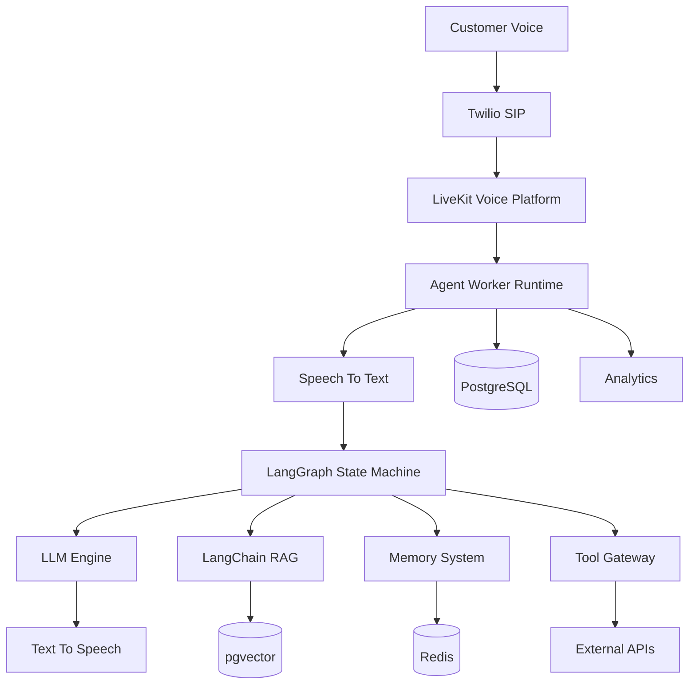

# Agent Runtime Complete Architecture Overview

**Document Version:** 1.0
**Project:** AI Voice Agent SaaS Platform
**Phase:** 04 - LiveKit Voice Platform
**Status:** Draft
**Last Updated:** 2026-07-23

---

# 1. Overview

This document provides the complete architecture overview of the AI Agent Runtime platform.

The Agent Runtime is the execution engine responsible for operating intelligent voice agents.

It connects:

* LiveKit real-time communication
* Speech processing
* LLM reasoning
* LangGraph workflows
* LangChain RAG
* Memory systems
* External tools
* Business workflows

---

# 2. Complete Agent Runtime Architecture



---

# 3. Agent Runtime Responsibilities

The runtime manages:

```text
Agent Runtime

├── Conversation Control

├── AI Reasoning

├── Workflow Execution

├── Knowledge Retrieval

├── Memory Management

├── Tool Execution

├── Error Recovery

└── Observability
```

---

# 4. Runtime Execution Flow

Complete call lifecycle:

```text
Incoming Call

↓

SIP Connection

↓

LiveKit Room Creation

↓

Agent Assignment

↓

Load Configuration

↓

Initialize Runtime

↓

Start Conversation

↓

Process User Speech

↓

Retrieve Context

↓

Generate Response

↓

Execute Tools

↓

Generate Voice

↓

Continue Conversation

↓

End Session
```

---

# 5. Agent Worker Architecture

Each worker contains:

```text
Agent Worker

├── LiveKit SDK

├── Audio Pipeline

├── STT Adapter

├── LLM Adapter

├── TTS Adapter

├── LangGraph Engine

├── LangChain Components

├── Memory Manager

├── Tool Executor

└── Telemetry Collector
```

---

# 6. LangGraph Workflow Engine

The workflow controls reasoning:

```text
State

↓

Analyze Intent

↓

Retrieve Knowledge

↓

Decide Action

↓

Execute Tool

↓

Generate Response

↓

Update Memory
```

---

# 7. LangChain RAG Integration

Knowledge flow:

```text
User Question

↓

Embedding Generation

↓

Vector Search

↓

Metadata Filtering

↓

Document Retrieval

↓

Context Injection

↓

LLM Response
```

---

# 8. Memory Architecture

Memory layers:

```text
Memory System

├── Short-Term Memory

│   Current Conversation

│

├── Session Memory

│   Current Call

│

└── Long-Term Memory

    Customer History
```

---

# 9. Tool Execution Architecture

Tools execute business actions:

Examples:

```text
Tools

├── CRM Lookup

├── Appointment Booking

├── Payment Processing

├── Email Sending

├── Database Queries

└── Custom APIs
```

---

# 10. LiveKit Integration Model

LiveKit provides:

```text
LiveKit

├── Audio Transport

├── Room Management

├── Participant Events

├── SIP Integration

├── Recording

└── Real-Time Communication
```

---

# 11. Configuration Loading

Runtime startup:

```text
Call Received

↓

Tenant Identification

↓

Agent Lookup

↓

Load Configuration

↓

Initialize Agent
```

---

# 12. Security Architecture

Security layers:

```text
Security

├── Authentication

├── Authorization

├── Tenant Isolation

├── Secret Management

├── Data Protection

└── Audit Logging
```

---

# 13. Multi-Tenant Runtime

Tenant isolation:

```text
Tenant A

↓

Agent Worker

↓

Tenant A Data


Tenant B

↓

Agent Worker

↓

Tenant B Data
```

No cross-access is allowed.

---

# 14. Observability Layer

Every execution produces:

```text
Telemetry

├── Logs

├── Metrics

├── Traces

├── Cost Data

└── Quality Data
```

---

# 15. Error Recovery

Recovery capabilities:

```text
Failure

↓

Detect

↓

Classify

↓

Retry

↓

Fallback

↓

Recover
```

---

# 16. Performance Optimization

Optimization areas:

```text
Performance

├── Streaming Audio

├── Model Routing

├── Cache Usage

├── RAG Optimization

├── Worker Scaling

└── Resource Management
```

---

# 17. Deployment Architecture

Production:

```text
Users

↓

Load Balancer

↓

API Services

↓

Agent Workers

↓

LiveKit Cluster

↓

Data Services
```

---

# 18. Technology Stack

## Backend

* Python
* FastAPI
* Async workers

## AI

* OpenAI Models
* LangChain
* LangGraph

## Voice

* LiveKit
* SIP
* STT
* TTS

## Data

* PostgreSQL
* pgvector
* Redis

## Infrastructure

* Docker
* Kubernetes
* Terraform

---

# 19. Database Domains

Core data:

```text
Database

├── Tenants

├── Users

├── Agents

├── Conversations

├── Calls

├── Knowledge

├── Memory

├── Tools

└── Analytics
```

---

# 20. Production Scalability

Supports:

* Multiple tenants
* Thousands of agents
* Concurrent calls
* Regional deployments
* Enterprise workloads

---

# 21. Operational Lifecycle

```text
Develop

↓

Test

↓

Deploy

↓

Monitor

↓

Improve

↓

Optimize
```

---

# 22. Architecture Principles

The platform follows:

```text
Principles

├── Modular Design

├── Event Driven Architecture

├── Cloud Native Deployment

├── Secure By Default

├── Observable Systems

└── Scalable Components
```

---

# 23. Future Evolution

Future capabilities:

* Autonomous agent optimization
* Multi-agent collaboration
* Local AI models
* Advanced analytics
* AI supervisor agents

---

# 24. Related Documents

| Document                                    | Purpose             |
| ------------------------------------------- | ------------------- |
| 15_LiveKit_Agent_Worker_Design.md           | Worker architecture |
| 18_Voice_Agent_Configuration_Model.md       | Configuration       |
| 19_Agent_Runtime_Security_Model.md          | Security            |
| 20_Agent_Runtime_Observability.md           | Monitoring          |
| 24_Agent_Runtime_Deployment_Architecture.md | Deployment          |

---

# 25. Conclusion

The Agent Runtime is the core intelligence layer of the AI Voice Agent SaaS platform.

It combines real-time communication, AI reasoning, knowledge retrieval, memory, and automation into a production-grade voice intelligence system.

---

**End of Document**
