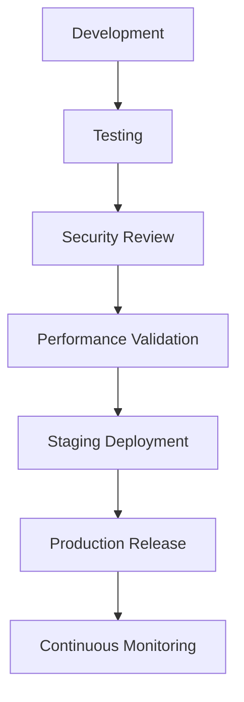

# Agent Runtime Production Readiness Checklist

**Document Version:** 1.0
**Project:** AI Voice Agent SaaS Platform
**Phase:** 04 - LiveKit Voice Platform
**Status:** Draft
**Last Updated:** 2026-07-23

---

# 1. Overview

This document defines the production readiness checklist for the AI Agent Runtime.

Before releasing the platform to customers, all operational, security, performance, and reliability requirements must be validated.

The checklist covers:

* Infrastructure
* Voice pipeline
* AI services
* Data systems
* Security
* Monitoring
* Operations

---

# 2. Production Readiness Framework



---

# 3. Infrastructure Checklist

## Compute

| Item                          | Status |
| ----------------------------- | ------ |
| Production servers configured | ☐      |
| CPU resources validated       | ☐      |
| Memory limits configured      | ☐      |
| Auto scaling enabled          | ☐      |
| Resource monitoring enabled   | ☐      |

---

## Container Platform

| Item                               | Status |
| ---------------------------------- | ------ |
| Docker images hardened             | ☐      |
| Image scanning enabled             | ☐      |
| Container health checks configured | ☐      |
| Restart policies configured        | ☐      |

---

# 4. LiveKit Production Checklist

Verify:

```text
LiveKit

├── Server Configuration

├── Room Management

├── Agent Connection

├── Audio Streaming

├── SIP Integration

├── Recording

└── Monitoring
```

Checklist:

| Item                               | Status |
| ---------------------------------- | ------ |
| LiveKit cluster deployed           | ☐      |
| SIP gateway tested                 | ☐      |
| Agent workers connect successfully | ☐      |
| Audio quality validated            | ☐      |
| Disconnect recovery tested         | ☐      |

---

# 5. Agent Runtime Checklist

Verify:

```text
Agent Runtime

├── Worker Startup

├── Configuration Loading

├── Session Management

├── Workflow Execution

├── Tool Execution

└── Shutdown Handling
```

Checklist:

| Item                          | Status |
| ----------------------------- | ------ |
| Workers start correctly       | ☐      |
| Agent assignment works        | ☐      |
| State management works        | ☐      |
| Error recovery tested         | ☐      |
| Graceful shutdown implemented | ☐      |

---

# 6. AI Model Checklist

Validate:

## Speech Recognition

| Item                    | Status |
| ----------------------- | ------ |
| STT provider configured | ☐      |
| Accuracy tested         | ☐      |
| Latency measured        | ☐      |

---

## LLM

| Item                       | Status |
| -------------------------- | ------ |
| Models configured          | ☐      |
| Token limits defined       | ☐      |
| Cost tracking enabled      | ☐      |
| Fallback models configured | ☐      |

---

## Text To Speech

| Item                       | Status |
| -------------------------- | ------ |
| Voice providers configured | ☐      |
| Voice quality tested       | ☐      |
| Fallback voice available   | ☐      |

---

# 7. LangChain RAG Checklist

Validate:

```text
RAG System

├── Document Ingestion

├── Embeddings

├── Vector Storage

├── Retrieval

├── Metadata Filtering

└── Answer Quality
```

Checklist:

| Item                      | Status |
| ------------------------- | ------ |
| Knowledge upload works    | ☐      |
| Embeddings generated      | ☐      |
| pgvector configured       | ☐      |
| Tenant filtering enabled  | ☐      |
| Retrieval accuracy tested | ☐      |

---

# 8. LangGraph Workflow Checklist

Verify:

| Item                        | Status |
| --------------------------- | ------ |
| Agent states defined        | ☐      |
| Workflow transitions tested | ☐      |
| Tool routing validated      | ☐      |
| Recovery paths tested       | ☐      |

---

# 9. Database Checklist

PostgreSQL:

| Item                          | Status |
| ----------------------------- | ------ |
| Production database deployed  | ☐      |
| Backups enabled               | ☐      |
| Indexes optimized             | ☐      |
| Connection pooling configured | ☐      |
| Migration process tested      | ☐      |

---

# 10. Redis Checklist

Verify:

| Item                       | Status |
| -------------------------- | ------ |
| Redis deployed             | ☐      |
| Persistence configured     | ☐      |
| Cache strategy implemented | ☐      |
| Session storage tested     | ☐      |

---

# 11. Multi-Tenant Security Checklist

Validate:

```text
Tenant Isolation

├── Database Isolation

├── Vector Isolation

├── Memory Isolation

├── Tool Isolation

└── Configuration Isolation
```

Checklist:

| Item                        | Status |
| --------------------------- | ------ |
| Tenant authorization tested | ☐      |
| PostgreSQL RLS enabled      | ☐      |
| Cross-tenant access blocked | ☐      |
| Audit logging enabled       | ☐      |

---

# 12. Security Checklist

Verify:

| Item                             | Status |
| -------------------------------- | ------ |
| Authentication implemented       | ☐      |
| Authorization implemented        | ☐      |
| Secrets secured                  | ☐      |
| TLS enabled                      | ☐      |
| Vulnerability scanning completed | ☐      |
| Security review completed        | ☐      |

---

# 13. Observability Checklist

Verify:

```text
Monitoring

├── Logs

├── Metrics

├── Traces

├── Alerts

└── Dashboards
```

Checklist:

| Item                     | Status |
| ------------------------ | ------ |
| OpenTelemetry configured | ☐      |
| Metrics available        | ☐      |
| Logs searchable          | ☐      |
| Alerts configured        | ☐      |
| Dashboards created       | ☐      |

---

# 14. Performance Checklist

Validate:

| Metric                 | Target     |
| ---------------------- | ---------- |
| Voice response latency | < 800ms    |
| RAG retrieval          | < 200ms    |
| Worker startup         | Optimized  |
| Concurrent calls       | Tested     |
| Memory usage           | Controlled |

---

# 15. Load Testing Checklist

Execute:

```text
Load Tests

├── Normal Traffic

├── Peak Traffic

├── Stress Testing

├── Failure Testing

└── Recovery Testing
```

---

# 16. Backup and Recovery Checklist

Verify:

| Item                         | Status |
| ---------------------------- | ------ |
| Database backups tested      | ☐      |
| Restore procedure documented | ☐      |
| Disaster recovery tested     | ☐      |
| Recovery time measured       | ☐      |

---

# 17. CI/CD Checklist

Pipeline:

```text
Code

↓

Test

↓

Build

↓

Security Scan

↓

Deploy

↓

Validate
```

Checklist:

| Item                   | Status |
| ---------------------- | ------ |
| Automated tests run    | ☐      |
| Deployment automated   | ☐      |
| Rollback available     | ☐      |
| Versioning implemented | ☐      |

---

# 18. Documentation Checklist

Required documents:

| Document                   | Status |
| -------------------------- | ------ |
| Architecture documentation | ☐      |
| API documentation          | ☐      |
| Runbooks                   | ☐      |
| Security documentation     | ☐      |
| Troubleshooting guides     | ☐      |

---

# 19. Customer Launch Checklist

Before first customer:

| Item                     | Status |
| ------------------------ | ------ |
| Tenant onboarding tested | ☐      |
| Agent creation tested    | ☐      |
| Voice calls tested       | ☐      |
| Billing tested           | ☐      |
| Analytics tested         | ☐      |

---

# 20. Final Production Approval

Approval requires:

```text
Engineering

+

Security

+

Operations

+

Product
```

---

# 21. Production Go-Live Process

```text
Final Review

↓

Production Deployment

↓

Smoke Tests

↓

Enable Traffic

↓

Monitor Closely
```

---

# 22. Related Documents

| Document                                           | Purpose           |
| -------------------------------------------------- | ----------------- |
| 27_Agent_Runtime_Complete_Architecture_Overview.md | Full architecture |
| 24_Agent_Runtime_Deployment_Architecture.md        | Deployment        |
| 23_Agent_Runtime_Testing_Strategy.md               | Testing           |
| 20_Agent_Runtime_Observability.md                  | Monitoring        |

---

# 23. Conclusion

The Agent Runtime Production Readiness Checklist ensures that the AI Voice Agent SaaS platform is ready for enterprise deployment.

It validates:

* Reliability
* Security
* Performance
* Scalability
* Operational maturity

---

**End of Document**
