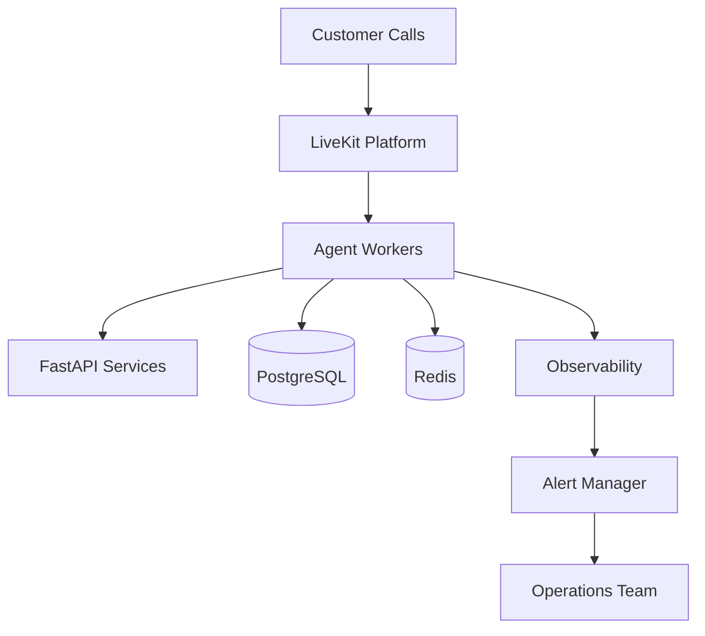

# Agent Runtime Operations Runbook

**Document Version:** 1.0
**Project:** AI Voice Agent SaaS Platform
**Phase:** 04 - LiveKit Voice Platform
**Status:** Draft
**Last Updated:** 2026-07-23

---

# 1. Overview

This operations runbook defines procedures for operating, monitoring, troubleshooting, and maintaining the AI Agent Runtime in production.

The runbook is designed for:

* DevOps engineers
* Platform engineers
* SRE teams
* Backend engineers
* Support engineers

It provides operational procedures for:

* Deployment
* Monitoring
* Incident response
* Recovery
* Maintenance

---

# 2. Operations Architecture



---

# 3. Daily Operations Checklist

Every day verify:

```text
Daily Checks

├── Service Health

├── Active Calls

├── Error Rate

├── Infrastructure Usage

├── Database Health

├── Queue Status

└── Alerts
```

---

# 4. Service Health Verification

Check:

```text
Services

├── API Gateway

├── FastAPI Backend

├── Agent Workers

├── LiveKit

├── Redis

├── PostgreSQL

└── Monitoring Stack
```

Expected:

```text
Status: Healthy

Response: Normal

Errors: None
```

---

# 5. Agent Worker Operations

## Check Worker Status

Verify:

* Worker availability
* Active sessions
* Memory usage
* CPU usage

---

## Restart Worker

Procedure:

```text
Stop Worker

↓

Wait for Active Sessions

↓

Restart Worker

↓

Verify Registration

↓

Monitor Logs
```

---

# 6. LiveKit Operations

## Verify LiveKit Health

Check:

* Server availability
* Room creation
* Participant connections
* SIP status

---

## Room Troubleshooting

Issue:

```text
Agent Cannot Join Room
```

Check:

```text
1. Token Validity

2. Agent Worker Status

3. Network Connectivity

4. LiveKit Logs
```

---

# 7. Call Troubleshooting

## Customer Reports Failed Call

Investigation:

```text
Call ID

↓

Find Session

↓

Check LiveKit Events

↓

Check Agent Logs

↓

Check External Services

↓

Identify Failure
```

---

# 8. Agent Response Troubleshooting

Problem:

```text
Agent Response Slow
```

Check:

```text
STT Latency

↓

RAG Retrieval

↓

LLM Response Time

↓

TTS Latency
```

---

# 9. RAG Troubleshooting

Problem:

```text
Agent Gives Wrong Answer
```

Check:

```text
Knowledge Upload

↓

Embedding Status

↓

Vector Search

↓

Metadata Filtering

↓

Prompt Context
```

---

# 10. Memory Troubleshooting

Problem:

```text
Agent Forgot Previous Conversation
```

Check:

```text
Session ID

↓

Redis State

↓

Conversation Storage

↓

Memory Retrieval
```

---

# 11. Tool Failure Troubleshooting

Problem:

```text
External Action Failed
```

Check:

```text
Tool Configuration

↓

Authentication

↓

API Availability

↓

Request Payload

↓

Response Handling
```

---

# 12. Database Operations

Monitor:

```text
PostgreSQL

├── Connections

├── Query Performance

├── Storage

├── Locks

└── Backups
```

---

# 13. Redis Operations

Monitor:

```text
Redis

├── Memory Usage

├── Key Expiration

├── Cache Hit Rate

├── Connections

└── Persistence
```

---

# 14. Deployment Procedure

Production deployment:

```text
Prepare Release

↓

Run Tests

↓

Build Container

↓

Deploy New Version

↓

Health Check

↓

Monitor
```

---

# 15. Rollback Procedure

If deployment fails:

```text
Detect Issue

↓

Stop New Version

↓

Restore Previous Version

↓

Restart Services

↓

Validate
```

---

# 16. Incident Response Process

Severity levels:

```text
SEV-1

Complete outage


SEV-2

Major degradation


SEV-3

Limited impact


SEV-4

Minor issue
```

---

# 17. SEV-1 Response

Examples:

* All calls failing
* LiveKit unavailable
* Database outage

Actions:

```text
1. Declare Incident

2. Notify Team

3. Identify Root Cause

4. Apply Recovery

5. Document Resolution
```

---

# 18. Log Investigation

Search by:

```text
Call ID

Tenant ID

Agent ID

Request ID

Error ID
```

---

# 19. Monitoring Dashboards

Required dashboards:

```text
Dashboards

├── Platform Health

├── Voice Quality

├── Agent Performance

├── AI Cost

├── Tenant Usage

└── Errors
```

---

# 20. Backup Operations

Verify:

```text
Database Backup

↓

Knowledge Backup

↓

Configuration Backup

↓

Restore Testing
```

---

# 21. Scaling Operations

Scale when:

```text
Traffic Increase

↓

Monitor Capacity

↓

Increase Workers

↓

Validate Performance
```

---

# 22. Security Operations

Regular checks:

```text
Security

├── Secret Rotation

├── Access Review

├── Audit Logs

├── Vulnerability Scan

└── Dependency Updates
```

---

# 23. Maintenance Windows

During maintenance:

```text
Notify Users

↓

Backup Data

↓

Apply Changes

↓

Test Services

↓

Resume Operations
```

---

# 24. Common Issues Reference

| Issue             | Action                    |
| ----------------- | ------------------------- |
| Agent offline     | Restart worker            |
| Slow response     | Check latency chain       |
| Missing knowledge | Verify RAG pipeline       |
| Call failure      | Check SIP/LiveKit         |
| Memory loss       | Check Redis/session state |
| Tool failure      | Verify external API       |

---

# 25. Operational Metrics

Track:

```text
Metrics

├── Availability

├── Call Success Rate

├── Latency

├── Error Rate

├── Cost Per Call

└── Customer Satisfaction
```

---

# 26. Future Enhancements

Future improvements:

* Automated remediation
* AI incident assistant
* Predictive monitoring
* Self-healing infrastructure

---

# 27. Related Documents

| Document                                           | Purpose          |
| -------------------------------------------------- | ---------------- |
| 28_Agent_Runtime_Production_Readiness_Checklist.md | Launch readiness |
| 20_Agent_Runtime_Observability.md                  | Monitoring       |
| 21_Agent_Runtime_Error_Handling_and_Recovery.md    | Recovery         |
| 24_Agent_Runtime_Deployment_Architecture.md        | Deployment       |

---

# 28. Conclusion

This runbook provides operational procedures required to run the AI Agent Runtime reliably in production.

It enables:

* Faster incident resolution
* Stable operations
* Consistent maintenance
* Enterprise support readiness

---

**End of Document**
