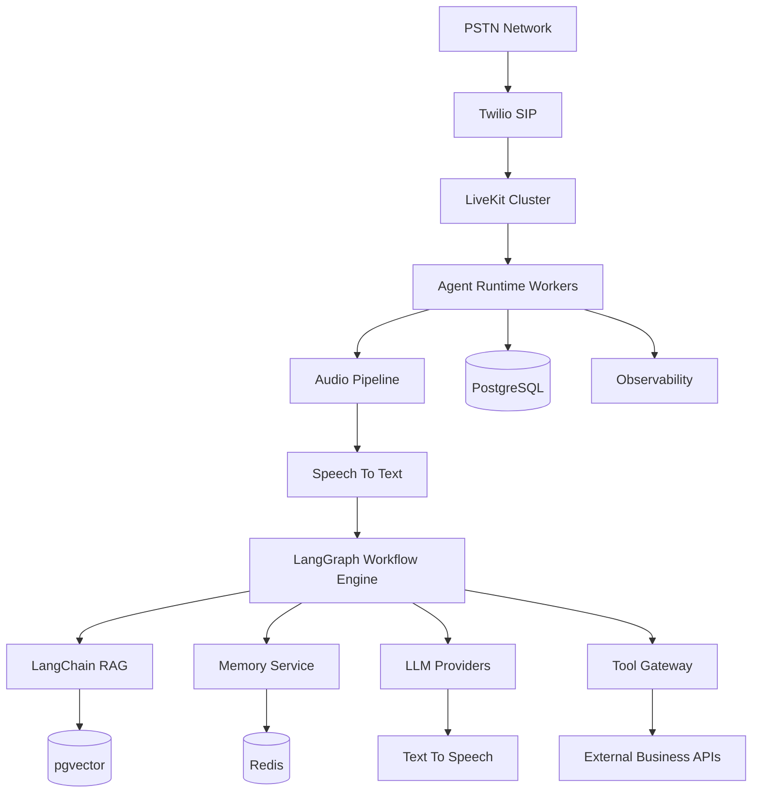

# Agent Runtime Final Architecture Summary

**Document Version:** 1.0
**Project:** AI Voice Agent SaaS Platform
**Phase:** 04 - LiveKit Voice Platform
**Status:** Draft
**Last Updated:** 2026-07-23

---

# 1. Overview

This document provides the final consolidated architecture summary of the AI Agent Runtime.

The Agent Runtime is the core intelligence execution layer of the AI Voice Agent SaaS platform.

It connects real-time communication, artificial intelligence, knowledge systems, memory, automation, and enterprise services into one scalable runtime.

---

# 2. Complete Platform Position

The overall platform architecture:

```text
Customer

↓

PSTN / SIP

↓

LiveKit Voice Platform

↓

Agent Runtime

↓

AI Reasoning Layer

↓

Business Automation

↓

Enterprise Systems
```

---

# 3. Agent Runtime Mission

The Agent Runtime is responsible for:

```text
Agent Runtime

├── Understand User Speech

├── Manage Conversation State

├── Reason Using AI Models

├── Retrieve Knowledge

├── Execute Business Actions

├── Maintain Memory

├── Generate Voice Responses

└── Track Performance
```

---

# 4. Final Architecture Diagram



---

# 5. Core Runtime Components

## 5.1 LiveKit Communication Layer

Responsibilities:

* Real-time audio transport
* SIP connectivity
* Room management
* Participant handling
* Recording

---

## 5.2 Agent Worker Layer

Responsibilities:

* Execute agent sessions
* Process audio streams
* Run workflows
* Manage tools

---

## 5.3 LangGraph Intelligence Layer

Responsibilities:

* State management
* Decision flow
* Workflow execution
* Error recovery

---

## 5.4 LangChain Knowledge Layer

Responsibilities:

* Document ingestion
* Embeddings
* Retrieval
* Context generation

---

## 5.5 Memory Layer

Memory hierarchy:

```text
Short-Term Memory

↓

Session Memory

↓

Long-Term Customer Memory
```

---

# 6. Data Architecture Summary

## PostgreSQL

Stores:

```text
PostgreSQL

├── Tenants

├── Users

├── Agents

├── Configurations

├── Calls

├── Conversations

├── Analytics

└── Billing
```

---

## pgvector

Stores:

```text
Knowledge System

├── Documents

├── Embeddings

├── Metadata

└── Tenant Filters
```

---

## Redis

Stores:

```text
Fast State

├── Sessions

├── Cache

├── Runtime State

└── Temporary Data
```

---

# 7. Multi-Tenant Architecture Summary

The platform supports:

```text
Tenant A

↓

Independent Agents

↓

Independent Knowledge

↓

Independent Memory


Tenant B

↓

Independent Agents

↓

Independent Knowledge

↓

Independent Memory
```

Isolation mechanisms:

* Tenant IDs
* PostgreSQL RLS
* Vector metadata filtering
* Permission checks
* Audit logging

---

# 8. Voice Conversation Lifecycle

```text
1. Customer Calls

↓

2. SIP Receives Call

↓

3. LiveKit Creates Session

↓

4. Agent Worker Joins

↓

5. Audio Converted To Text

↓

6. Agent Workflow Executes

↓

7. Knowledge Retrieved

↓

8. Response Generated

↓

9. Speech Generated

↓

10. Conversation Continues

↓

11. Session Stored
```

---

# 9. Production Scalability Model

The system scales by:

```text
Traffic Increase

↓

More Agent Workers

↓

More LiveKit Capacity

↓

More Database Resources

↓

Regional Expansion
```

---

# 10. Reliability Architecture

Reliability features:

```text
Reliability

├── Retry Handling

├── Failure Recovery

├── Health Checks

├── Monitoring

├── Backups

└── Disaster Recovery
```

---

# 11. Security Architecture

Security controls:

```text
Security

├── Authentication

├── Authorization

├── Encryption

├── Tenant Isolation

├── Secret Management

├── Audit Logs

└── Compliance Controls
```

---

# 12. Performance Targets

Primary goals:

| Component      | Target           |
| -------------- | ---------------- |
| Voice response | <800ms           |
| RAG retrieval  | <200ms           |
| Tool execution | <500ms           |
| Worker startup | Optimized        |
| Availability   | Enterprise grade |

---

# 13. Deployment Architecture

Production deployment:

```text
Users

↓

Load Balancer

↓

API Services

↓

Agent Workers

↓

LiveKit Cluster

↓

Data Infrastructure

↓

Monitoring
```

---

# 14. Engineering Standards

The platform follows:

```text
Standards

├── Modular Services

├── API First Design

├── Event Driven Architecture

├── Infrastructure As Code

├── Automated Testing

└── Continuous Deployment
```

---

# 15. Completed Architecture Documents

Phase 04 includes:

| Document                    | Purpose               |
| --------------------------- | --------------------- |
| Agent Worker Design         | Worker execution      |
| Agent Runtime Security      | Protection            |
| Agent Runtime Observability | Monitoring            |
| Error Handling              | Reliability           |
| Performance Optimization    | Speed                 |
| Testing Strategy            | Quality               |
| Deployment Architecture     | Infrastructure        |
| Multi-Tenant Architecture   | SaaS isolation        |
| Configuration Lifecycle     | Agent management      |
| Operations Runbook          | Production operations |
| ADRs                        | Decision history      |

---

# 16. Remaining Platform Areas

After completing Agent Runtime, next architecture phases are:

```text
Phase 05

Database Schema Implementation


Phase 06

OpenAPI Service Contracts


Phase 07

gRPC Definitions


Phase 08

Deployment Infrastructure


Phase 09

CI/CD Pipeline


Phase 10

Security Threat Model
```

---

# 17. Final Architecture Statement

The AI Agent Runtime provides the foundation for a production-grade voice AI SaaS platform.

It combines:

* LiveKit real-time communication
* Python agent execution
* LangGraph workflows
* LangChain RAG
* PostgreSQL data architecture
* Redis real-time state
* Enterprise security
* Cloud-native deployment

This architecture supports scalable, intelligent, and reliable AI voice agents for multiple industries.

---

**End of Document**
