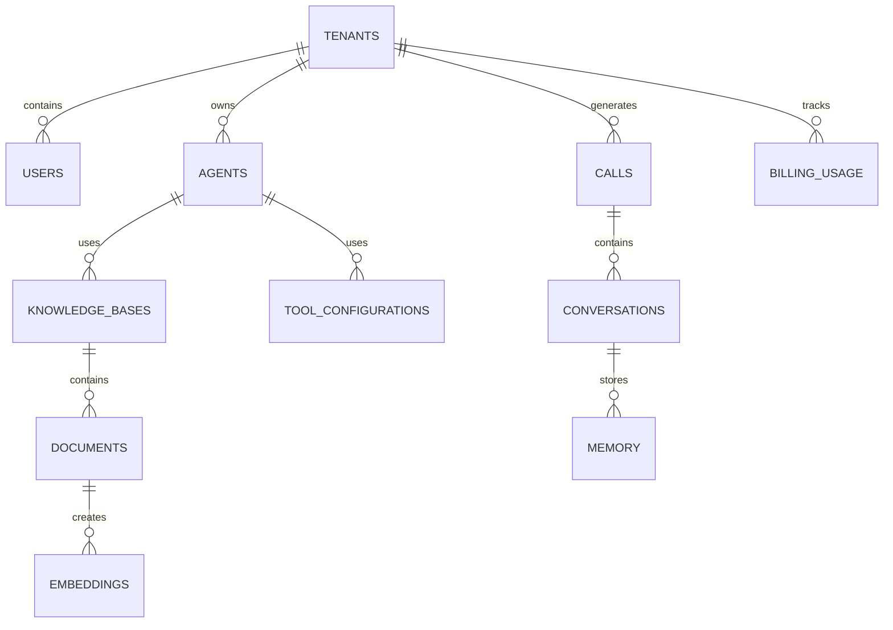

# Database Architecture Overview

**Document Version:** 1.0
**Project:** AI Voice Agent SaaS Platform
**Phase:** 05 - Database Schema
**Database Platform:** Supabase PostgreSQL
**Status:** Draft
**Last Updated:** 2026-07-23

---

# 1. Overview

This document defines the database architecture for the AI Voice Agent SaaS Platform.

The database layer is responsible for storing and managing:

* Tenant information
* Users
* AI agents
* Voice configurations
* Conversations
* Call records
* Knowledge bases
* RAG embeddings
* Memory
* Tool execution history
* Billing data
* Analytics
* Audit records

The database architecture is built on:

* Supabase PostgreSQL
* PostgreSQL extensions
* pgvector
* Row Level Security (RLS)

---

# 2. Database Architecture Position

```text
                    AI Voice SaaS Platform


                         Frontend
                       Next.js App

                            |
                            |
                            v

                    FastAPI Backend

                            |
                            |
                            v

                 Supabase PostgreSQL


        -----------------------------------------

        Core Data        AI Data        Operations

        Tenants          Agents         Analytics

        Users            RAG            Billing

        Calls            Memory         Audit Logs

        Conversations    Tools          Usage


        -----------------------------------------


              Supabase Storage

              Documents

              Recordings

              Files
```

---

# 3. Technology Stack

## Primary Database

```text
PostgreSQL
```

Used for:

* Relational data
* Transactions
* Business logic
* Reporting

---

## Supabase Services

```text
Supabase

├── PostgreSQL

├── Authentication

├── Storage

├── Realtime

└── Database Functions
```

---

## PostgreSQL Extensions

Required extensions:

```sql
CREATE EXTENSION IF NOT EXISTS vector;

CREATE EXTENSION IF NOT EXISTS pgcrypto;

CREATE EXTENSION IF NOT EXISTS uuid-ossp;
```

---

# 4. Database Design Principles

The database follows:

```text
Architecture Principles

├── Multi-Tenant By Design

├── Secure By Default

├── API First

├── Normalized Core Data

├── Optimized AI Retrieval

├── Auditable Changes

└── Scalable Operations
```

---

# 5. Multi-Tenant Database Model

The platform supports multiple organizations.

Example:

```text
Tenant A

    |
    +-- Users

    +-- Agents

    +-- Calls

    +-- Knowledge

    +-- Billing


Tenant B

    |
    +-- Users

    +-- Agents

    +-- Calls

    +-- Knowledge

    +-- Billing
```

---

# 6. Tenant Isolation Strategy

The database uses:

```text
Tenant Isolation

├── tenant_id Columns

├── PostgreSQL Row Level Security

├── API Authorization

├── Vector Metadata Filtering

└── Audit Tracking
```

---

# 7. High-Level Entity Model



---

# 8. Core Database Domains

The schema is divided into domains.

---

## Identity Domain

Tables:

```text
users

tenant_users

roles

permissions
```

---

## Tenant Domain

Tables:

```text
tenants

tenant_settings

tenant_limits
```

---

## Agent Domain

Tables:

```text
agents

agent_versions

agent_prompts

agent_models

agent_voice_settings
```

---

## Voice Domain

Tables:

```text
calls

call_sessions

call_participants

call_events

recordings
```

---

## Conversation Domain

Tables:

```text
conversations

messages

conversation_events
```

---

## RAG Domain

Tables:

```text
knowledge_bases

documents

document_chunks

embeddings
```

---

## Memory Domain

Tables:

```text
memory_records

customer_profiles

conversation_memory
```

---

## Automation Domain

Tables:

```text
tools

tool_executions

workflow_states
```

---

## Business Domain

Tables:

```text
subscriptions

usage_records

invoices
```

---

# 9. Data Flow Architecture

```text
Customer Call

↓

LiveKit Session

↓

Agent Runtime

↓

FastAPI Backend

↓

PostgreSQL


Additional Data:

Conversation

↓

Memory

↓

RAG Context

↓

Analytics
```

---

# 10. Storage Strategy

## PostgreSQL

Stores:

* Structured application data
* Metadata
* Relationships
* Transactions

---

## Supabase Storage

Stores:

* PDFs
* Documents
* Audio recordings
* Export files

---

## pgvector

Stores:

* Embeddings
* Semantic indexes
* Knowledge vectors

---

# 11. Database Security Model

Security layers:

```text
Security

├── Authentication

├── Authorization

├── RLS Policies

├── Encryption

├── Audit Logs

└── Access Control
```

---

# 12. Performance Strategy

Optimization includes:

```text
Performance

├── Proper Indexing

├── Connection Pooling

├── Query Optimization

├── Vector Indexes

├── Partitioning

└── Caching
```

---

# 13. Backup Strategy

Database backups:

```text
Backup

├── Daily Snapshots

├── Point In Time Recovery

├── Schema Backups

└── Migration Tracking
```

---

# 14. Migration Strategy

Schema changes are managed through:

```text
Migration Files

↓

Version Control

↓

Deployment Pipeline

↓

Production Database
```

Example:

```text
001_initial_schema.sql

002_agent_tables.sql

003_rag_tables.sql
```

---

# 15. Development Workflow

```text
Developer

↓

Create Migration

↓

Test Locally

↓

Review

↓

Apply Supabase Migration

↓

Deploy
```

---

# 16. Environment Separation

Database environments:

```text
Development

↓

Testing

↓

Staging

↓

Production
```

Each environment has:

* Separate database
* Separate credentials
* Separate storage

---

# 17. Database Naming Standards

Tables:

```text
snake_case_plural
```

Examples:

```text
agents

voice_calls

knowledge_documents
```

Primary keys:

```text
uuid
```

Foreign keys:

```text
<table>_id
```

---

# 18. Future Scalability

The database supports:

* Thousands of tenants
* Millions of conversations
* Large knowledge bases
* High-volume analytics

Future options:

* Read replicas
* Partitioning
* Dedicated databases for enterprise customers

---

# 19. Related Documents

| Document                               | Purpose          |
| -------------------------------------- | ---------------- |
| 01_Supabase_PostgreSQL_Architecture.md | Supabase details |
| 02_Multi_Tenant_Data_Model.md          | Tenant design    |
| 06_Agent_Configuration_Schema.md       | Agent tables     |
| 10_RAG_Knowledge_Base_Schema.md        | RAG design       |
| 18_RLS_Security_Policies.md            | Security         |

---

# 20. Conclusion

The database architecture provides the foundation for the AI Voice Agent SaaS platform.

It enables:

* Secure multi-tenancy
* AI knowledge retrieval
* Real-time voice operations
* Scalable SaaS growth
* Enterprise-grade data management

---

**End of Document**
