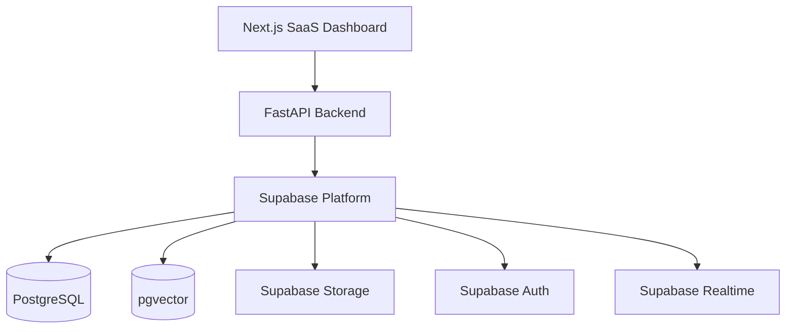

# Supabase PostgreSQL Architecture

**Document Version:** 1.0
**Project:** AI Voice Agent SaaS Platform
**Phase:** 05 - Database Schema
**Database Platform:** Supabase PostgreSQL
**Status:** Draft
**Last Updated:** 2026-07-23

---

# 1. Overview

This document defines the Supabase PostgreSQL architecture used by the AI Voice Agent SaaS Platform.

Supabase provides the managed PostgreSQL foundation while the application layer is handled by:

* Next.js frontend
* FastAPI backend
* LiveKit voice platform
* Agent Runtime
* LangChain RAG pipeline
* LangGraph workflows

---

# 2. Supabase Architecture Position



---

# 3. Supabase Components

Supabase provides the following services:

```text id="4c2e8r"
Supabase

├── PostgreSQL Database

├── Authentication

├── Storage

├── Realtime Engine

├── Database Functions

└── API Layer
```

---

# 4. PostgreSQL Database Layer

PostgreSQL is the primary source of truth.

Stores:

```text id="d4m1pq"
Application Data

├── Tenants

├── Users

├── Agents

├── Calls

├── Conversations

├── Knowledge Metadata

├── Billing

└── Analytics
```

---

# 5. Database Schema Organization

Recommended schema separation:

```sql id="4m7y8p"
public

auth

storage

analytics

billing

audit
```

---

# 6. Public Schema

Application tables:

```text id="0x3a7m"
public

├── tenants

├── users

├── agents

├── calls

├── conversations

├── messages

└── knowledge_bases
```

---

# 7. Auth Architecture

Supabase Auth manages:

* User authentication
* JWT generation
* Session management

Authentication flow:

```text id="n9x6w2"
User Login

↓

Supabase Auth

↓

JWT Token

↓

FastAPI Validation

↓

Database Access
```

---

# 8. Authentication Model

JWT contains:

```json id="gq5m7a"
{
 "sub":"user_uuid",
 "role":"authenticated",
 "tenant_id":"tenant_uuid"
}
```

The backend validates:

* User identity
* Tenant membership
* Permissions

---

# 9. FastAPI Integration Pattern

Recommended architecture:

```text id="5y3j8m"
Next.js

↓

JWT

↓

FastAPI

↓

Authorization Middleware

↓

Supabase PostgreSQL
```

---

# 10. Do Not Access Database Directly From Frontend

Recommended:

```text id="4zv3b1"
BAD:

Next.js

↓

Database


GOOD:

Next.js

↓

FastAPI

↓

Database
```

Reasons:

* Business logic protection
* Better security
* Tenant validation
* Audit control

---

# 11. Row Level Security Architecture

Supabase RLS protects tenant data.

Example:

```text id="v2g7x5"
Tenant A User

↓

Query Agents

↓

Returns Tenant A Agents Only
```

---

# 12. RLS Execution Flow

```text id="6f3c2k"
Request

↓

JWT

↓

Tenant Context

↓

RLS Policy

↓

Allowed Rows

↓

Response
```

---

# 13. pgvector Architecture

The RAG system uses PostgreSQL vector extension.

Architecture:

```text id="0m9x4h"
Document

↓

Chunking

↓

Embedding Model

↓

Vector Storage

↓

Similarity Search

↓

LLM Context
```

---

# 14. Vector Table Example

```sql id="r5j8k2"
document_chunks

id

tenant_id

document_id

content

embedding vector
```

---

# 15. Vector Isolation

Every vector record contains:

```text id="f9j3x6"
tenant_id
```

Search requires:

```sql id="3s7m1d"
WHERE tenant_id = current_tenant
```

---

# 16. Supabase Storage Architecture

Storage manages files:

```text id="b7v0n4"
Storage Buckets

├── knowledge-documents

├── call-recordings

├── exports

└── backups
```

---

# 17. Knowledge Upload Flow

```text id="k4q8x1"
User Uploads PDF

↓

Supabase Storage

↓

FastAPI Processing

↓

LangChain Ingestion

↓

Embeddings Created

↓

pgvector Stored
```

---

# 18. Call Recording Storage

Voice recordings:

```text id="p2m8q6"
LiveKit Recording

↓

Object Storage

↓

Database Metadata

↓

Tenant Access
```

---

# 19. Realtime Usage

Supabase Realtime can support:

* Dashboard updates
* Call status
* Agent status
* Notifications

Example:

```text id="d8m1k5"
Active Call

↓

Database Event

↓

Realtime Update

↓

Dashboard
```

---

# 20. Database Functions

Use PostgreSQL functions for:

* Complex queries
* Security operations
* Reporting calculations

Example:

```sql id="n6x2q4"
calculate_tenant_usage()
```

---

# 21. Database Extensions

Required:

```sql id="s9w4m2"
CREATE EXTENSION vector;

CREATE EXTENSION pgcrypto;

CREATE EXTENSION uuid-ossp;
```

---

# 22. Connection Management

Production:

```text id="m2q7v8"
FastAPI

↓

Connection Pool

↓

Supabase PostgreSQL
```

Recommended:

* Connection pooling
* Async database driver
* Query monitoring

---

# 23. Backup Architecture

Protection:

```text id="r4k9x1"
Database

↓

Snapshots

↓

Point In Time Recovery

↓

Restore Testing
```

---

# 24. Environment Architecture

Separate projects:

```text id="z7m3q8"
Supabase Development

↓

Supabase Staging

↓

Supabase Production
```

---

# 25. Production Recommendations

Enable:

* RLS on all tenant tables
* Database backups
* Monitoring
* Query optimization
* Migration versioning

---

# 26. Related Documents

| Document                             | Purpose           |
| ------------------------------------ | ----------------- |
| 00_Database_Architecture_Overview.md | Database overview |
| 02_Multi_Tenant_Data_Model.md        | Tenant isolation  |
| 18_RLS_Security_Policies.md          | Security policies |
| 22_SQL_Migrations                    | Migration scripts |

---

# 27. Conclusion

Supabase PostgreSQL provides a secure and scalable database foundation for the AI Voice Agent SaaS platform.

It supports:

* Multi-tenant SaaS architecture
* AI knowledge retrieval
* Real-time operations
* Secure application access
* Enterprise scalability

---

**End of Document**
