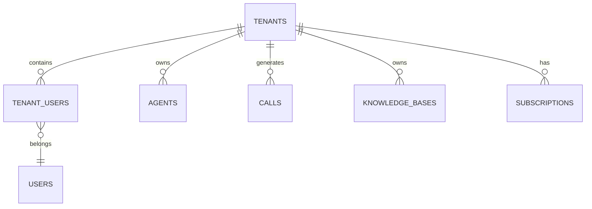

# Multi-Tenant Data Model

**Document Version:** 1.0
**Project:** AI Voice Agent SaaS Platform
**Phase:** 05 - Database Schema
**Database Platform:** Supabase PostgreSQL
**Status:** Draft
**Last Updated:** 2026-07-23

---

# 1. Overview

This document defines the multi-tenant database architecture for the AI Voice Agent SaaS platform.

The platform is designed as a Software-as-a-Service system where multiple organizations share the same application infrastructure while maintaining strict data isolation.

The tenant model supports:

* Multiple companies
* Multiple users per company
* Multiple AI agents per company
* Separate knowledge bases
* Separate conversations
* Separate billing
* Separate analytics

---

# 2. Multi-Tenant Architecture Model

The recommended architecture is:

```text id="7m4x8q"
Shared Infrastructure

        |
        |
        v

Shared PostgreSQL Database

        |
        |
        v

Tenant Isolation Layer

        |
 --------------------------------
 |              |               |
Tenant A     Tenant B       Tenant C

```

---

# 3. Tenant Isolation Strategy

The platform uses a shared database with logical isolation.

Isolation mechanisms:

```text id="3p9x6m"
Tenant Security

├── tenant_id on all business tables

├── PostgreSQL Row Level Security

├── API Authorization

├── JWT Tenant Claims

├── Vector Metadata Filtering

└── Audit Validation
```

---

# 4. Tenant Hierarchy Model



---

# 5. Tenant Entity

Primary table:

```text id="9m2v7k"
tenants
```

Purpose:

Stores customer organizations using the platform.

Example:

```json id="6z1r8p"
{
 "id":"uuid",
 "name":"ABC Company",
 "status":"active",
 "plan":"enterprise"
}
```

---

# 6. Tenant Table Design

```sql id="4q8x2n"
tenants

id UUID PRIMARY KEY

name TEXT

slug TEXT UNIQUE

status TEXT

plan_id UUID

created_at TIMESTAMP

updated_at TIMESTAMP
```

---

# 7. Tenant Status Lifecycle

```text id="1x7m9q"
TRIAL

↓

ACTIVE

↓

SUSPENDED

↓

CANCELLED

↓

ARCHIVED
```

---

# 8. User-Tenant Relationship

A user can belong to one or more tenants.

Example:

```text id="8q3m5v"
User

 |

 +---- Tenant A

 |

 +---- Tenant B
```

---

# 9. Tenant User Table

Purpose:

Maps users to organizations.

```sql id="6n2q8m"
tenant_users

id UUID

tenant_id UUID

user_id UUID

role TEXT

status TEXT

created_at TIMESTAMP
```

---

# 10. Tenant Roles

Recommended roles:

```text id="4m9x1q"
Owner

Administrator

Manager

Agent Designer

Analyst

Viewer
```

---

# 11. Role Permissions

Example:

| Role     | Permission       |
| -------- | ---------------- |
| Owner    | Full access      |
| Admin    | Manage tenant    |
| Manager  | Manage agents    |
| Designer | Configure agents |
| Analyst  | View reports     |
| Viewer   | Read only        |

---

# 12. Tenant Data Ownership

All business records contain:

```sql id="8p4x7m"
tenant_id UUID NOT NULL
```

Example:

```text id="0z6q9r"
agents

id

tenant_id

name
```

---

# 13. Tenant Data Flow

```text id="5x8m2q"
User Request

↓

JWT Token

↓

FastAPI

↓

Extract tenant_id

↓

Database Query

↓

RLS Validation

↓

Tenant Data Returned
```

---

# 14. Row Level Security Model

Example policy:

```sql id="3m8q5x"
CREATE POLICY tenant_isolation
ON agents

USING (
 tenant_id = current_setting('app.tenant_id')
);
```

---

# 15. RAG Tenant Isolation

Knowledge data also requires isolation.

Architecture:

```text id="7q2m9x"
Tenant A

Documents

↓

Chunks

↓

Embeddings


Tenant B

Documents

↓

Chunks

↓

Embeddings
```

Every vector contains:

```text id="5n8x3q"
tenant_id
```

---

# 16. Conversation Isolation

Conversation records:

```text id="2m7q9x"
Conversation

├── tenant_id

├── agent_id

├── customer_id

├── messages
```

---

# 17. Voice Call Isolation

Calls belong to:

```text id="9x4m6q"
Tenant

↓

Agent

↓

Call Session

↓

Conversation
```

---

# 18. Tenant Configuration Isolation

Each tenant manages:

```text id="6q3m8x"
Tenant

├── Agents

├── Prompts

├── Voices

├── Models

├── Tools

└── Knowledge
```

---

# 19. Enterprise Tenant Option

Future support:

Dedicated databases:

```text id="1q8m4x"
Enterprise Customer

↓

Dedicated PostgreSQL Instance

↓

Dedicated Storage

↓

Dedicated Workers
```

---

# 20. Tenant Resource Limits

Example:

```text id="7x5m2q"
Tenant Limits

├── Maximum Agents

├── Monthly Minutes

├── Storage Size

├── API Requests

└── Knowledge Documents
```

---

# 21. Tenant Usage Tracking

Track:

```text id="8m4q1x"
Usage

├── Voice Minutes

├── AI Tokens

├── Storage

├── API Calls

└── Agent Sessions
```

---

# 22. Tenant Deletion Strategy

Soft deletion:

```text id="3q7m9x"
ACTIVE

↓

DEACTIVATED

↓

DATA EXPORT

↓

ARCHIVED
```

---

# 23. Backup Considerations

Tenant data includes:

* Configuration
* Calls
* Conversations
* Knowledge
* Billing history

Backup strategy:

```text id="9m5x2q"
Database Backup

+

Storage Backup

+

Configuration Export
```

---

# 24. Security Requirements

Mandatory:

* RLS enabled
* Tenant validation
* Audit logging
* Permission checks
* Encrypted secrets

---

# 25. Related Documents

| Document                               | Purpose              |
| -------------------------------------- | -------------------- |
| 01_Supabase_PostgreSQL_Architecture.md | Database platform    |
| 03_Core_Entity_Model.md                | Entity relationships |
| 18_RLS_Security_Policies.md            | Security rules       |
| 17_Audit_Log_Schema.md                 | Audit tracking       |

---

# 26. Conclusion

The multi-tenant data model provides a secure foundation for a scalable AI Voice Agent SaaS platform.

It enables:

* Customer isolation
* Enterprise security
* Shared infrastructure efficiency
* Future dedicated deployments

---

**End of Document**
