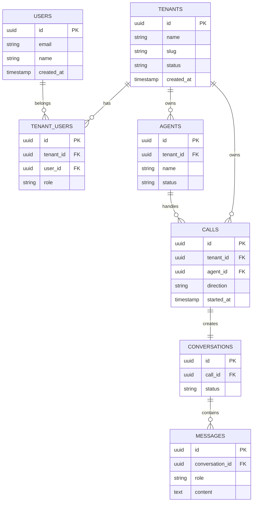

# Core Entity Model

**Document Version:** 1.0
**Project:** AI Voice Agent SaaS Platform
**Phase:** 05 - Database Schema
**Database Platform:** Supabase PostgreSQL
**Status:** Draft
**Last Updated:** 2026-07-23

---

# 1. Overview

This document defines the core entity model for the AI Voice Agent SaaS Platform.

The core entity model represents the primary business objects that power the platform.

These entities provide the foundation for:

* SaaS tenancy
* User management
* AI agent management
* Voice operations
* Knowledge systems
* Billing
* Analytics

---

# 2. Core Entity Architecture



---

# 3. Entity Categories

The database entities are grouped into domains:

```text id="8q4m1x"
Core Entities

├── Identity

├── Tenant Management

├── Agent Management

├── Voice Operations

├── AI Conversation

├── Knowledge System

├── Billing

└── Analytics
```

---

# 4. Tenant Entity

## Purpose

Represents a customer organization using the SaaS platform.

Example:

```text id="2m7x9q"
ABC Plumbing Services

↓

Tenant
```

---

## Table

```text id="5q8m3x"
tenants
```

---

## Main Attributes

| Field      | Description              |
| ---------- | ------------------------ |
| id         | Unique tenant identifier |
| name       | Organization name        |
| slug       | URL identifier           |
| status     | Account status           |
| created_at | Creation timestamp       |

---

# 5. User Entity

## Purpose

Represents a person accessing the platform.

Examples:

* Account owner
* Administrator
* Agent designer
* Analyst

---

## Table

```text id="7x2m9q"
users
```

---

## Relationship

```text id="1m8q4x"
User

belongs to

Tenant(s)
```

---

# 6. Tenant User Entity

## Purpose

Creates the relationship between users and organizations.

---

## Table

```text id="9q3m6x"
tenant_users
```

---

## Attributes

| Field     | Description       |
| --------- | ----------------- |
| tenant_id | Organization      |
| user_id   | User              |
| role      | Permission level  |
| status    | Membership status |

---

# 7. Agent Entity

## Purpose

Represents an AI voice agent.

Examples:

* Receptionist Agent
* Sales Agent
* Booking Agent
* Support Agent

---

## Table

```text id="4m7x2q"
agents
```

---

## Attributes

| Field     | Description      |
| --------- | ---------------- |
| id        | Agent identifier |
| tenant_id | Owner tenant     |
| name      | Agent name       |
| type      | Agent purpose    |
| status    | Active state     |

---

# 8. Agent Configuration Entities

Supporting entities:

```text id="8x5m1q"
agents

↓

agent_prompts

↓

agent_models

↓

agent_voice_settings

↓

agent_tools
```

---

# 9. Voice Call Entity

## Purpose

Represents a phone interaction.

---

## Table

```text id="6m9q3x"
calls
```

---

## Attributes

| Field     | Description      |
| --------- | ---------------- |
| id        | Call ID          |
| tenant_id | Tenant           |
| agent_id  | Agent            |
| direction | Inbound/Outbound |
| status    | Call status      |
| duration  | Length           |

---

# 10. Conversation Entity

## Purpose

Represents the AI conversation session.

---

## Table

```text id="2x7m9q"
conversations
```

---

## Relationship

```text id="4q8m1x"
Call

↓

Conversation

↓

Messages
```

---

# 11. Message Entity

## Purpose

Stores conversation exchanges.

Examples:

```text id="9m3x6q"
User:

"I need an appointment"


Agent:

"I can help schedule that"
```

---

## Table

```text id="7q2m5x"
messages
```

---

# 12. Knowledge Base Entity

## Purpose

Stores tenant AI knowledge collections.

Examples:

* Product documents
* FAQ
* Policies
* Training material

---

## Table

```text id="3m8x1q"
knowledge_bases
```

---

# 13. Document Entity

## Purpose

Stores uploaded knowledge files.

Relationship:

```text id="5x9m2q"
Knowledge Base

↓

Documents

↓

Chunks

↓

Embeddings
```

---

# 14. Memory Entity

## Purpose

Stores AI memory.

Types:

```text id="8m4x7q"
Memory

├── Conversation Memory

├── Customer Memory

└── Agent Memory
```

---

# 15. Tool Entity

## Purpose

Represents external actions available to agents.

Examples:

```text id="6q1m9x"
Tools

├── Calendar Booking

├── CRM Lookup

├── Payment

└── Email
```

---

# 16. Billing Entity

Represents commercial usage.

Includes:

```text id="3x7m8q"
Billing

├── Plans

├── Subscriptions

├── Usage

└── Invoices
```

---

# 17. Analytics Entity

Tracks:

* Calls
* Performance
* AI usage
* Costs
* Quality metrics

---

# 18. Common Entity Fields

Most tables contain:

```sql id="1q6m9x"
id UUID PRIMARY KEY

tenant_id UUID

created_at TIMESTAMP

updated_at TIMESTAMP
```

---

# 19. Entity Relationship Summary

```text id="7m3q8x"
Tenant

 ├── Users

 ├── Agents

 │     ├── Prompts

 │     ├── Tools

 │     └── Voice Settings

 ├── Calls

 │     └── Conversations

 │            └── Messages

 ├── Knowledge

 │     └── Documents

 │            └── Embeddings

 └── Billing
```

---

# 20. Design Principles

The model follows:

```text id="4x8m2q"
Principles

├── UUID Primary Keys

├── Tenant Ownership

├── Audit Fields

├── Soft Delete Support

├── Strong Relationships

└── Security Policies
```

---

# 21. Future Extensions

Possible additions:

* Human agent routing
* Contact center features
* Advanced CRM objects
* Marketplace agents
* Multi-agent teams

---

# 22. Related Documents

| Document                         | Purpose             |
| -------------------------------- | ------------------- |
| 02_Multi_Tenant_Data_Model.md    | Tenant architecture |
| 06_Agent_Configuration_Schema.md | Agent tables        |
| 07_Voice_Call_Schema.md          | Call database       |
| 10_RAG_Knowledge_Base_Schema.md  | Knowledge system    |

---

# 23. Conclusion

The Core Entity Model defines the foundation of the database architecture.

All future database modules build on these entities to create a scalable AI Voice Agent SaaS platform.

---

**End of Document**
