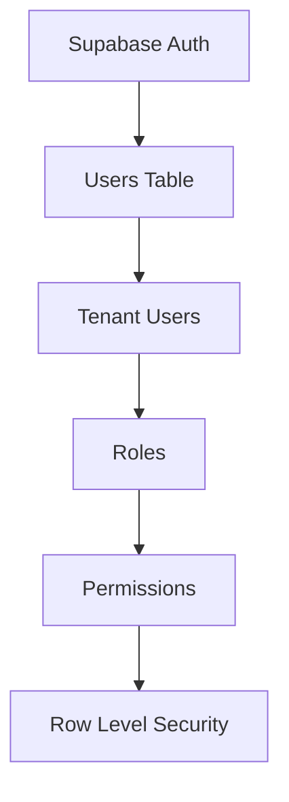

# User Management Schema

**Document Version:** 1.0
**Project:** AI Voice Agent SaaS Platform
**Phase:** 05 - Database Schema
**Database Platform:** Supabase PostgreSQL
**Status:** Draft
**Last Updated:** 2026-07-23

---

# 1. Overview

This document defines the user management database architecture.

The user management system controls:

* Platform users
* Tenant memberships
* Roles
* Permissions
* Access control
* User preferences
* Authentication mapping

The design integrates with:

* Supabase Auth
* PostgreSQL Row Level Security
* FastAPI authorization middleware

---

# 2. User Management Architecture



---

# 3. User Domain Entities

```text id="4x9m2q"
User Management

├── users

├── tenant_users

├── roles

├── permissions

├── role_permissions

└── user_preferences
```

---

# 4. Supabase Auth Integration

Supabase Auth manages:

* Authentication
* Password handling
* OAuth providers
* JWT sessions

The application stores business user data separately.

Architecture:

```text id="6m1q8x"
Supabase Auth User

        |

        |

users table

        |

        |

Tenant Membership
```

---

# 5. Users Table

## Purpose

Stores application user profiles.

Table:

```text id="8q3m5x"
users
```

---

## Schema

```sql id="9m2x7q"
CREATE TABLE users (

    id UUID PRIMARY KEY,

    auth_user_id UUID UNIQUE,

    email TEXT UNIQUE,

    full_name TEXT,

    avatar_url TEXT,

    status TEXT DEFAULT 'active',

    created_at TIMESTAMP,

    updated_at TIMESTAMP

);
```

---

# 6. User Fields

| Field        | Description             |
| ------------ | ----------------------- |
| id           | Internal user ID        |
| auth_user_id | Supabase Auth reference |
| email        | User email              |
| full_name    | Display name            |
| avatar_url   | Profile image           |
| status       | Account status          |

---

# 7. User Lifecycle

```text id="5q8m1x"
INVITED

↓

ACTIVE

↓

SUSPENDED

↓

DEACTIVATED
```

---

# 8. Tenant User Membership

A user can belong to multiple organizations.

Example:

```text id="3m7x9q"
John

 |

 +---- ABC Company

 |

 +---- XYZ Company
```

---

# 9. Tenant Users Table

## Purpose

Connects users with tenants.

Table:

```text id="7x2m4q"
tenant_users
```

---

## Schema

```sql id="2q8m5x"
CREATE TABLE tenant_users (

    id UUID PRIMARY KEY,

    tenant_id UUID NOT NULL,

    user_id UUID NOT NULL,

    role_id UUID NOT NULL,

    status TEXT,

    created_at TIMESTAMP,

    updated_at TIMESTAMP

);
```

---

# 10. User Roles

Roles define access level.

Default roles:

```text id="8m4q2x"
Owner

Administrator

Manager

Agent Designer

Analyst

Viewer
```

---

# 11. Roles Table

```sql id="4x7m9q"
roles

id UUID PRIMARY KEY

name TEXT

description TEXT

system_role BOOLEAN
```

---

# 12. Permissions Model

Permission examples:

```text id="6q3m8x"
agents.create

agents.update

agents.delete

calls.view

knowledge.upload

billing.manage
```

---

# 13. Permissions Table

```sql id="1m9q5x"
permissions

id UUID PRIMARY KEY

name TEXT

description TEXT
```

---

# 14. Role Permissions Mapping

Many-to-many relationship:

```text id="7m2x8q"
Role

  |

  |

Permissions
```

---

## Table

```sql id="5x8m3q"
role_permissions

role_id UUID

permission_id UUID
```

---

# 15. User Permission Flow

```text id="9q4m1x"
User Login

↓

Supabase Auth

↓

JWT

↓

Tenant Membership

↓

Role

↓

Permissions

↓

Allowed Actions
```

---

# 16. User Preferences

Stores:

* Language
* Timezone
* Notification settings
* Dashboard preferences

---

## Table

```sql id="3x7m9q"
user_preferences
```

---

## Schema

```sql id="8m2q5x"
user_preferences

id UUID PRIMARY KEY

user_id UUID

timezone TEXT

language TEXT

notifications JSONB
```

---

# 17. API Authorization Model

FastAPI checks:

```text id="6m8q2x"
Request

↓

JWT Validation

↓

User Identity

↓

Tenant Membership

↓

Permission Check

↓

Execute Action
```

---

# 18. Row Level Security

Example:

```sql id="2m7x9q"
CREATE POLICY user_tenant_access

ON tenant_users

USING (

tenant_id =
current_setting('app.tenant_id')::uuid

);
```

---

# 19. Audit Requirements

Track:

* User login
* Role changes
* Permission changes
* Tenant invitations
* Account changes

Related table:

```text id="5q9m3x"
audit_logs
```

---

# 20. Security Rules

Required:

```text id="8x4m1q"
Security

├── Never expose auth secrets

├── Validate JWT

├── Apply RLS

├── Verify tenant membership

└── Audit sensitive actions
```

---

# 21. User Invitation Flow

```text id="1x6m9q"
Admin Invites User

↓

Invitation Created

↓

Email Sent

↓

User Registers

↓

Tenant Membership Activated
```

---

# 22. Future Enhancements

Possible additions:

* Single Sign-On (SSO)
* Enterprise identity providers
* SCIM provisioning
* Advanced RBAC
* Attribute-based access control

---

# 23. Related Documents

| Document                      | Purpose           |
| ----------------------------- | ----------------- |
| 02_Multi_Tenant_Data_Model.md | Tenant isolation  |
| 18_RLS_Security_Policies.md   | Database security |
| 17_Audit_Log_Schema.md        | Activity tracking |

---

# 24. Conclusion

The User Management Schema provides secure identity and access management for the AI Voice Agent SaaS platform.

It supports:

* Multi-tenant users
* Role-based access control
* Supabase authentication
* Enterprise security requirements

---

**End of Document**
