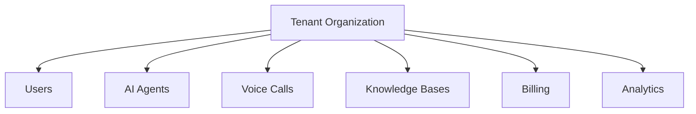
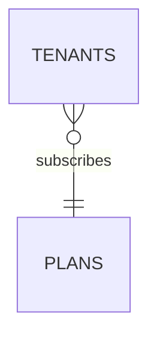

# Tenant Schema

**Document Version:** 1.0
**Project:** AI Voice Agent SaaS Platform
**Phase:** 05 - Database Schema
**Database Platform:** Supabase PostgreSQL
**Status:** Draft
**Last Updated:** 2026-07-23

---

# 1. Overview

This document defines the tenant database schema for the AI Voice Agent SaaS platform.

The tenant model represents customer organizations using the platform.

Each tenant owns and manages:

* AI agents
* Voice configurations
* Knowledge bases
* Conversations
* Calls
* Users
* Usage
* Billing

The tenant entity is the foundation of the multi-tenant SaaS architecture.

---

# 2. Tenant Architecture



---

# 3. Tenant Entity Lifecycle

```text id="9m2q7x"
Created

↓

Trial

↓

Active

↓

Suspended

↓

Cancelled

↓

Archived
```

---

# 4. Tenant Table

## Purpose

Stores organization-level information.

Table:

```text id="3x8m1q"
tenants
```

---

# 5. Tenant Schema

```sql id="5m7q2x"
CREATE TABLE tenants (

    id UUID PRIMARY KEY DEFAULT gen_random_uuid(),

    name TEXT NOT NULL,

    slug TEXT UNIQUE NOT NULL,

    status TEXT DEFAULT 'trial',

    plan_id UUID,

    settings JSONB DEFAULT '{}',

    created_at TIMESTAMP DEFAULT now(),

    updated_at TIMESTAMP DEFAULT now()

);
```

---

# 6. Tenant Fields

| Field      | Description              |
| ---------- | ------------------------ |
| id         | Unique tenant identifier |
| name       | Company name             |
| slug       | URL-friendly identifier  |
| status     | Account state            |
| plan_id    | Subscription plan        |
| settings   | Custom configuration     |
| created_at | Creation date            |
| updated_at | Last update              |

---

# 7. Tenant Settings

Tenant-specific configuration:

```json id="7q3m8x"
{
 "timezone":"America/New_York",
 "language":"en",
 "default_voice":"professional",
 "recording_enabled":true
}
```

---

# 8. Tenant Profile Information

Future extension:

```text id="4x9m2q"
tenant_profiles

├── Industry

├── Company Size

├── Address

├── Contact Information

└── Branding
```

---

# 9. Tenant Plan Relationship



---

# 10. Tenant Plans

Plans define:

* Features
* Limits
* Pricing

Examples:

```text id="8q1m5x"
Starter

Professional

Business

Enterprise
```

---

# 11. Tenant Limits

The platform controls usage:

```text id="5x7m3q"
Tenant Limits

├── Maximum Agents

├── Monthly Call Minutes

├── Storage Limit

├── Knowledge Documents

├── API Requests

└── Team Members
```

---

# 12. Tenant Limits Table

```sql id="1q9m4x"
tenant_limits

id UUID PRIMARY KEY

tenant_id UUID

max_agents INTEGER

max_minutes INTEGER

max_storage_mb INTEGER

max_users INTEGER
```

---

# 13. Tenant Configuration Model

```text id="3m8q6x"
Tenant

 |

 +-- Agent Settings

 |

 +-- Voice Settings

 |

 +-- Security Settings

 |

 +-- Billing Settings

 |

 +-- Integration Settings
```

---

# 14. Tenant Feature Flags

Feature control:

```sql id="7m2x9q"
tenant_features

id UUID

tenant_id UUID

feature_name TEXT

enabled BOOLEAN
```

---

Examples:

```text id="4q8m1x"
advanced_rag

voice_cloning

custom_tools

analytics
```

---

# 15. Tenant API Keys

Used for integrations:

```text id="9x3m7q"
tenant_api_keys

├── API Key

├── Name

├── Permissions

├── Expiration

└── Status
```

---

# 16. Tenant Branding

Supports white-label SaaS:

```text id="6m4q8x"
Branding

├── Logo

├── Colors

├── Company Name

└── Custom Domain
```

---

# 17. Tenant Onboarding Flow

```text id="2x7m9q"
Customer Signup

↓

Create Tenant

↓

Create Owner User

↓

Assign Plan

↓

Configure Settings

↓

Create First Agent
```

---

# 18. Tenant Access Control

Every tenant request requires:

```text id="8m5x1q"
Authenticated User

+

Tenant Membership

+

Permission Check

+

RLS Validation
```

---

# 19. Tenant Deactivation

When suspended:

Disable:

* New calls
* Agent execution
* API access

Preserve:

* Historical calls
* Conversations
* Billing records

---

# 20. Tenant Data Export

Enterprise requirement:

Export:

```text id="3q9m6x"
Tenant Export

├── Users

├── Agents

├── Calls

├── Conversations

├── Knowledge

└── Billing
```

---

# 21. Tenant Deletion Strategy

Recommended:

Soft delete first.

```text id="7x4m2q"
Active

↓

Deleted Requested

↓

Export Data

↓

Retention Period

↓

Permanent Delete
```

---

# 22. Security Requirements

Tenant tables require:

* UUID identifiers
* RLS policies
* Audit logging
* Encryption
* Access validation

---

# 23. Related Documents

| Document                      | Purpose             |
| ----------------------------- | ------------------- |
| 02_Multi_Tenant_Data_Model.md | Tenant architecture |
| 04_User_Management_Schema.md  | Users               |
| 18_RLS_Security_Policies.md   | Security            |
| 16_Billing_Usage_Schema.md    | Usage               |

---

# 24. Conclusion

The Tenant Schema provides the organizational foundation of the AI Voice Agent SaaS platform.

It enables:

* Secure customer separation
* SaaS scalability
* Enterprise configuration
* Usage management
* Future white-label capabilities

---

**End of Document**
