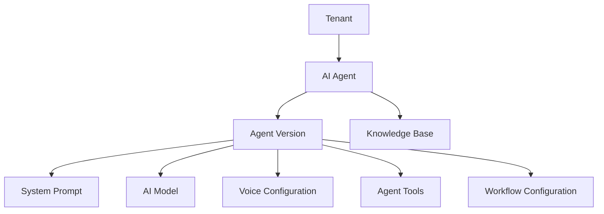

# Agent Configuration Schema

**Document Version:** 1.0
**Project:** AI Voice Agent SaaS Platform
**Phase:** 05 - Database Schema
**Database Platform:** Supabase PostgreSQL
**Status:** Draft
**Last Updated:** 2026-07-23

---

# 1. Overview

This document defines the database schema for AI Agent configuration.

The Agent Configuration domain stores everything required to create, customize, deploy, and operate AI voice agents.

An agent configuration controls:

* Agent identity
* Conversation behavior
* Voice settings
* AI models
* Prompts
* Tools
* Workflows
* Knowledge sources
* Runtime settings

---

# 2. Agent Configuration Architecture



---

# 3. Agent Domain Entities

```text id="4m8x2q"
Agent Configuration

├── agents

├── agent_versions

├── agent_prompts

├── agent_models

├── agent_voice_settings

├── agent_tools

├── agent_workflows

└── agent_runtime_settings
```

---

# 4. Agent Entity

## Purpose

Represents an AI agent owned by a tenant.

Examples:

* Receptionist Agent
* Sales Agent
* Booking Agent
* Customer Support Agent

---

## Table

```text id="7q3m9x"
agents
```

---

# 5. Agents Table Schema

```sql id="3x8m1q"
CREATE TABLE agents (

    id UUID PRIMARY KEY DEFAULT gen_random_uuid(),

    tenant_id UUID NOT NULL,

    name TEXT NOT NULL,

    description TEXT,

    agent_type TEXT,

    status TEXT DEFAULT 'draft',

    active_version_id UUID,

    created_at TIMESTAMP DEFAULT now(),

    updated_at TIMESTAMP DEFAULT now()

);
```

---

# 6. Agent Status Lifecycle

```text id="6m9q2x"
DRAFT

↓

CONFIGURED

↓

TESTING

↓

ACTIVE

↓

PAUSED

↓

ARCHIVED
```

---

# 7. Agent Types

Examples:

```text id="8x4m1q"
Receptionist

Sales

Support

Appointment Booking

Lead Qualification

Medical Assistant

Custom
```

---

# 8. Agent Versioning

Agents require version control.

Reason:

* Safe updates
* Rollback
* Testing
* Deployment history

Architecture:

```text id="2q7m9x"
Agent

 |

 +-- Version 1

 |

 +-- Version 2

 |

 +-- Version 3 (Active)
```

---

# 9. Agent Versions Table

```sql id="5m8x3q"
agent_versions

id UUID PRIMARY KEY

agent_id UUID

version_number INTEGER

status TEXT

configuration JSONB

created_at TIMESTAMP
```

---

# 10. Agent Prompt Configuration

Stores AI behavior instructions.

Examples:

* Personality
* Rules
* Conversation guidelines
* Business instructions

---

## Table

```text id="9q1m6x"
agent_prompts
```

---

Schema:

```sql id="4x7m2q"
agent_prompts

id UUID PRIMARY KEY

agent_version_id UUID

system_prompt TEXT

developer_prompt TEXT

created_at TIMESTAMP
```

---

# 11. Prompt Lifecycle

```text id="1m8q5x"
Draft Prompt

↓

Test

↓

Approve

↓

Deploy

↓

Monitor
```

---

# 12. AI Model Configuration

Controls model selection.

Examples:

* GPT model
* Local model
* Custom provider

---

## Table

```text id="7x3m9q"
agent_models
```

---

Schema:

```sql id="6q2m8x"
agent_models

id UUID PRIMARY KEY

agent_version_id UUID

provider TEXT

model_name TEXT

temperature FLOAT

max_tokens INTEGER
```

---

# 13. Voice Configuration

Controls speech behavior.

Stores:

* Voice provider
* Voice ID
* Speed
* Pitch
* Language

---

## Table

```text id="3m7x1q"
agent_voice_settings
```

---

Schema:

```sql id="8m4x2q"
agent_voice_settings

id UUID PRIMARY KEY

agent_version_id UUID

provider TEXT

voice_id TEXT

language TEXT

settings JSONB
```

---

# 14. Agent Tool Configuration

Tools allow agents to perform actions.

Examples:

```text id="5x9m3q"
Tools

├── Calendar Booking

├── CRM Search

├── Email

├── SMS

└── Payment
```

---

## Table

```text id="2q8m6x"
agent_tools
```

---

Schema:

```sql id="9m3x7q"
agent_tools

id UUID PRIMARY KEY

agent_id UUID

tool_name TEXT

configuration JSONB

enabled BOOLEAN
```

---

# 15. Workflow Configuration

Defines LangGraph workflows.

Example:

```text id="4m8x1q"
Greeting

↓

Intent Detection

↓

Knowledge Search

↓

Action

↓

Response
```

---

## Table

```text id="7q2m9x"
agent_workflows
```

---

Schema:

```sql id="1x6m8q"
agent_workflows

id UUID PRIMARY KEY

agent_version_id UUID

workflow_definition JSONB

created_at TIMESTAMP
```

---

# 16. Runtime Configuration

Controls execution behavior.

Examples:

* Timeout
* Retry rules
* Transfer settings
* Recording settings

---

## Table

```text id="5q7m2x"
agent_runtime_settings
```

---

Schema:

```sql id="8x3m9q"
agent_runtime_settings

id UUID PRIMARY KEY

agent_id UUID

settings JSONB
```

---

# 17. Agent Knowledge Assignment

Agents connect to knowledge bases.

Relationship:

```text id="2m9q4x"
Agent

↓

Knowledge Base

↓

Documents

↓

Embeddings
```

---

# 18. Agent Deployment

Deployment flow:

```text id="6x1m8q"
Create Agent

↓

Configure

↓

Test

↓

Publish Version

↓

Assign Runtime

↓

Receive Calls
```

---

# 19. Multi-Tenant Security

Every agent record contains:

```sql id="4q7m2x"
tenant_id UUID NOT NULL
```

Security:

* RLS policies
* Tenant validation
* Permission checks

---

# 20. Agent Configuration Validation

Before activation:

Check:

```text id="9m5x3q"
Validation

├── Prompt Exists

├── Model Selected

├── Voice Configured

├── Tools Valid

├── Knowledge Connected

└── Runtime Settings Ready
```

---

# 21. Agent Analytics Connection

Agent performance tracks:

* Calls handled
* Success rate
* Response latency
* Token usage
* Customer satisfaction

---

# 22. Future Extensions

Future support:

* Agent marketplace
* Agent templates
* Multi-agent teams
* Agent collaboration
* Self-improving agents

---

# 23. Related Documents

| Document                        | Purpose           |
| ------------------------------- | ----------------- |
| 03_Core_Entity_Model.md         | Entity foundation |
| 07_Voice_Call_Schema.md         | Call data         |
| 10_RAG_Knowledge_Base_Schema.md | Knowledge system  |
| 14_Workflow_State_Schema.md     | Workflow storage  |

---

# 24. Conclusion

The Agent Configuration Schema defines the foundation for creating and managing AI voice agents.

It supports:

* Version-controlled agents
* Custom AI behavior
* Voice customization
* Tool execution
* LangGraph workflows
* Multi-tenant SaaS deployment

---

**End of Document**
