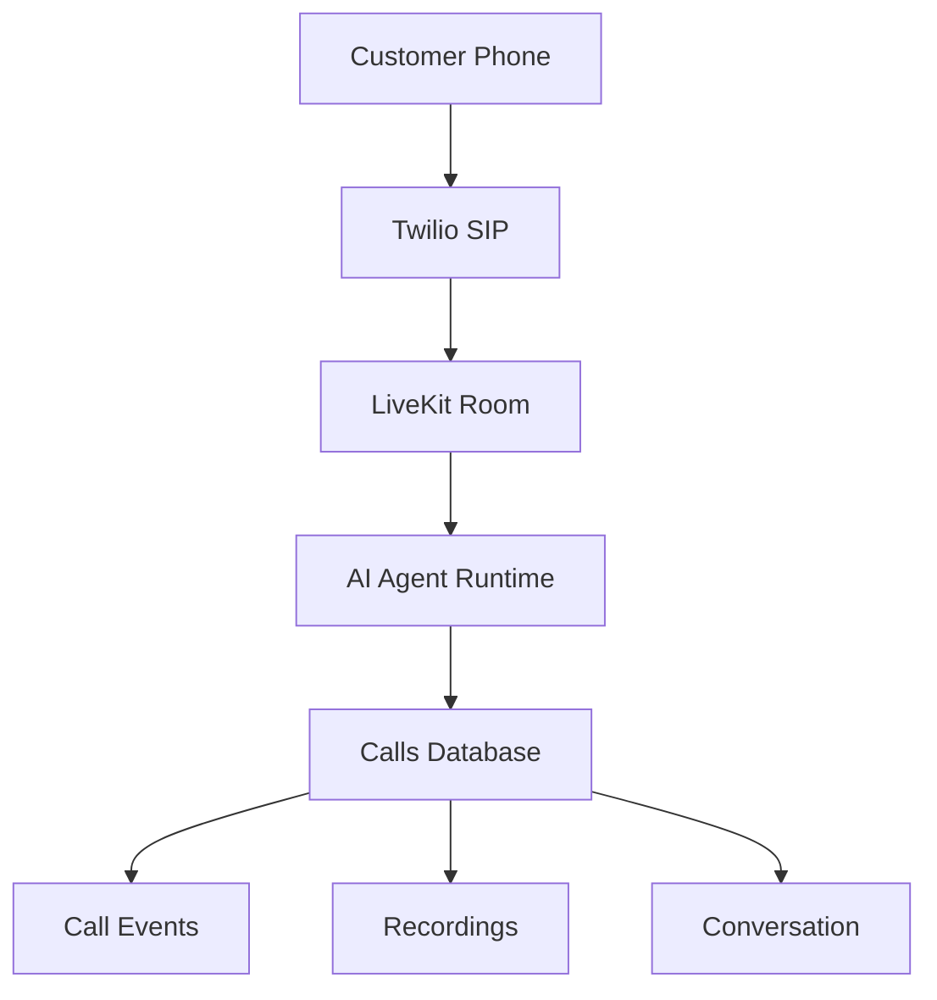

# Voice Call Schema

**Document Version:** 1.0
**Project:** AI Voice Agent SaaS Platform
**Phase:** 05 - Database Schema
**Database Platform:** Supabase PostgreSQL
**Status:** Draft
**Last Updated:** 2026-07-23

---

# 1. Overview

This document defines the database schema for voice call management.

The Voice Call domain stores all information related to:

* Inbound calls
* Outbound calls
* LiveKit sessions
* Twilio SIP connections
* Call participants
* Call events
* Recordings
* Call metrics

The schema supports real-time AI voice operations and enterprise call analytics.

---

# 2. Voice Call Architecture



---

# 3. Voice Domain Entities

```text
Voice Platform Database

├── calls

├── call_sessions

├── call_participants

├── call_events

├── recordings

├── call_transfers

└── call_metrics
```

---

# 4. Call Entity

## Purpose

Represents a customer voice interaction.

A call connects:

```text
Customer

↓

Phone Network

↓

LiveKit Session

↓

AI Agent

↓

Conversation
```

---

# 5. Calls Table

```sql
CREATE TABLE calls (

    id UUID PRIMARY KEY DEFAULT gen_random_uuid(),

    tenant_id UUID NOT NULL,

    agent_id UUID NOT NULL,

    direction TEXT NOT NULL,

    status TEXT DEFAULT 'initiated',

    phone_number TEXT,

    started_at TIMESTAMP,

    ended_at TIMESTAMP,

    duration_seconds INTEGER,

    created_at TIMESTAMP DEFAULT now()

);
```

---

# 6. Call Fields

| Field        | Description            |
| ------------ | ---------------------- |
| id           | Unique call identifier |
| tenant_id    | Customer organization  |
| agent_id     | AI agent handling call |
| direction    | inbound/outbound       |
| status       | Current state          |
| phone_number | Caller/callee          |
| duration     | Call duration          |

---

# 7. Call Direction

Supported:

```text
INBOUND

Customer calls business

        ↓

AI Agent answers
```

and:

```text
OUTBOUND

AI Agent calls customer

        ↓

Conversation starts
```

---

# 8. Call Lifecycle

```text
CREATED

↓

RINGING

↓

CONNECTED

↓

ACTIVE

↓

TRANSFERRED

↓

COMPLETED

↓

FAILED
```

---

# 9. Call Status Values

Recommended:

```text
initiated

ringing

connected

active

completed

failed

cancelled

transferred
```

---

# 10. LiveKit Session Mapping

Each call creates a LiveKit session.

Relationship:

```text
Call

↓

LiveKit Room

↓

Agent Participant

↓

Customer Participant
```

---

# 11. Call Sessions Table

Purpose:

Stores real-time communication session data.

```sql
call_sessions

id UUID PRIMARY KEY

call_id UUID

livekit_room_id TEXT

livekit_session_id TEXT

started_at TIMESTAMP

ended_at TIMESTAMP
```

---

# 12. SIP Metadata Storage

Stores Twilio SIP information.

```sql
sip_metadata

id UUID

call_id UUID

provider TEXT

sip_call_sid TEXT

sip_trunk_id TEXT

metadata JSONB
```

---

# 13. Call Participants

A call may contain multiple participants.

Examples:

* Customer
* AI Agent
* Human Agent

---

Table:

```text
call_participants
```

Schema:

```sql
call_participants

id UUID PRIMARY KEY

call_id UUID

participant_type TEXT

identity TEXT

joined_at TIMESTAMP

left_at TIMESTAMP
```

---

# 14. Participant Types

```text
customer

ai_agent

human_agent

supervisor

system
```

---

# 15. Call Events

Every important action is recorded.

Examples:

```text
Call Started

Agent Joined

User Spoke

Tool Executed

Transfer Started

Call Ended
```

---

Table:

```text
call_events
```

---

Schema:

```sql
call_events

id UUID PRIMARY KEY

call_id UUID

event_type TEXT

event_data JSONB

created_at TIMESTAMP
```

---

# 16. Event Timeline Example

```text
10:00:00

Call Started


10:00:03

AI Agent Joined


10:00:05

Customer Speech Detected


10:00:07

RAG Search Executed


10:00:09

Response Generated


10:05:00

Call Completed
```

---

# 17. Call Recording Schema

Stores recording information.

Table:

```text
recordings
```

---

Schema:

```sql
recordings

id UUID PRIMARY KEY

call_id UUID

storage_path TEXT

duration_seconds INTEGER

format TEXT

created_at TIMESTAMP
```

---

# 18. Recording Storage

Recommended:

```text
LiveKit Recording

↓

Supabase Storage

↓

Database Metadata
```

Storage bucket:

```text
call-recordings
```

---

# 19. Call Transfer Schema

Supports AI-to-human transfer.

Flow:

```text
AI Agent

↓

Transfer Request

↓

Human Agent

↓

Live Conversation
```

---

Table:

```text
call_transfers
```

---

Schema:

```sql
call_transfers

id UUID PRIMARY KEY

call_id UUID

from_agent TEXT

to_destination TEXT

reason TEXT

created_at TIMESTAMP
```

---

# 20. Call Metrics

Stores performance data.

Metrics:

* Latency
* Duration
* AI response time
* Interruptions
* Transfer rate

---

Table:

```text
call_metrics
```

---

Schema:

```sql
call_metrics

id UUID PRIMARY KEY

call_id UUID

first_response_time_ms INTEGER

average_latency_ms INTEGER

customer_sentiment TEXT
```

---

# 21. Call Analytics

Generated from:

```text
Calls

+

Events

+

Conversation Data

+

AI Metrics
```

---

# 22. Multi-Tenant Security

All call tables require:

```sql
tenant_id UUID NOT NULL
```

Security:

* RLS policies
* Tenant validation
* Permission checks

---

# 23. Index Strategy

Recommended indexes:

```sql
CREATE INDEX idx_calls_tenant
ON calls(tenant_id);

CREATE INDEX idx_calls_agent
ON calls(agent_id);

CREATE INDEX idx_events_call
ON call_events(call_id);
```

---

# 24. Data Retention

Configurable:

```text
Free Plan

30 Days


Business Plan

1 Year


Enterprise

Custom Retention
```

---

# 25. Related Documents

| Document                         | Purpose              |
| -------------------------------- | -------------------- |
| 06_Agent_Configuration_Schema.md | Agent data           |
| 08_Conversation_Schema.md        | Conversation storage |
| 09_LiveKit_Session_Schema.md     | LiveKit mapping      |
| 17_Audit_Log_Schema.md           | Audit records        |

---

# 26. Conclusion

The Voice Call Schema provides the database foundation for real-time AI voice operations.

It supports:

* Twilio SIP calls
* LiveKit sessions
* AI agent execution
* Human transfers
* Recording management
* Enterprise analytics

---

**End of Document**
