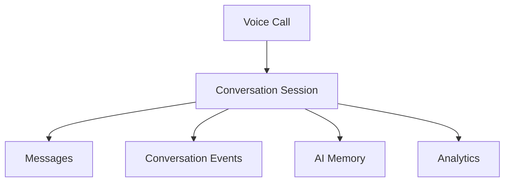

# Conversation Schema

**Document Version:** 1.0
**Project:** AI Voice Agent SaaS Platform
**Phase:** 05 - Database Schema
**Database Platform:** Supabase PostgreSQL
**Status:** Draft
**Last Updated:** 2026-07-23

---

# 1. Overview

This document defines the conversation database schema for the AI Voice Agent SaaS platform.

The Conversation domain stores the complete interaction history between:

* Customers
* AI Agents
* Human Agents
* External systems

It provides the foundation for:

* Conversation history
* AI memory
* Analytics
* Quality monitoring
* Training data
* Compliance

---

# 2. Conversation Architecture



---

# 3. Conversation Domain Entities

```text id="8m4q1x"
Conversation System

├── conversations

├── messages

├── message_metadata

├── conversation_events

├── conversation_participants

├── summaries

└── feedback
```

---

# 4. Conversation Entity

## Purpose

Represents one complete customer interaction.

A conversation may happen through:

* Phone call
* Web chat
* SMS
* Future channels

---

Table:

```text id="3x7m9q"
conversations
```

---

# 5. Conversations Table Schema

```sql id="7m2x5q"
CREATE TABLE conversations (

    id UUID PRIMARY KEY DEFAULT gen_random_uuid(),

    tenant_id UUID NOT NULL,

    call_id UUID,

    agent_id UUID NOT NULL,

    customer_id UUID,

    status TEXT DEFAULT 'active',

    started_at TIMESTAMP,

    ended_at TIMESTAMP,

    created_at TIMESTAMP DEFAULT now()

);
```

---

# 6. Conversation Fields

| Field       | Description             |
| ----------- | ----------------------- |
| id          | Conversation identifier |
| tenant_id   | Tenant owner            |
| call_id     | Related voice call      |
| agent_id    | AI agent                |
| customer_id | Customer identity       |
| status      | Conversation state      |

---

# 7. Conversation Lifecycle

```text id="4q8m9x"
CREATED

↓

ACTIVE

↓

PAUSED

↓

COMPLETED

↓

ARCHIVED
```

---

# 8. Conversation Status

Supported:

```text id="9m1x7q"
active

completed

failed

transferred

archived
```

---

# 9. Message Entity

## Purpose

Stores every conversational exchange.

Examples:

```text id="6x3m8q"
Customer:

"I need to schedule an appointment"


AI:

"I can help you with that"
```

---

Table:

```text id="2m9x4q"
messages
```

---

# 10. Messages Table Schema

```sql id="5q7m3x"
CREATE TABLE messages (

    id UUID PRIMARY KEY DEFAULT gen_random_uuid(),

    conversation_id UUID NOT NULL,

    role TEXT NOT NULL,

    content TEXT,

    message_type TEXT,

    created_at TIMESTAMP DEFAULT now()

);
```

---

# 11. Message Roles

Supported:

```text id="7x1m9q"
system

assistant

user

tool

human_agent
```

---

# 12. Message Types

Examples:

```text id="3m8q6x"
text

voice_transcript

tool_result

system_event

handoff_message
```

---

# 13. Conversation Timeline

Example:

```text id="8q4m2x"
09:00:00

Conversation Started


09:00:05

Customer Message


09:00:06

AI Response


09:00:08

Tool Called


09:00:12

Booking Confirmed


09:02:00

Conversation Ended
```

---

# 14. Message Metadata

Stores additional information:

```text id="1x7m9q"
Metadata

├── STT confidence

├── Token usage

├── Model response time

├── Voice timing

└── Tool references
```

---

Table:

```text id="6m2q8x"
message_metadata
```

---

Schema:

```sql id="4x9m3q"
message_metadata

id UUID PRIMARY KEY

message_id UUID

metadata JSONB

created_at TIMESTAMP
```

---

# 15. Conversation Events

Tracks state changes.

Examples:

```text id="5m8x1q"
Agent Started

Intent Detected

RAG Search

Tool Execution

Transfer

Completion
```

---

Table:

```text id="7q3m9x"
conversation_events
```

---

Schema:

```sql id="9x2m5q"
conversation_events

id UUID PRIMARY KEY

conversation_id UUID

event_type TEXT

event_data JSONB

created_at TIMESTAMP
```

---

# 16. Conversation Participants

Stores involved parties.

```text id="3q8m1x"
Participants

Customer

AI Agent

Human Agent

System
```

---

Table:

```text id="6x4m9q"
conversation_participants
```

---

Schema:

```sql id="1m7q5x"
conversation_participants

id UUID PRIMARY KEY

conversation_id UUID

participant_type TEXT

participant_id UUID
```

---

# 17. Conversation Summary

AI-generated summaries.

Used for:

* Agent memory
* Customer history
* Analytics

---

Table:

```text id="8m3x2q"
conversation_summaries
```

---

Schema:

```sql id="4q9m6x"
conversation_summaries

id UUID PRIMARY KEY

conversation_id UUID

summary TEXT

generated_by TEXT

created_at TIMESTAMP
```

---

# 18. AI Memory Connection

Conversation data feeds memory.

Architecture:

```text id="2x8m5q"
Conversation

↓

Summary Generation

↓

Memory Service

↓

Long-Term Customer Memory
```

---

# 19. Customer Context

Future support:

```text id="7m1x9q"
customers

├── Name

├── Phone

├── Preferences

├── History

└── Attributes
```

---

# 20. Conversation Analytics

Metrics:

```text id="5x3m8q"
Analytics

├── Duration

├── Sentiment

├── Resolution

├── Intent

├── CSAT

└── Success Rate
```

---

# 21. RAG Context Tracking

Store retrieved knowledge references:

```text id="9q2m7x"
Message

↓

Retrieved Documents

↓

Sources Used
```

Example:

```sql id="4m8x3q"
message_sources

message_id

document_chunk_id

similarity_score
```

---

# 22. Multi-Tenant Security

All conversation tables contain:

```sql id="6q1m8x"
tenant_id UUID NOT NULL
```

Protected by:

* RLS
* API authorization
* Audit logging

---

# 23. Index Strategy

Recommended:

```sql id="8x4m2q"
CREATE INDEX idx_conversations_tenant
ON conversations(tenant_id);


CREATE INDEX idx_messages_conversation
ON messages(conversation_id);
```

---

# 24. Data Retention

Retention depends on:

* Subscription plan
* Compliance requirements
* Industry rules

Example:

```text id="3m7q9x"
Standard

90 Days


Enterprise

Custom Retention
```

---

# 25. Related Documents

| Document                        | Purpose        |
| ------------------------------- | -------------- |
| 07_Voice_Call_Schema.md         | Call data      |
| 09_LiveKit_Session_Schema.md    | Voice sessions |
| 12_Memory_System_Schema.md      | AI memory      |
| 10_RAG_Knowledge_Base_Schema.md | RAG system     |

---

# 26. Conclusion

The Conversation Schema provides the foundation for storing and understanding AI-human interactions.

It enables:

* Complete conversation history
* AI memory
* RAG traceability
* Analytics
* Enterprise auditing

---

**End of Document**
