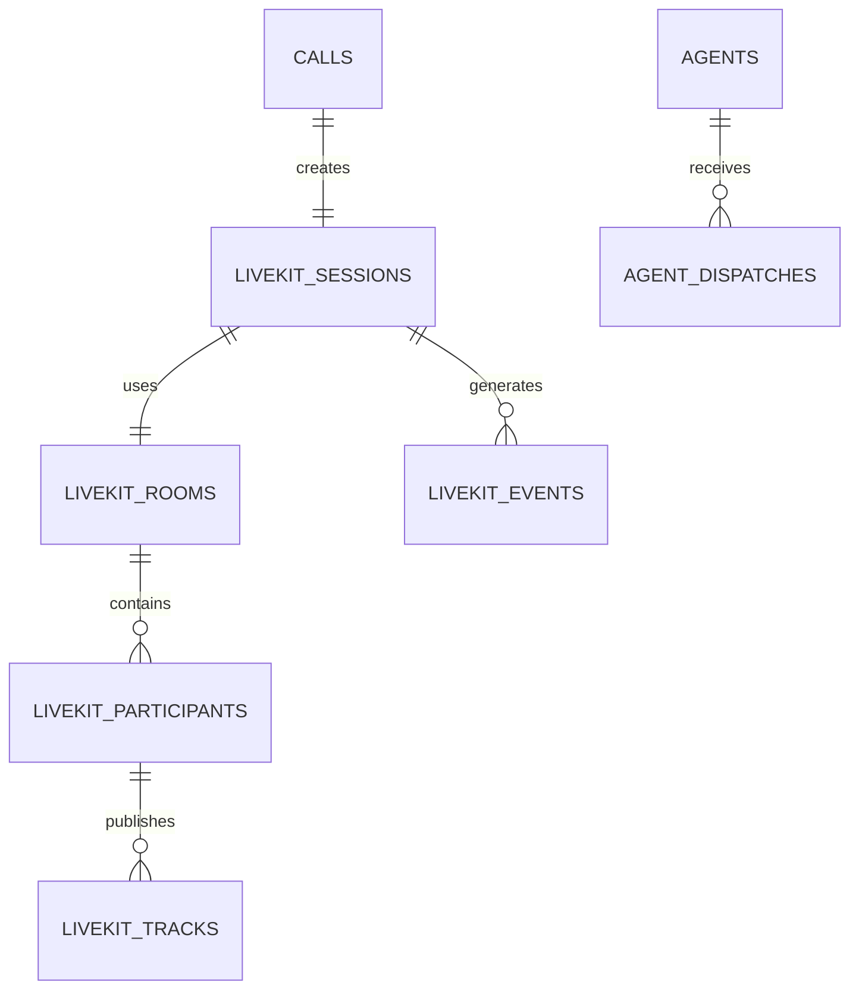

# LiveKit Session Schema

**Document Version:** 1.0
**Project:** AI Voice Agent SaaS Platform
**Phase:** 05 - Database Schema
**Database Platform:** Supabase PostgreSQL
**Status:** Draft
**Last Updated:** 2026-07-23

---

# 1. Overview

This document defines the database schema for LiveKit session management.

The LiveKit Session domain stores the relationship between:

* Customer phone calls
* Twilio SIP connections
* LiveKit rooms
* AI agent workers
* Participants
* Real-time media sessions
* Voice events

LiveKit acts as the real-time communication layer of the AI Voice Agent platform.

---

# 2. LiveKit Architecture Position

```text
Customer Phone

        |
        |
        v

     Twilio SIP

        |
        |
        v

   LiveKit SIP Gateway

        |
        |
        v

  LiveKit Room Session

        |
        |
        v

 AI Agent Worker

        |
        |
        v

 PostgreSQL Database
```

---

# 3. LiveKit Database Domain

```text
LiveKit Session Management

├── livekit_rooms

├── livekit_sessions

├── livekit_participants

├── livekit_tracks

├── livekit_events

├── agent_dispatches

└── sip_connections
```

---

# 4. LiveKit Entity Relationship



---

# 5. LiveKit Room Entity

## Purpose

Stores the LiveKit communication room.

A room represents the real-time audio session.

Example:

```text
Room

↓

Customer

+

AI Agent

+

Optional Human Agent
```

---

# 6. LiveKit Rooms Table

```sql
CREATE TABLE livekit_rooms (

    id UUID PRIMARY KEY DEFAULT gen_random_uuid(),

    tenant_id UUID NOT NULL,

    call_id UUID NOT NULL,

    room_name TEXT UNIQUE NOT NULL,

    status TEXT DEFAULT 'created',

    created_at TIMESTAMP DEFAULT now(),

    closed_at TIMESTAMP

);
```

---

# 7. Room Lifecycle

```text
CREATED

↓

CONNECTED

↓

ACTIVE

↓

CLOSING

↓

CLOSED
```

---

# 8. LiveKit Session Entity

## Purpose

Stores a complete runtime session.

Relationship:

```text
Call

↓

LiveKit Session

↓

Room

↓

Participants
```

---

# 9. LiveKit Sessions Table

```sql
CREATE TABLE livekit_sessions (

    id UUID PRIMARY KEY DEFAULT gen_random_uuid(),

    tenant_id UUID NOT NULL,

    call_id UUID NOT NULL,

    room_id UUID NOT NULL,

    livekit_session_id TEXT,

    agent_worker_id TEXT,

    started_at TIMESTAMP,

    ended_at TIMESTAMP,

    created_at TIMESTAMP DEFAULT now()

);
```

---

# 10. Session Status

```text
INITIALIZING

↓

CONNECTING

↓

ACTIVE

↓

DISCONNECTED

↓

FAILED
```

---

# 11. LiveKit Participant Entity

A room can contain multiple participants.

Examples:

```text
Customer

AI Agent

Human Agent

Supervisor
```

---

# 12. Participants Table

```sql
CREATE TABLE livekit_participants (

    id UUID PRIMARY KEY DEFAULT gen_random_uuid(),

    room_id UUID NOT NULL,

    identity TEXT NOT NULL,

    participant_type TEXT,

    joined_at TIMESTAMP,

    left_at TIMESTAMP

);
```

---

# 13. Participant Types

```text
customer

ai_agent

human_agent

operator

system
```

---

# 14. Track Management

LiveKit tracks represent media streams.

Examples:

* Audio input
* Audio output
* Data messages

---

# 15. Tracks Table

```sql
CREATE TABLE livekit_tracks (

    id UUID PRIMARY KEY DEFAULT gen_random_uuid(),

    participant_id UUID NOT NULL,

    track_type TEXT,

    track_sid TEXT,

    created_at TIMESTAMP

);
```

---

# 16. Track Types

```text
audio_input

audio_output

data_channel
```

---

# 17. Agent Dispatch Model

LiveKit dispatches AI workers.

Flow:

```text
Incoming Call

↓

Create Room

↓

Dispatch Agent

↓

Agent Worker Joins

↓

Conversation Starts
```

---

# 18. Agent Dispatch Table

```sql
CREATE TABLE agent_dispatches (

    id UUID PRIMARY KEY DEFAULT gen_random_uuid(),

    tenant_id UUID NOT NULL,

    agent_id UUID NOT NULL,

    room_name TEXT,

    worker_id TEXT,

    status TEXT,

    created_at TIMESTAMP

);
```

---

# 19. Dispatch Status

```text
REQUESTED

↓

ASSIGNED

↓

RUNNING

↓

COMPLETED

↓

FAILED
```

---

# 20. Twilio SIP Connection Mapping

Stores PSTN information.

Relationship:

```text
Twilio SIP

↓

LiveKit Session

↓

Call Record
```

---

# 21. SIP Connections Table

```sql
CREATE TABLE sip_connections (

    id UUID PRIMARY KEY DEFAULT gen_random_uuid(),

    call_id UUID NOT NULL,

    provider TEXT,

    sip_call_sid TEXT,

    trunk_id TEXT,

    metadata JSONB,

    created_at TIMESTAMP

);
```

---

# 22. LiveKit Events

Stores runtime events.

Examples:

```text
Room Created

Participant Joined

Track Published

Agent Connected

Participant Left
```

---

# 23. LiveKit Events Table

```sql
CREATE TABLE livekit_events (

    id UUID PRIMARY KEY DEFAULT gen_random_uuid(),

    session_id UUID,

    event_type TEXT,

    event_data JSONB,

    created_at TIMESTAMP DEFAULT now()

);
```

---

# 24. Real-Time Data Flow

```text
Twilio Webhook

↓

FastAPI

↓

Create Call

↓

Create LiveKit Room

↓

Dispatch Agent

↓

Agent Connects

↓

Store Session Data

↓

Conversation Begins
```

---

# 25. Security Model

All LiveKit records require:

```sql
tenant_id UUID NOT NULL
```

Protection:

* RLS policies
* API authorization
* Signed access tokens
* Audit logging

---

# 26. Index Strategy

Recommended:

```sql
CREATE INDEX idx_livekit_room_call
ON livekit_rooms(call_id);


CREATE INDEX idx_livekit_session_tenant
ON livekit_sessions(tenant_id);


CREATE INDEX idx_livekit_events_session
ON livekit_events(session_id);
```

---

# 27. Data Retention

LiveKit metadata retention:

```text
Session Metadata

Long Term


Media Files

Configurable Storage Policy


Event Logs

90-365 Days
```

---

# 28. Related Documents

| Document                         | Purpose              |
| -------------------------------- | -------------------- |
| 07_Voice_Call_Schema.md          | Call management      |
| 08_Conversation_Schema.md        | Conversation storage |
| 06_Agent_Configuration_Schema.md | Agent setup          |
| 37_Observability                 | Runtime monitoring   |

---

# 29. Conclusion

The LiveKit Session Schema connects the real-time voice infrastructure with the SaaS database layer.

It supports:

* Twilio SIP integration
* LiveKit room management
* AI worker dispatch
* Voice session tracking
* Real-time analytics

---

**End of Document**
