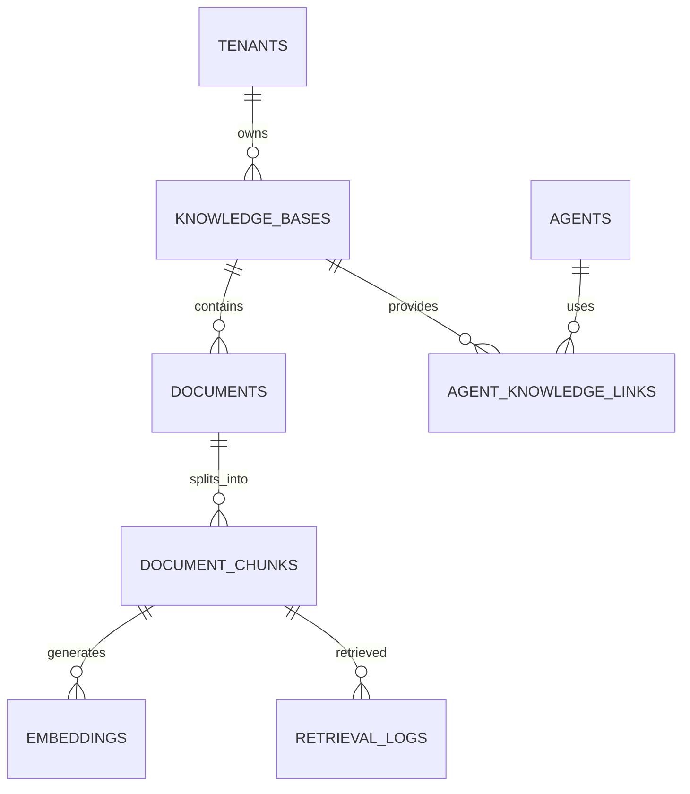

# RAG Knowledge Base Schema

**Document Version:** 1.0
**Project:** AI Voice Agent SaaS Platform
**Phase:** 05 - Database Schema
**Database Platform:** Supabase PostgreSQL + pgvector
**AI Framework:** LangChain
**Status:** Draft
**Last Updated:** 2026-07-23

---

# 1. Overview

This document defines the database schema for the Retrieval-Augmented Generation (RAG) knowledge system.

The RAG system enables AI agents to retrieve tenant-specific knowledge and generate accurate responses.

The architecture uses:

* Supabase PostgreSQL
* pgvector extension
* LangChain ingestion pipeline
* Embedding models
* Vector similarity search

---

# 2. RAG Architecture Position

```text id="7x9m2q"
Customer Question

        |

        v

AI Agent Runtime

        |

        v

LangChain Retriever

        |

        v

pgvector Similarity Search

        |

        v

Relevant Knowledge Chunks

        |

        v

LLM Context

        |

        v

AI Response
```

---

# 3. RAG Database Domain

```text id="3m8q7x"
RAG Knowledge System

├── knowledge_bases

├── knowledge_sources

├── documents

├── document_versions

├── document_chunks

├── embeddings

├── retrieval_logs

└── agent_knowledge_links
```

---

# 4. RAG Entity Relationship



---

# 5. Knowledge Base Entity

## Purpose

A knowledge base is a collection of documents available to AI agents.

Examples:

* Company FAQ
* Product documentation
* Policies
* Pricing information
* Internal manuals

---

# 6. Knowledge Bases Table

```sql id="8m3q9x"
CREATE TABLE knowledge_bases (

    id UUID PRIMARY KEY DEFAULT gen_random_uuid(),

    tenant_id UUID NOT NULL,

    name TEXT NOT NULL,

    description TEXT,

    status TEXT DEFAULT 'active',

    settings JSONB DEFAULT '{}',

    created_at TIMESTAMP DEFAULT now(),

    updated_at TIMESTAMP DEFAULT now()

);
```

---

# 7. Knowledge Base Status

```text id="2x7m5q"
CREATING

↓

ACTIVE

↓

SYNCING

↓

FAILED

↓

ARCHIVED
```

---

# 8. Knowledge Sources

A source represents where information came from.

Examples:

* PDF upload
* Website crawl
* Database
* API
* Manual entry

---

Table:

```text id="9m4x7q"
knowledge_sources
```

---

Schema:

```sql id="6x2m8q"
knowledge_sources

id UUID PRIMARY KEY

knowledge_base_id UUID

source_type TEXT

source_location TEXT

metadata JSONB
```

---

# 9. Source Types

```text id="4q8m2x"
pdf

docx

txt

csv

website

api

database
```

---

# 10. Document Entity

Stores uploaded knowledge files.

---

Table:

```text id="7m1x9q"
documents
```

---

Schema:

```sql id="3x8m5q"
CREATE TABLE documents (

    id UUID PRIMARY KEY DEFAULT gen_random_uuid(),

    tenant_id UUID NOT NULL,

    knowledge_base_id UUID NOT NULL,

    source_id UUID,

    filename TEXT,

    file_type TEXT,

    storage_path TEXT,

    status TEXT,

    created_at TIMESTAMP DEFAULT now()

);
```

---

# 11. Document Processing Lifecycle

```text id="5x9m3q"
Uploaded

↓

Extract Text

↓

Clean Data

↓

Split Chunks

↓

Generate Embeddings

↓

Indexed

↓

Available
```

---

# 12. Document Versions

Supports updates and rollback.

Example:

```text id="8q2m6x"
Pricing.pdf

Version 1

Version 2

Version 3
```

---

Table:

```text id="1m7x9q"
document_versions
```

---

Schema:

```sql id="4x6m8q"
document_versions

id UUID PRIMARY KEY

document_id UUID

version_number INTEGER

checksum TEXT

created_at TIMESTAMP
```

---

# 13. Document Chunking

LangChain splits documents into smaller pieces.

Example:

```text id="9q3m7x"
Document

↓

Chunk 1

Chunk 2

Chunk 3

Chunk 4
```

---

# 14. Document Chunks Table

```sql id="2x8m5q"
CREATE TABLE document_chunks (

    id UUID PRIMARY KEY DEFAULT gen_random_uuid(),

    tenant_id UUID NOT NULL,

    document_id UUID NOT NULL,

    chunk_index INTEGER,

    content TEXT,

    metadata JSONB,

    created_at TIMESTAMP DEFAULT now()

);
```

---

# 15. Embedding Storage

The vector database is PostgreSQL pgvector.

---

# 16. Embeddings Table

```sql id="6m3x9q"
CREATE TABLE embeddings (

    id UUID PRIMARY KEY DEFAULT gen_random_uuid(),

    tenant_id UUID NOT NULL,

    chunk_id UUID NOT NULL,

    embedding VECTOR(1536),

    model_name TEXT,

    created_at TIMESTAMP DEFAULT now()

);
```

---

# 17. Vector Search Example

LangChain performs:

```sql id="7x2m9q"
SELECT

content

FROM document_chunks

ORDER BY

embedding <-> query_embedding

LIMIT 5;
```

---

# 18. Vector Index

Recommended:

```sql id="5m8x1q"
CREATE INDEX embedding_vector_idx

ON embeddings

USING ivfflat (embedding vector_cosine_ops);
```

---

# 19. Tenant Vector Isolation

Every embedding contains:

```text id="8x4m2q"
tenant_id
```

Search must filter:

```sql id="1q7m9x"
WHERE tenant_id = current_tenant
```

---

# 20. Agent Knowledge Assignment

Agents connect to knowledge bases.

Table:

```text id="6x9m3q"
agent_knowledge_links
```

---

Schema:

```sql id="3m7x8q"
agent_knowledge_links

id UUID PRIMARY KEY

agent_id UUID

knowledge_base_id UUID

priority INTEGER
```

---

# 21. Retrieval Logging

Tracks RAG usage.

Stores:

* Query
* Retrieved chunks
* Similarity scores
* Agent
* Conversation

---

Table:

```text id="9m5x2q"
retrieval_logs
```

---

Schema:

```sql id="4x8m6q"
retrieval_logs

id UUID PRIMARY KEY

conversation_id UUID

query TEXT

results JSONB

created_at TIMESTAMP
```

---

# 22. LangChain Integration Flow

```text id="7q1m8x"
Document Upload

↓

LangChain Loader

↓

Text Splitter

↓

Embedding Model

↓

pgvector

↓

Retriever

↓

Agent Runtime
```

---

# 23. Supported LangChain Components

Recommended:

```text id="5x3m9q"
Document Loaders

├── PDF Loader

├── Web Loader

├── CSV Loader


Text Splitters

├── RecursiveCharacterTextSplitter


Vector Store

├── PGVector


Retriever

├── Similarity Search

└── MMR Search
```

---

# 24. Security Requirements

Mandatory:

* Tenant filtering
* RLS policies
* Storage permissions
* Document access control
* Audit logs

---

# 25. Performance Strategy

Optimization:

```text id="8m2x5q"
Performance

├── Vector Indexes

├── Chunk Optimization

├── Metadata Filtering

├── Hybrid Search

└── Retrieval Caching
```

---

# 26. Future Extensions

Support:

* Hybrid search
* Knowledge graphs
* Multi-modal documents
* Image understanding
* Enterprise connectors

---

# 27. Related Documents

| Document                         | Purpose              |
| -------------------------------- | -------------------- |
| 06_Agent_Configuration_Schema.md | Agent setup          |
| 08_Conversation_Schema.md        | Conversation context |
| 12_Memory_System_Schema.md       | AI memory            |
| 31_LangChain_Architecture.md     | AI runtime           |

---

# 28. Conclusion

The RAG Knowledge Base Schema provides the data foundation for intelligent AI agents.

It enables:

* LangChain ingestion
* pgvector retrieval
* Tenant-specific knowledge
* Accurate AI responses
* Enterprise knowledge management

---

**End of Document**
