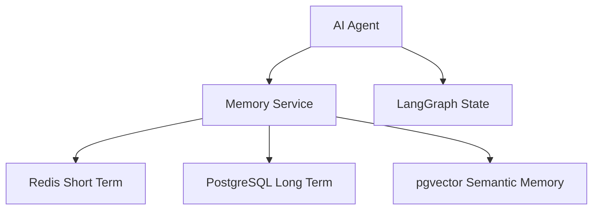

# AI Memory System Schema

**Document Version:** 1.0
**Project:** AI Voice Agent SaaS Platform
**Phase:** 05 - Database Schema
**Database Platform:** Supabase PostgreSQL + Redis
**AI Framework:** LangChain + LangGraph
**Status:** Draft
**Last Updated:** 2026-07-23

---

# 1. Overview

This document defines the AI memory database architecture.

The memory system enables AI agents to remember:

* Current conversation context
* Previous interactions
* Customer preferences
* Business rules
* Agent state
* Workflow progress

The system combines:

* Redis for fast short-term memory
* PostgreSQL for durable memory
* pgvector for semantic memory retrieval
* LangGraph checkpoints for workflow state

---

# 2. Memory Architecture

```text
AI Agent Runtime

        |

        |

Memory Service

        |

 ----------------------------

 |            |             |

Redis      PostgreSQL    pgvector

Short      Long-Term     Semantic

Memory     Memory        Memory

```

---

# 3. Memory Types

```text
AI Memory

├── Short-Term Memory

│
├── Conversation Memory

│
├── Long-Term Customer Memory

│
├── Semantic Memory

│
└── Workflow State Memory
```

---

# 4. Memory Storage Strategy

| Memory Type          | Storage          | Purpose              |
| -------------------- | ---------------- | -------------------- |
| Active conversation  | Redis            | Fast context         |
| Customer history     | PostgreSQL       | Permanent records    |
| Knowledge memories   | pgvector         | Similarity retrieval |
| Agent workflow state | PostgreSQL/Redis | Resume execution     |
| Session data         | Redis            | Runtime state        |

---

# 5. Memory Flow Architecture



---

# 6. Conversation Memory

## Purpose

Stores current conversation context.

Example:

```text
Customer:

"I need an appointment tomorrow"


AI remembers:

Customer wants appointment

Date = tomorrow

Intent = booking
```

---

# 7. Redis Conversation Memory

Recommended key:

```text
tenant:{tenant_id}:conversation:{conversation_id}
```

Example:

```json
{
 "messages":[
   {
    "role":"user",
    "content":"Book appointment"
   }
 ],
 "current_intent":"booking"
}
```

---

# 8. Redis Memory Data

Stores:

```text
Conversation State

├── Recent Messages

├── Current Intent

├── Active Tools

├── User Context

├── Agent State

└── Temporary Variables
```

---

# 9. PostgreSQL Memory Tables

```text
AI Memory Database

├── memories

├── customer_memories

├── conversation_summaries

├── memory_embeddings

└── memory_events
```

---

# 10. Memories Table

Stores durable AI memories.

```sql
CREATE TABLE memories (

    id UUID PRIMARY KEY DEFAULT gen_random_uuid(),

    tenant_id UUID NOT NULL,

    user_id UUID,

    memory_type TEXT,

    content TEXT,

    importance_score FLOAT,

    created_at TIMESTAMP DEFAULT now()

);
```

---

# 11. Memory Types

```text
customer_preference

business_rule

conversation_fact

agent_instruction

user_profile

```

---

# 12. Customer Memory

## Purpose

Stores information learned from interactions.

Examples:

```text
Customer prefers morning appointments

Customer owns two properties

Customer requested monthly service
```

---

Table:

```text
customer_memories
```

---

Schema:

```sql
customer_memories

id UUID PRIMARY KEY

tenant_id UUID

customer_id UUID

memory TEXT

source_conversation_id UUID

created_at TIMESTAMP
```

---

# 13. Semantic Memory

Stores memories that require similarity search.

Architecture:

```text
Memory Text

↓

Embedding Model

↓

pgvector

↓

Semantic Retrieval
```

---

# 14. Memory Embeddings Table

```sql
CREATE TABLE memory_embeddings (

    id UUID PRIMARY KEY,

    tenant_id UUID,

    memory_id UUID,

    embedding VECTOR(1536),

    created_at TIMESTAMP

);
```

---

# 15. Memory Retrieval Flow

```text
New Conversation

↓

Generate Query Embedding

↓

Search Memory Vectors

↓

Retrieve Relevant Memories

↓

Add To Agent Context
```

---

# 16. LangGraph State Persistence

LangGraph workflows maintain execution state.

Example:

```text
Agent Workflow

START

↓

Intent Detection

↓

RAG Search

↓

Tool Execution

↓

Response

```

If interrupted:

```text
Resume From Checkpoint
```

---

# 17. LangGraph Checkpoint Table

```sql
CREATE TABLE workflow_checkpoints (

    id UUID PRIMARY KEY,

    tenant_id UUID,

    conversation_id UUID,

    workflow_name TEXT,

    state JSONB,

    created_at TIMESTAMP

);
```

---

# 18. Agent Runtime State

Stores:

```text
Runtime State

├── Current Node

├── Tool Results

├── Variables

├── Pending Actions

└── Error State
```

---

# 19. Memory Lifecycle

```text
Capture

↓

Evaluate

↓

Store

↓

Embed

↓

Retrieve

↓

Update

↓

Expire
```

---

# 20. Memory Importance Scoring

Example:

```json
{
 "memory":"Customer prefers SMS reminders",
 "importance":0.92
}
```

High-value memories:

* Preferences
* Requirements
* Account information

Low-value:

* Temporary conversation phrases

---

# 21. Memory Expiration

Not all memory is permanent.

Example:

```text
Temporary Memory

7 days


Conversation Memory

90 days


Customer Preferences

Permanent
```

---

# 22. Tenant Isolation

Every memory record requires:

```sql
tenant_id UUID NOT NULL
```

Security:

* RLS
* Tenant filtering
* Access validation

---

# 23. Memory Security

Sensitive data protection:

* Encrypt private information
* Limit retrieval scope
* Log memory access
* Allow deletion requests

---

# 24. Performance Strategy

Optimization:

```text
Redis

↓

Fast context retrieval


PostgreSQL

↓

Durable storage


pgvector

↓

Semantic search

```

---

# 25. Integration With Agent Runtime

Flow:

```text
Call Starts

↓

Load Conversation Memory

↓

Retrieve Customer Memories

↓

Load Agent State

↓

Execute LangGraph Workflow

↓

Save New Memories

```

---

# 26. Related Documents

| Document                         | Purpose              |
| -------------------------------- | -------------------- |
| 08_Conversation_Schema.md        | Conversation storage |
| 10_RAG_Knowledge_Base_Schema.md  | Knowledge retrieval  |
| 31_Agent_Runtime_Architecture.md | Agent execution      |
| 37_Observability                 | Monitoring           |

---

# 27. Conclusion

The AI Memory System Schema provides persistent intelligence for AI agents.

It enables:

* Context-aware conversations
* Customer personalization
* Workflow recovery
* Semantic memory search
* Advanced LangGraph agents

---

**End of Document**
