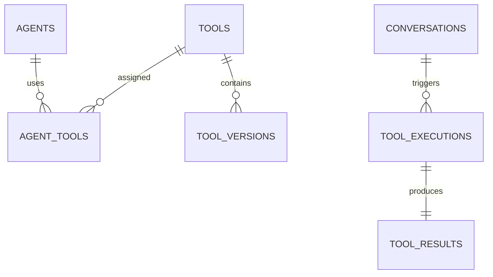

# Agent Tool Execution Schema

**Document Version:** 1.0
**Project:** AI Voice Agent SaaS Platform
**Phase:** 05 - Database Schema
**Database Platform:** Supabase PostgreSQL
**AI Framework:** LangChain + LangGraph + MCP
**Status:** Draft
**Last Updated:** 2026-07-23

---

# 1. Overview

This document defines the database schema for AI agent tools and execution tracking.

Tools allow AI agents to perform actions beyond conversation.

Examples:

* Booking appointments
* Searching CRM records
* Sending emails
* Creating tickets
* Processing payments
* Calling external APIs
* Executing MCP tools

The system stores:

* Available tools
* Agent tool assignments
* Tool configurations
* Executions
* Results
* Errors
* Performance metrics

---

# 2. Tool Architecture

```text id="q9m2x7"
AI Agent

    |

    v

LangGraph Workflow

    |

    v

Tool Router

    |

 ---------------------

 |        |          |

Internal  MCP     External

Tools     Tools    APIs

    |

    v

Execution Service

    |

    v

Database Logging
```

---

# 3. Tool Domain Entities

```text id="m7x3q9"
Agent Tools System

├── tools

├── tool_versions

├── agent_tools

├── tool_configurations

├── tool_executions

├── tool_results

└── tool_credentials
```

---

# 4. Tool Entity Relationship



---

# 5. Tool Entity

## Purpose

Represents an available action that an AI agent can execute.

Examples:

```text id="9m5x1q"
Calendar Booking Tool

CRM Lookup Tool

Email Tool

SMS Tool

Payment Tool

Custom API Tool
```

---

# 6. Tools Table

```sql id="6q8m3x"
CREATE TABLE tools (

    id UUID PRIMARY KEY DEFAULT gen_random_uuid(),

    tenant_id UUID,

    name TEXT NOT NULL,

    description TEXT,

    tool_type TEXT,

    provider TEXT,

    status TEXT DEFAULT 'active',

    created_at TIMESTAMP DEFAULT now()

);
```

---

# 7. Tool Types

```text id="3m8x5q"
internal

langchain_tool

langgraph_tool

mcp_tool

api_tool

database_tool

workflow_tool
```

---

# 8. Tool Providers

Examples:

```text id="7x2m9q"
Platform

Google Calendar

Twilio

CRM

Stripe

Custom API

MCP Server
```

---

# 9. Tool Versioning

Tools require version control.

Reason:

* Safe updates
* Compatibility
* Rollback

---

Table:

```text id="2q8m6x"
tool_versions
```

---

Schema:

```sql id="8m4x1q"
tool_versions

id UUID PRIMARY KEY

tool_id UUID

version INTEGER

schema JSONB

created_at TIMESTAMP
```

---

# 10. Agent Tool Assignment

Connects tools to agents.

Example:

```text id="5x9m3q"
Booking Agent

 |

 +-- Calendar Tool

 +-- Customer Lookup Tool

 +-- Notification Tool
```

---

Table:

```text id="1m7q9x"
agent_tools
```

---

Schema:

```sql id="4q8m2x"
CREATE TABLE agent_tools (

    id UUID PRIMARY KEY,

    agent_id UUID NOT NULL,

    tool_id UUID NOT NULL,

    enabled BOOLEAN DEFAULT true,

    configuration JSONB

);
```

---

# 11. Tool Configuration

Stores tool-specific settings.

Examples:

```json id="8x3m5q"
{
 "calendar_id":"abc123",
 "timezone":"America/New_York",
 "duration":30
}
```

---

Table:

```text id="9m2x7q"
tool_configurations
```

---

Schema:

```sql id="6x4m8q"
tool_configurations

id UUID PRIMARY KEY

tool_id UUID

settings JSONB

created_at TIMESTAMP
```

---

# 12. MCP Tool Support

Model Context Protocol tools.

Architecture:

```text id="3q7m9x"
AI Agent

↓

MCP Client

↓

MCP Server

↓

External Capability
```

---

MCP Examples:

```text id="5m8x2q"
Database MCP

Filesystem MCP

CRM MCP

Knowledge MCP

Browser MCP
```

---

# 13. Tool Credentials

Secure storage for external access.

Examples:

* API keys
* OAuth tokens
* Service credentials

---

Table:

```text id="7x1m4q"
tool_credentials
```

---

Schema:

```sql id="2m9q5x"
tool_credentials

id UUID PRIMARY KEY

tenant_id UUID

tool_id UUID

credential_type TEXT

encrypted_value TEXT

created_at TIMESTAMP
```

---

# 14. Tool Execution Entity

Tracks every execution.

Example:

```text id="9q4m1x"
Customer:

"Book me tomorrow"


AI:

Calls Calendar Tool


Result:

Appointment Created
```

---

Table:

```text id="6m3x8q"
tool_executions
```

---

Schema:

```sql id="8q2m5x"
CREATE TABLE tool_executions (

    id UUID PRIMARY KEY,

    conversation_id UUID,

    tool_id UUID,

    input JSONB,

    status TEXT,

    started_at TIMESTAMP,

    completed_at TIMESTAMP

);
```

---

# 15. Execution Lifecycle

```text id="3x9m7q"
REQUESTED

↓

VALIDATING

↓

EXECUTING

↓

SUCCESS

↓

FAILED
```

---

# 16. Tool Results

Stores execution output.

---

Table:

```text id="7m5x2q"
tool_results
```

---

Schema:

```sql id="4x8m1q"
tool_results

id UUID PRIMARY KEY

execution_id UUID

output JSONB

error JSONB

created_at TIMESTAMP
```

---

# 17. Tool Execution Example

```json id="1q8m4x"
{
 "tool":"calendar_booking",

 "input":{
   "date":"2026-07-25",
   "customer":"John"
 },

 "result":{
   "appointment_id":"12345"
 }
}
```

---

# 18. Tool Failure Handling

Store:

* Error message
* Stack trace
* Retry count
* Recovery action

---

Example:

```text id="8m3q7x"
API Timeout

↓

Retry

↓

Success

```

---

# 19. Tool Security

Required:

* Tenant isolation
* Encrypted credentials
* Permission checks
* Audit logs
* Rate limits

---

# 20. Tool Analytics

Track:

* Execution count
* Success rate
* Latency
* Cost
* Failure rate

---

# 21. Index Strategy

Recommended:

```sql id="5q2m8x"
CREATE INDEX idx_tool_execution_conversation

ON tool_executions(conversation_id);


CREATE INDEX idx_agent_tools_agent

ON agent_tools(agent_id);
```

---

# 22. Integration With Agent Runtime

Execution flow:

```text id="9x6m3q"
User Request

↓

LLM Decision

↓

LangGraph Node

↓

Tool Router

↓

Execute Tool

↓

Store Result

↓

Continue Conversation
```

---

# 23. Future Extensions

Support:

* Tool marketplace
* Dynamic tool discovery
* AI-generated tools
* Enterprise connectors
* Advanced MCP ecosystem

---

# 24. Related Documents

| Document                         | Purpose          |
| -------------------------------- | ---------------- |
| 06_Agent_Configuration_Schema.md | Agent setup      |
| 11_AI_Memory_System_Schema.md    | Memory           |
| 31_Agent_Runtime_Architecture.md | Execution engine |
| 30_OpenAPI_Specs                 | API definitions  |

---

# 25. Conclusion

The Agent Tool Execution Schema provides the foundation for AI agents that can perform real-world actions.

It supports:

* LangChain tools
* LangGraph execution
* MCP integration
* External APIs
* Secure automation
* Execution analytics

---

**End of Document**
