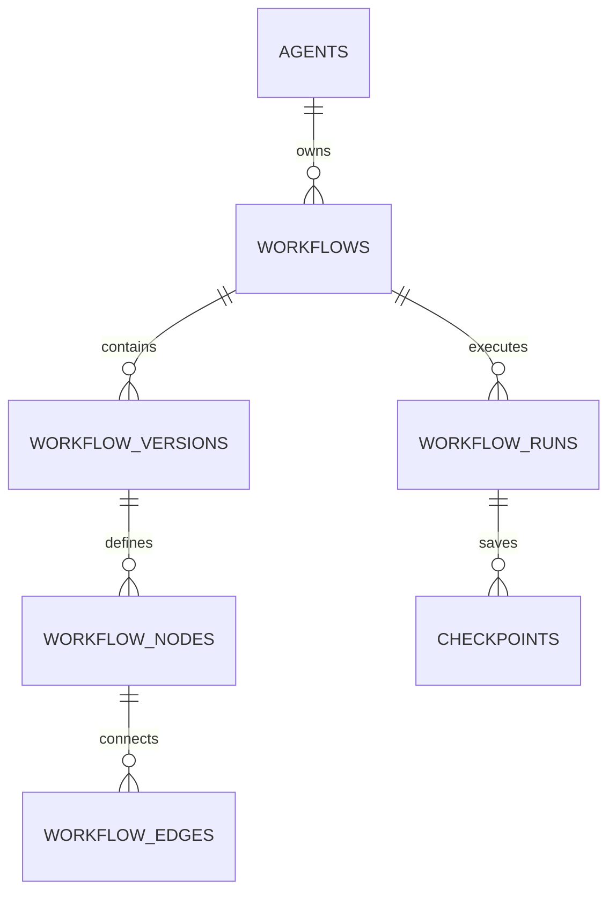

# Workflow State Schema

**Document Version:** 1.0
**Project:** AI Voice Agent SaaS Platform
**Phase:** 05 - Database Schema
**Database Platform:** Supabase PostgreSQL + Redis
**AI Framework:** LangGraph StateGraph
**Status:** Draft
**Last Updated:** 2026-07-23

---

# 1. Overview

This document defines the workflow state database architecture for AI agent execution.

The workflow system manages:

* LangGraph StateGraph execution
* Agent decision paths
* Workflow nodes
* State transitions
* Checkpoints
* Human approval steps
* Recovery after interruption

A workflow represents the reasoning and execution process of an AI agent.

---

# 2. Workflow Architecture

```text id="8m2q5x"
User Request

      |

      v

LangGraph Workflow

      |

 ---------------------

 |        |          |

Nodes   State     Edges

 |        |          |

 ---------------------

      |

      v

Agent Response
```

---

# 3. Workflow Domain Entities

```text id="2x7m9q"
Workflow System

├── workflows

├── workflow_versions

├── workflow_nodes

├── workflow_edges

├── workflow_runs

├── workflow_states

├── checkpoints

└── human_approvals
```

---

# 4. Workflow Relationship Model



---

# 5. Workflow Entity

## Purpose

Defines an AI agent workflow.

Examples:

* Appointment booking flow
* Sales qualification flow
* Customer support flow

---

Table:

```text id="7x4m2q"
workflows
```

---

Schema:

```sql id="4m8q1x"
CREATE TABLE workflows (

    id UUID PRIMARY KEY DEFAULT gen_random_uuid(),

    tenant_id UUID NOT NULL,

    agent_id UUID NOT NULL,

    name TEXT NOT NULL,

    description TEXT,

    status TEXT DEFAULT 'draft',

    created_at TIMESTAMP DEFAULT now()

);
```

---

# 6. Workflow Lifecycle

```text id="9m5x3q"
DRAFT

↓

TESTING

↓

PUBLISHED

↓

ACTIVE

↓

ARCHIVED
```

---

# 7. Workflow Versioning

Workflows require version control.

Example:

```text id="5q8m2x"
Booking Workflow

Version 1

Version 2

Version 3
```

---

Table:

```text id="3x7m9q"
workflow_versions
```

---

Schema:

```sql id="8m1q5x"
workflow_versions

id UUID PRIMARY KEY

workflow_id UUID

version INTEGER

definition JSONB

created_at TIMESTAMP
```

---

# 8. Workflow Definition

Stores LangGraph graph structure.

Example:

```json id="6x2m8q"
{
 "nodes":[
   "detect_intent",
   "retrieve_context",
   "execute_tool",
   "respond"
 ],

 "edges":[
   {
    "from":"detect_intent",
    "to":"retrieve_context"
   }
 ]
}
```

---

# 9. Workflow Nodes

A node represents one execution step.

Examples:

```text id="1m9q4x"
Nodes

├── Intent Detection

├── RAG Retrieval

├── Tool Execution

├── Validation

├── Response Generation

└── Human Transfer
```

---

Table:

```text id="7q3m8x"
workflow_nodes
```

---

Schema:

```sql id="2x6m9q"
workflow_nodes

id UUID PRIMARY KEY

workflow_version_id UUID

node_name TEXT

node_type TEXT

configuration JSONB
```

---

# 10. Node Types

```text id="8m4q7x"
llm

tool

retriever

condition

human_review

memory

response
```

---

# 11. Workflow Edges

Edges define movement between nodes.

Example:

```text id="4x9m2q"
Intent Node

      |

      v

Booking Node

      |

      v

Confirmation Node
```

---

Table:

```text id="5m7q1x"
workflow_edges
```

---

Schema:

```sql id="9x3m6q"
workflow_edges

id UUID PRIMARY KEY

workflow_version_id UUID

source_node TEXT

target_node TEXT

condition JSONB
```

---

# 12. Workflow Run

A workflow run represents one execution.

Example:

```text id="6m8x2q"
Customer Call

↓

Booking Workflow Run

↓

Completed
```

---

Table:

```text id="3q7m9x"
workflow_runs
```

---

Schema:

```sql id="1x5m8q"
CREATE TABLE workflow_runs (

    id UUID PRIMARY KEY,

    tenant_id UUID,

    conversation_id UUID,

    workflow_id UUID,

    status TEXT,

    started_at TIMESTAMP,

    completed_at TIMESTAMP

);
```

---

# 13. Workflow Run Status

```text id="7m2x9q"
STARTED

↓

RUNNING

↓

WAITING

↓

COMPLETED

↓

FAILED

↓

CANCELLED
```

---

# 14. Workflow State

Stores current execution data.

Example:

```json id="4q8m1x"
{
 "current_node":"booking_tool",

 "customer_name":"John",

 "appointment_date":"tomorrow"
}
```

---

Table:

```text id="8x5m3q"
workflow_states
```

---

Schema:

```sql id="2m9q7x"
workflow_states

id UUID PRIMARY KEY

workflow_run_id UUID

state JSONB

updated_at TIMESTAMP
```

---

# 15. LangGraph Checkpoints

Checkpointing enables recovery.

Example:

```text id="5x8m2q"
Node 1 Complete

↓

SAVE CHECKPOINT

↓

Node 2 Running

↓

Failure

↓

Resume From Checkpoint
```

---

Table:

```text id="9m4x6q"
checkpoints
```

---

Schema:

```sql id="7q1m5x"
checkpoints

id UUID PRIMARY KEY

workflow_run_id UUID

node_name TEXT

state JSONB

created_at TIMESTAMP
```

---

# 16. Human-in-the-Loop Approval

Some actions require human confirmation.

Examples:

* Refund approval
* Medical escalation
* Contract changes

---

Table:

```text id="3x9m1q"
human_approvals
```

---

Schema:

```sql id="6m2q8x"
human_approvals

id UUID PRIMARY KEY

workflow_run_id UUID

requested_action TEXT

status TEXT

approved_by UUID

created_at TIMESTAMP
```

---

# 17. Retry Management

Failed nodes require retry tracking.

---

Table:

```text id="8q4m6x"
workflow_retries
```

---

Schema:

```sql id="1m7x3q"
workflow_retries

id UUID PRIMARY KEY

workflow_run_id UUID

node_name TEXT

attempt INTEGER

error JSONB
```

---

# 18. Workflow Execution Flow

```text id="5m9x2q"
Call Received

↓

Create Workflow Run

↓

Load State

↓

Execute Node

↓

Save Checkpoint

↓

Next Node

↓

Generate Response

↓

Complete
```

---

# 19. Security Model

Workflow data requires:

* Tenant isolation
* Agent authorization
* Audit logging
* Secure state storage

---

# 20. Performance Strategy

Recommended:

```text id="2x8m5q"
Redis

↓

Active Workflow State


PostgreSQL

↓

Permanent Checkpoints


JSONB

↓

Flexible State Storage
```

---

# 21. Related Documents

| Document                          | Purpose     |
| --------------------------------- | ----------- |
| 06_Agent_Configuration_Schema.md  | Agent setup |
| 11_AI_Memory_System_Schema.md     | Memory      |
| 12_Agent_Tool_Execution_Schema.md | Tools       |
| 31_Agent_Runtime_Architecture.md  | Runtime     |

---

# 22. Conclusion

The Workflow State Schema provides reliable execution control for AI agents.

It enables:

* LangGraph workflows
* Stateful agents
* Recovery after failures
* Human approvals
* Complex automation

---

**End of Document**
