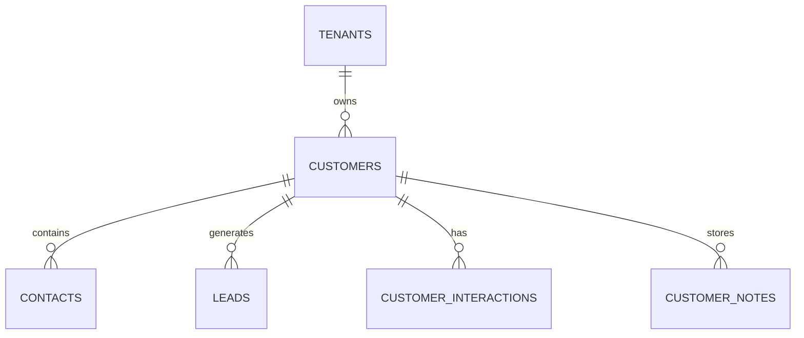

# Customer CRM Schema

**Document Version:** 1.0
**Project:** AI Voice Agent SaaS Platform
**Phase:** 05 - Database Schema
**Database Platform:** Supabase PostgreSQL
**Status:** Draft
**Last Updated:** 2026-07-23

---

# 1. Overview

This document defines the Customer Relationship Management (CRM) database schema.

The CRM system stores customer information required by AI voice agents.

It enables agents to:

* Identify customers
* Retrieve customer history
* Personalize conversations
* Manage leads
* Track interactions
* Maintain customer lifecycle

---

# 2. CRM Architecture

```text id="q8m4x1"
Customer

    |

    v

CRM Service

    |

 ---------------------

 |          |          |

Contacts  Leads   Interactions

    |

    v

AI Agent Memory

```

---

# 3. CRM Domain Entities

```text id="m7q3x9"
CRM System

├── customers

├── contacts

├── companies

├── leads

├── customer_addresses

├── customer_notes

├── customer_tags

├── customer_interactions

└── customer_custom_fields
```

---

# 4. CRM Relationship Model



---

# 5. Customer Entity

## Purpose

Represents an individual or organization interacting with the business.

Examples:

* Caller
* Lead
* Existing customer
* Subscriber

---

# 6. Customers Table

```sql id="4m9x2q"
CREATE TABLE customers (

    id UUID PRIMARY KEY DEFAULT gen_random_uuid(),

    tenant_id UUID NOT NULL,

    customer_type TEXT DEFAULT 'individual',

    first_name TEXT,

    last_name TEXT,

    email TEXT,

    phone TEXT,

    status TEXT DEFAULT 'active',

    metadata JSONB DEFAULT '{}',

    created_at TIMESTAMP DEFAULT now(),

    updated_at TIMESTAMP DEFAULT now()

);
```

---

# 7. Customer Types

```text id="6q8m3x"
individual

business

lead

partner

vendor
```

---

# 8. Customer Lifecycle

```text id="2x7m9q"
PROSPECT

↓

LEAD

↓

CUSTOMER

↓

ACTIVE

↓

INACTIVE

↓

ARCHIVED
```

---

# 9. Contact Entity

A customer may have multiple contacts.

Example:

```text id="5m8q1x"
Company

 |

 +-- CEO

 +-- Manager

 +-- Billing Contact
```

---

Table:

```text id="7x3m9q"
contacts
```

---

Schema:

```sql id="1q6m8x"
contacts

id UUID PRIMARY KEY

customer_id UUID

name TEXT

role TEXT

email TEXT

phone TEXT
```

---

# 10. Company Entity

Stores business customers.

Table:

```text id="9m4x2q"
companies
```

---

Schema:

```sql id="3x8m5q"
companies

id UUID PRIMARY KEY

tenant_id UUID

company_name TEXT

industry TEXT

website TEXT

metadata JSONB
```

---

# 11. Lead Management

AI agents can qualify leads.

Example:

```text id="8q2m7x"
Inbound Call

↓

AI Qualification

↓

Lead Created

↓

Sales Follow-up
```

---

# 12. Leads Table

```sql id="5x1m9q"
CREATE TABLE leads (

    id UUID PRIMARY KEY DEFAULT gen_random_uuid(),

    tenant_id UUID NOT NULL,

    customer_id UUID,

    source TEXT,

    status TEXT,

    score INTEGER,

    created_at TIMESTAMP DEFAULT now()

);
```

---

# 13. Lead Status

```text id="7m5x2q"
new

contacted

qualified

converted

lost
```

---

# 14. Lead Scoring

AI can calculate:

```text id="3q8m6x"
Lead Score

+

Intent

+

Budget

+

Urgency

+

Fit
```

Example:

```json id="9x2m4q"
{
 "score":85,
 "intent":"high",
 "priority":"urgent"
}
```

---

# 15. Customer Address

Stores location information.

Table:

```text id="4m7x9q"
customer_addresses
```

---

Schema:

```sql id="8x1m5q"
customer_addresses

id UUID PRIMARY KEY

customer_id UUID

address_line TEXT

city TEXT

state TEXT

country TEXT

postal_code TEXT
```

---

# 16. Customer Notes

AI and human agents can store notes.

Examples:

```text id="6m3q8x"
Customer prefers email

Requested premium service

Requires follow-up
```

---

Table:

```text id="2x9m7q"
customer_notes
```

---

Schema:

```sql id="5m1x8q"
customer_notes

id UUID PRIMARY KEY

customer_id UUID

note TEXT

created_by UUID

created_at TIMESTAMP
```

---

# 17. Customer Tags

Used for segmentation.

Examples:

```text id="7q4m2x"
VIP

High Value

Requires Follow-up

Enterprise
```

---

Tables:

```text id="9m6x3q"
customer_tags

customer_tag_mapping
```

---

# 18. Customer Interactions

Tracks every touchpoint.

Examples:

* Calls
* Emails
* SMS
* Meetings

---

Table:

```text id="3x5m8q"
customer_interactions
```

---

Schema:

```sql id="8m2q7x"
customer_interactions

id UUID PRIMARY KEY

customer_id UUID

interaction_type TEXT

reference_id UUID

created_at TIMESTAMP
```

---

# 19. Interaction Types

```text id="1m9x4q"
voice_call

email

sms

chat

meeting

note
```

---

# 20. AI Agent Customer Lookup Flow

```text id="5x7m3q"
Incoming Call

↓

Identify Phone Number

↓

Search Customer

↓

Load History

↓

Load Memory

↓

Personalized Response
```

---

# 21. CRM + AI Memory Integration

```text id="2q8m6x"
Customer Record

+

Conversation History

+

AI Memories

+

Preferences

=

Customer Context
```

---

# 22. Multi-Tenant Security

All CRM tables require:

```sql id="9x3m7q"
tenant_id UUID NOT NULL
```

Security:

* RLS policies
* Tenant filtering
* Permission checks

---

# 23. Index Strategy

Recommended:

```sql id="6m4x8q"
CREATE INDEX idx_customer_phone

ON customers(phone);


CREATE INDEX idx_customer_tenant

ON customers(tenant_id);
```

---

# 24. Future Extensions

Support:

* Salesforce integration
* HubSpot integration
* Custom CRMs
* Customer scoring AI
* Automated sales pipelines

---

# 25. Related Documents

| Document                          | Purpose             |
| --------------------------------- | ------------------- |
| 08_Conversation_Schema.md         | Interaction history |
| 11_AI_Memory_System_Schema.md     | Customer memory     |
| 12_Agent_Tool_Execution_Schema.md | CRM tools           |
| 16_Billing_Usage_Schema.md        | Customer plans      |

---

# 26. Conclusion

The Customer CRM Schema provides the foundation for customer-aware AI agents.

It enables:

* Customer identification
* Lead management
* Personalized conversations
* AI-assisted sales
* Enterprise CRM integrations

---

**End of Document**
