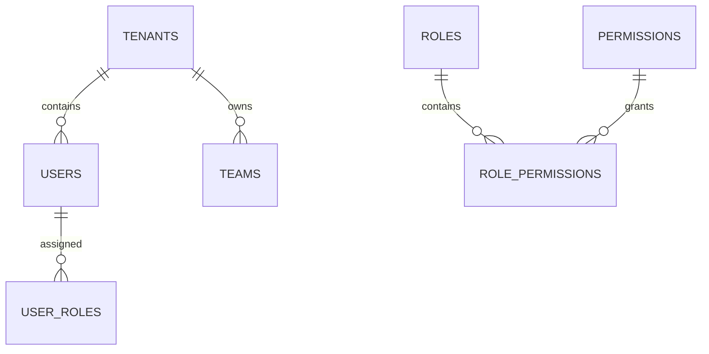

# Authentication & User Schema

**Document Version:** 1.0
**Project:** AI Voice Agent SaaS Platform
**Phase:** 05 - Database Schema
**Database Platform:** Supabase Auth + PostgreSQL
**Security Model:** Multi-Tenant RBAC + Row Level Security (RLS)
**Status:** Draft
**Last Updated:** 2026-07-23

---

# 1. Overview

This document defines the authentication, authorization, and user management database schema.

The authentication system supports:

* SaaS tenant accounts
* User registration
* Team members
* Roles
* Permissions
* Organization isolation
* Supabase Auth integration
* Row Level Security policies

---

# 2. Authentication Architecture

```text id="7x2m9q"
User

 |

 v

Supabase Auth

 |

 v

JWT Token

 |

 v

API Gateway

 |

 v

Tenant Authorization

 |

 v

Application Database
```

---

# 3. Identity Model

```text id="5m8q3x"
Platform

├── Tenants

│
├── Users

│
├── Teams

│
├── Roles

│
└── Permissions
```

---

# 4. Entity Relationship



---

# 5. Supabase Auth Integration

Supabase provides:

* User authentication
* Password management
* OAuth providers
* JWT generation
* Session handling

The application stores business user data separately.

---

# 6. Auth Users Table

Managed by Supabase:

```text id="2x8m5q"
auth.users
```

Contains:

```text
id

email

encrypted_password

created_at

last_sign_in
```

---

# 7. Application Users Table

Stores application profile data.

Table:

```text id="9m4x7q"
users
```

---

Schema:

```sql id="4x8m2q"
CREATE TABLE users (

    id UUID PRIMARY KEY,

    tenant_id UUID NOT NULL,

    email TEXT,

    first_name TEXT,

    last_name TEXT,

    phone TEXT,

    status TEXT DEFAULT 'active',

    created_at TIMESTAMP DEFAULT now(),

    updated_at TIMESTAMP DEFAULT now()

);
```

---

# 8. User Lifecycle

```text id="6m1x9q"
INVITED

↓

REGISTERED

↓

ACTIVE

↓

SUSPENDED

↓

DEACTIVATED
```

---

# 9. Tenant Membership

Users belong to organizations.

Example:

```text id="3q8m7x"
Company A

 |

 +-- Admin

 +-- Manager

 +-- Agent Operator
```

---

Table:

```text id="7m2x5q"
tenant_memberships
```

---

Schema:

```sql id="1x9m4q"
tenant_memberships

id UUID PRIMARY KEY

tenant_id UUID

user_id UUID

role_id UUID

created_at TIMESTAMP
```

---

# 10. Teams

Organizations can create teams.

Examples:

* Sales Team
* Support Team
* Operations Team

---

Table:

```text id="8x4m2q"
teams
```

---

Schema:

```sql id="5m7q3x"
teams

id UUID PRIMARY KEY

tenant_id UUID

name TEXT

description TEXT

created_at TIMESTAMP
```

---

# 11. Team Members

Users can belong to teams.

---

Table:

```text id="2q6m9x"
team_members
```

---

Schema:

```sql id="9x3m5q"
team_members

id UUID PRIMARY KEY

team_id UUID

user_id UUID

created_at TIMESTAMP
```

---

# 12. Role-Based Access Control (RBAC)

Roles define permissions.

Example:

```text id="4m8x1q"
Admin

 |

All Permissions


Manager

 |

Limited Permissions


Operator

 |

Call Access
```

---

# 13. Roles Table

```sql id="7q2m6x"
roles

id UUID PRIMARY KEY

tenant_id UUID

name TEXT

description TEXT
```

---

# 14. Default Roles

Platform roles:

```text id="5x9m3q"
Owner

Administrator

Manager

Agent Operator

Viewer
```

---

# 15. Permissions

Permissions define actions.

Examples:

```text id="8m1q4x"
agents.create

agents.update

calls.view

calls.export

billing.manage

users.invite
```

---

Table:

```text id="3x7m9q"
permissions
```

---

Schema:

```sql id="6m2q8x"
permissions

id UUID PRIMARY KEY

name TEXT

description TEXT
```

---

# 16. Role Permissions Mapping

Table:

```text id="1m5x8q"
role_permissions
```

---

Schema:

```sql id="9q4m7x"
role_permissions

id UUID PRIMARY KEY

role_id UUID

permission_id UUID
```

---

# 17. Row Level Security Model

Every tenant table follows:

```sql id="5x3m9q"
tenant_id = authenticated_user_tenant
```

Example:

```sql
CREATE POLICY tenant_access

ON agents

USING (

tenant_id = auth.jwt()->>'tenant_id'

);
```

---

# 18. Authorization Flow

```text id="7m9x2q"
Login

↓

Supabase Auth

↓

JWT Created

↓

Tenant ID Extracted

↓

Permission Checked

↓

Database Access
```

---

# 19. API Authorization

Every request includes:

```http id="2x8m5q"
Authorization: Bearer JWT

X-Tenant-ID

X-Request-ID
```

---

# 20. Security Requirements

Required:

* MFA support
* Session expiration
* Password policies
* Audit logging
* Permission validation
* RLS enforcement

---

# 21. User Audit Tracking

Track:

* Login events
* Role changes
* Permission changes
* Account changes

---

Related table:

```text id="8m3q6x"
audit_logs
```

---

# 22. Index Strategy

Recommended:

```sql id="4x7m1q"
CREATE INDEX idx_users_tenant

ON users(tenant_id);


CREATE INDEX idx_membership_user

ON tenant_memberships(user_id);
```

---

# 23. Future Extensions

Support:

* SSO/SAML
* Enterprise identity providers
* SCIM provisioning
* Advanced organization hierarchy
* Custom roles

---

# 24. Related Documents

| Document                    | Purpose           |
| --------------------------- | ----------------- |
| 03_Core_Entity_Model.md     | Tenant model      |
| 14_Customer_CRM_Schema.md   | Customer data     |
| 17_Audit_Log_Schema.md      | Security tracking |
| 40_Security_Threat_Model.md | Security design   |

---

# 25. Conclusion

The Authentication & User Schema provides secure identity management for the AI Voice Agent SaaS platform.

It enables:

* Supabase authentication
* Multi-tenant isolation
* Role-based permissions
* Team management
* Enterprise security

---

**End of Document**
