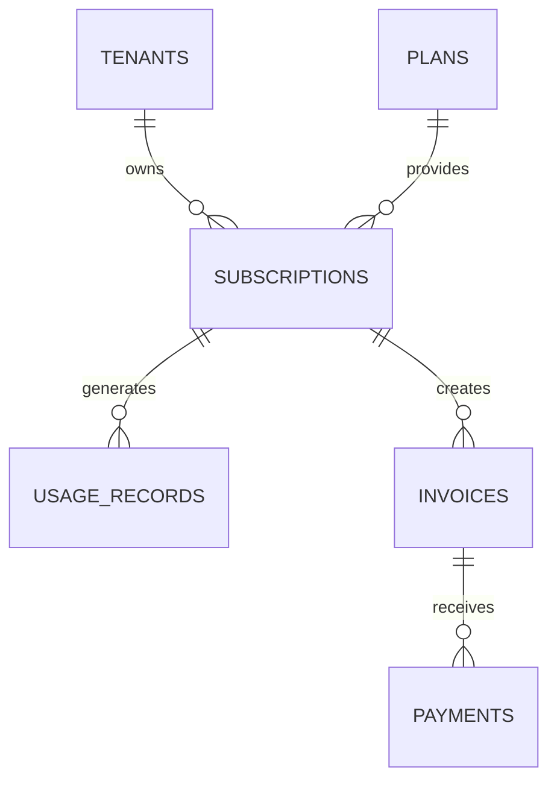

# Billing & Usage Schema

**Document Version:** 1.0
**Project:** AI Voice Agent SaaS Platform
**Phase:** 05 - Database Schema
**Database Platform:** Supabase PostgreSQL
**Payment Provider:** Stripe
**Status:** Draft
**Last Updated:** 2026-07-23

---

# 1. Overview

This document defines the billing, subscription, and usage metering database schema.

The billing system supports the SaaS business model for AI voice agents.

It tracks:

* Customer subscriptions
* Pricing plans
* AI usage
* Voice minutes
* Token consumption
* API usage
* Invoices
* Payments
* Usage limits

---

# 2. Billing Architecture

```text id="4x9m2q"
Tenant Customer

        |

        v

Subscription System

        |

 ----------------------------

 |             |             |

Stripe      Usage         Limits

Billing     Metering      Enforcement

        |

        v

Database
```

---

# 3. Billing Domain Entities

```text id="8m3q5x"
Billing System

├── plans

├── subscriptions

├── subscription_items

├── usage_records

├── usage_limits

├── invoices

├── payments

└── billing_events
```

---

# 4. Billing Relationship Model



---

# 5. Pricing Plans

Defines available SaaS packages.

Examples:

```text id="3m8q7x"
Starter

Professional

Business

Enterprise
```

---

Table:

```text id="9x2m6q"
plans
```

---

Schema:

```sql id="5m8q1x"
CREATE TABLE plans (

    id UUID PRIMARY KEY DEFAULT gen_random_uuid(),

    name TEXT NOT NULL,

    description TEXT,

    price_monthly DECIMAL,

    price_yearly DECIMAL,

    features JSONB,

    created_at TIMESTAMP DEFAULT now()

);
```

---

# 6. Plan Features

Example:

```json id="1q7m9x"
{
 "voice_minutes":5000,

 "agents":10,

 "knowledge_bases":20,

 "users":25
}
```

---

# 7. Subscription Entity

Represents a tenant subscription.

---

Table:

```text id="6m3x8q"
subscriptions
```

---

Schema:

```sql id="8x4m2q"
CREATE TABLE subscriptions (

    id UUID PRIMARY KEY DEFAULT gen_random_uuid(),

    tenant_id UUID NOT NULL,

    plan_id UUID NOT NULL,

    stripe_subscription_id TEXT,

    status TEXT,

    start_date TIMESTAMP,

    end_date TIMESTAMP,

    created_at TIMESTAMP DEFAULT now()

);
```

---

# 8. Subscription Lifecycle

```text id="2x9m7q"
TRIAL

↓

ACTIVE

↓

PAST_DUE

↓

CANCELLED

↓

EXPIRED
```

---

# 9. Subscription Status

```text id="7m4x1q"
trialing

active

past_due

cancelled

expired
```

---

# 10. Usage Metering

Tracks resource consumption.

The platform measures:

* Call minutes
* AI processing time
* Tokens
* Storage
* API calls

---

# 11. Usage Records Table

```sql id="4q8m6x"
CREATE TABLE usage_records (

    id UUID PRIMARY KEY DEFAULT gen_random_uuid(),

    tenant_id UUID NOT NULL,

    subscription_id UUID,

    usage_type TEXT,

    quantity DECIMAL,

    unit TEXT,

    recorded_at TIMESTAMP DEFAULT now()

);
```

---

# 12. Usage Types

```text id="9m2x5q"
voice_minutes

stt_minutes

tts_characters

llm_tokens

embedding_tokens

storage_bytes

api_requests
```

---

# 13. Voice Usage Tracking

Example:

```text id="5x8m3q"
Customer Call

↓

10 Minutes

↓

Usage Record

↓

Billing Calculation
```

---

# 14. AI Token Usage

Tracks:

* Input tokens
* Output tokens
* Model usage

---

Example:

```json id="8q1m4x"
{
 "model":"GPT",

 "input_tokens":1500,

 "output_tokens":500
}
```

---

# 15. Usage Limits

Controls plan restrictions.

Table:

```text id="3m7x9q"
usage_limits
```

---

Schema:

```sql id="6x2m8q"
usage_limits

id UUID PRIMARY KEY

plan_id UUID

usage_type TEXT

limit_value DECIMAL
```

---

# 16. Limit Enforcement Flow

```text id="1m9x5q"
Agent Starts Call

↓

Check Tenant Usage

↓

Compare Plan Limit

↓

Allow / Block / Upgrade
```

---

# 17. Invoices

Stores billing documents.

Table:

```text id="8m4x2q"
invoices
```

---

Schema:

```sql id="5q7m1x"
invoices

id UUID PRIMARY KEY

tenant_id UUID

stripe_invoice_id TEXT

amount DECIMAL

currency TEXT

status TEXT

created_at TIMESTAMP
```

---

# 18. Invoice Status

```text id="7x3m9q"
draft

open

paid

failed

void
```

---

# 19. Payments

Tracks payment transactions.

Table:

```text id="2m8x5q"
payments
```

---

Schema:

```sql id="9q4m6x"
payments

id UUID PRIMARY KEY

invoice_id UUID

amount DECIMAL

payment_method TEXT

status TEXT

created_at TIMESTAMP
```

---

# 20. Stripe Integration

Flow:

```text id="6m1x8q"
Customer Signup

↓

Create Stripe Customer

↓

Create Subscription

↓

Receive Webhooks

↓

Update Database
```

---

# 21. Billing Events

Stores external billing events.

Examples:

```text id="4x7m2q"
subscription.created

invoice.paid

payment.failed

subscription.cancelled
```

---

Table:

```text id="8m5q3x"
billing_events
```

---

Schema:

```sql id="3q9m6x"
billing_events

id UUID PRIMARY KEY

tenant_id UUID

event_type TEXT

payload JSONB

created_at TIMESTAMP
```

---

# 22. Cost Analytics

Track:

* Revenue
* AI cost
* Margin
* Usage growth

---

Example:

```text id="5m2x8q"
Revenue

-

OpenAI Cost

-

Twilio Cost

-

Infrastructure Cost

=

Profit
```

---

# 23. Multi-Tenant Security

All billing records require:

```sql id="7q4m9x"
tenant_id UUID NOT NULL
```

Protection:

* RLS policies
* Stripe ownership validation
* Audit logs

---

# 24. Index Strategy

Recommended:

```sql id="1x8m5q"
CREATE INDEX idx_usage_tenant

ON usage_records(tenant_id);


CREATE INDEX idx_subscription_tenant

ON subscriptions(tenant_id);
```

---

# 25. Future Extensions

Support:

* Usage-based pricing
* Enterprise contracts
* Multiple currencies
* Revenue analytics
* Partner billing
* Marketplace billing

---

# 26. Related Documents

| Document                         | Purpose          |
| -------------------------------- | ---------------- |
| 15_Authentication_User_Schema.md | Users            |
| 07_Voice_Call_Schema.md          | Call usage       |
| 37_Observability                 | Cost monitoring  |
| 40_Security_Threat_Model.md      | Payment security |

---

# 27. Conclusion

The Billing & Usage Schema provides the commercial foundation of the AI Voice Agent SaaS platform.

It enables:

* Subscription management
* Usage billing
* Stripe integration
* Cost tracking
* SaaS monetization

---

**End of Document**
