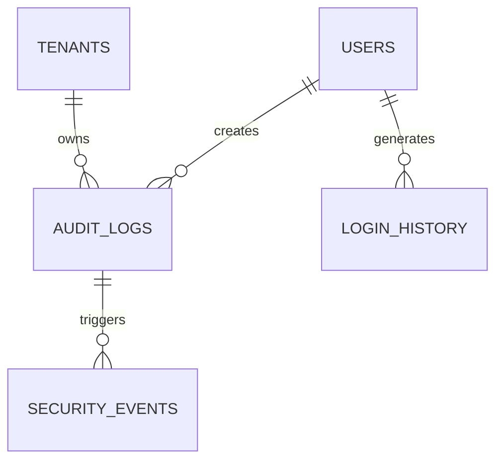

# Audit Log Schema

**Document Version:** 1.0
**Project:** AI Voice Agent SaaS Platform
**Phase:** 05 - Database Schema
**Database Platform:** Supabase PostgreSQL
**Security Model:** Enterprise Audit Trail
**Status:** Draft
**Last Updated:** 2026-07-23

---

# 1. Overview

This document defines the audit logging database schema.

The audit system records important actions performed across the platform.

It provides:

* Security monitoring
* Compliance tracking
* User accountability
* Troubleshooting
* Change history
* Enterprise governance

---

# 2. Audit Architecture

```text id="7x4m2q"
User Action

     |

     v

Application API

     |

     v

Audit Service

     |

     v

Audit Database

     |

     v

Security Monitoring
```

---

# 3. Audit Domain Entities

```text id="8m3q5x"
Audit System

├── audit_logs

├── security_events

├── login_history

├── api_access_logs

├── data_change_logs

└── compliance_events
```

---

# 4. Audit Relationship Model



---

# 5. Audit Log Entity

## Purpose

Stores every important system action.

Examples:

* User login
* Agent creation
* Configuration changes
* Permission updates
* Data exports

---

# 6. Audit Logs Table

```sql id="4m8x2q"
CREATE TABLE audit_logs (

    id UUID PRIMARY KEY DEFAULT gen_random_uuid(),

    tenant_id UUID NOT NULL,

    user_id UUID,

    action TEXT NOT NULL,

    resource_type TEXT,

    resource_id UUID,

    old_values JSONB,

    new_values JSONB,

    ip_address TEXT,

    user_agent TEXT,

    created_at TIMESTAMP DEFAULT now()

);
```

---

# 7. Audit Actions

Examples:

```text id="6x1m9q"
CREATE

UPDATE

DELETE

LOGIN

LOGOUT

EXPORT

IMPORT

APPROVE

DENY
```

---

# 8. Resource Types

Tracked resources:

```text id="2q8m5x"
agent

workflow

tool

customer

call

conversation

knowledge_base

billing

user
```

---

# 9. Audit Event Example

```json id="8m3x1q"
{
 "action":"agent.updated",

 "resource":"voice_agent",

 "old":{
   "language":"English"
 },

 "new":{
   "language":"Spanish"
 }
}
```

---

# 10. Security Events

Stores security-related incidents.

Examples:

* Failed login
* Unauthorized access
* Permission violation
* Suspicious activity

---

Table:

```text id="5q9m2x"
security_events
```

---

Schema:

```sql id="3x7m8q"
CREATE TABLE security_events (

    id UUID PRIMARY KEY DEFAULT gen_random_uuid(),

    tenant_id UUID,

    event_type TEXT,

    severity TEXT,

    details JSONB,

    created_at TIMESTAMP DEFAULT now()

);
```

---

# 11. Security Event Types

```text id="7m4x9q"
failed_login

invalid_token

permission_denied

data_export

credential_change

suspicious_activity
```

---

# 12. Severity Levels

```text id="1x8m5q"
INFO

LOW

MEDIUM

HIGH

CRITICAL
```

---

# 13. Login History

Tracks authentication activity.

---

Table:

```text id="9m2x7q"
login_history
```

---

Schema:

```sql id="6x3m8q"
login_history

id UUID PRIMARY KEY

user_id UUID

login_method TEXT

ip_address TEXT

success BOOLEAN

created_at TIMESTAMP
```

---

# 14. Login Methods

```text id="4q8m1x"
password

google_oauth

microsoft_oauth

sso

api_key
```

---

# 15. API Access Logs

Tracks API usage.

Useful for:

* Debugging
* Rate limiting
* Security analysis

---

Table:

```text id="8x5m3q"
api_access_logs
```

---

Schema:

```sql id="2m7q9x"
api_access_logs

id UUID PRIMARY KEY

tenant_id UUID

user_id UUID

endpoint TEXT

method TEXT

status_code INTEGER

duration_ms INTEGER

created_at TIMESTAMP
```

---

# 16. Data Change Tracking

Tracks database modifications.

Example:

```text id="5m8x2q"
Agent Configuration

Before:

Voice = Female


After:

Voice = Male
```

---

Table:

```text id="7q3m9x"
data_change_logs
```

---

Schema:

```sql id="1x6m8q"
data_change_logs

id UUID PRIMARY KEY

table_name TEXT

record_id UUID

operation TEXT

before_data JSONB

after_data JSONB

created_at TIMESTAMP
```

---

# 17. Compliance Events

Supports enterprise requirements.

Examples:

* Data deletion requests
* Privacy actions
* Export requests

---

Table:

```text id="9x4m7q"
compliance_events
```

---

Schema:

```sql id="3m8q1x"
compliance_events

id UUID PRIMARY KEY

tenant_id UUID

event_type TEXT

status TEXT

created_at TIMESTAMP
```

---

# 18. Immutable Audit Design

Audit logs should be:

* Append-only
* Protected from modification
* Retained according to policy

Recommended:

```text id="6q2m8x"
INSERT ONLY

NO UPDATE

NO DELETE
```

---

# 19. Audit Data Flow

```text id="4x9m2q"
User Changes Agent

↓

API Request

↓

Authorization Check

↓

Database Update

↓

Create Audit Record

↓

Store Event
```

---

# 20. Multi-Tenant Security

Every audit record contains:

```sql id="7m1x5q"
tenant_id UUID NOT NULL
```

Access controlled by:

* RLS
* Admin permissions
* Compliance roles

---

# 21. Retention Strategy

Example:

```text id="2x8m6q"
Standard

90 Days


Business

1 Year


Enterprise

7 Years
```

---

# 22. Index Strategy

Recommended:

```sql id="5q3m8x"
CREATE INDEX idx_audit_tenant

ON audit_logs(tenant_id);


CREATE INDEX idx_audit_resource

ON audit_logs(resource_id);


CREATE INDEX idx_security_events_type

ON security_events(event_type);
```

---

# 23. Future Extensions

Support:

* SIEM integrations
* Security dashboards
* Compliance automation
* Threat detection AI
* Immutable storage

---

# 24. Related Documents

| Document                         | Purpose         |
| -------------------------------- | --------------- |
| 15_Authentication_User_Schema.md | Identity        |
| 16_Billing_Usage_Schema.md       | Billing events  |
| 40_Security_Threat_Model.md      | Security design |
| 37_Observability                 | Monitoring      |

---

# 25. Conclusion

The Audit Log Schema provides enterprise-grade visibility and accountability.

It enables:

* Security auditing
* Compliance reporting
* Change tracking
* Incident investigation
* Enterprise governance

---

**End of Document**
