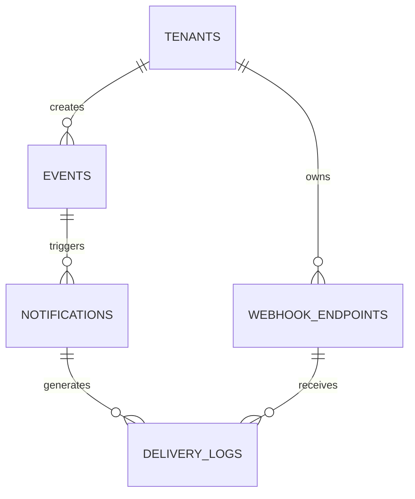

# Notification & Event Schema

**Document Version:** 1.0
**Project:** AI Voice Agent SaaS Platform
**Phase:** 05 - Database Schema
**Database Platform:** Supabase PostgreSQL + Redis
**Architecture:** Event-Driven System
**Status:** Draft
**Last Updated:** 2026-07-23

---

# 1. Overview

This document defines the notification and event management database schema.

The notification system manages asynchronous communication across the AI Voice Agent SaaS platform.

It supports:

* Email notifications
* SMS notifications
* Voice notifications
* Webhooks
* Internal events
* Background jobs
* Event processing

---

# 2. Event-Driven Architecture

```text id="8m2x5q"
Application Event

        |

        v

Event Bus

        |

 -------------------------

 |           |             |

Email      SMS          Webhook

Worker     Worker       Worker

        |

        v

External Provider
```

---

# 3. Notification Domain Entities

```text id="4x7m9q"
Notification System

├── events

├── event_subscriptions

├── notifications

├── notification_templates

├── notification_channels

├── webhook_endpoints

└── delivery_logs
```

---

# 4. Entity Relationship



---

# 5. Event Entity

## Purpose

Represents a system activity that can trigger actions.

Examples:

* Call completed
* Appointment created
* Payment received
* Agent updated

---

# 6. Events Table

```sql id="3m8x7q"
CREATE TABLE events (

    id UUID PRIMARY KEY DEFAULT gen_random_uuid(),

    tenant_id UUID NOT NULL,

    event_type TEXT NOT NULL,

    payload JSONB,

    source TEXT,

    created_at TIMESTAMP DEFAULT now()

);
```

---

# 7. Event Types

Platform events:

```text id="7x2m9q"
call.started

call.completed

conversation.completed

agent.created

agent.updated

payment.completed

subscription.changed

customer.created
```

---

# 8. Event Lifecycle

```text id="5q8m2x"
CREATED

↓

QUEUED

↓

PROCESSING

↓

COMPLETED

↓

FAILED
```

---

# 9. Event Subscription

Defines which actions happen for events.

Example:

```text id="2x9m5q"
Event:

call.completed


Actions:

Send Email

Update CRM

Trigger Webhook
```

---

Table:

```text id="8m3x6q"
event_subscriptions
```

---

Schema:

```sql id="4x1m7q"
event_subscriptions

id UUID PRIMARY KEY

tenant_id UUID

event_type TEXT

channel TEXT

configuration JSONB

enabled BOOLEAN
```

---

# 10. Notification Entity

Represents a message to be delivered.

---

Table:

```text id="6m9x3q"
notifications
```

---

Schema:

```sql id="1q5m8x"
CREATE TABLE notifications (

    id UUID PRIMARY KEY DEFAULT gen_random_uuid(),

    tenant_id UUID NOT NULL,

    event_id UUID,

    channel TEXT,

    recipient TEXT,

    subject TEXT,

    content TEXT,

    status TEXT,

    created_at TIMESTAMP DEFAULT now()

);
```

---

# 11. Notification Channels

Supported:

```text id="9m4x2q"
email

sms

voice

push

webhook

internal
```

---

# 12. Notification Status

```text id="3x8m5q"
pending

queued

sending

delivered

failed

cancelled
```

---

# 13. Notification Templates

Stores reusable message templates.

Examples:

* Appointment confirmation
* Welcome email
* Payment receipt

---

Table:

```text id="7q2m9x"
notification_templates
```

---

Schema:

```sql id="5m1x8q"
notification_templates

id UUID PRIMARY KEY

tenant_id UUID

name TEXT

channel TEXT

template TEXT

variables JSONB
```

---

# 14. Template Example

```json id="8x3m6q"
{
 "template":
 "Hello {{customer_name}}, your appointment is confirmed"
}
```

---

# 15. Webhook Endpoints

External systems receive events.

Examples:

* CRM
* ERP
* Custom applications

---

Table:

```text id="2m7x9q"
webhook_endpoints
```

---

Schema:

```sql id="6x4m8q"
webhook_endpoints

id UUID PRIMARY KEY

tenant_id UUID

url TEXT

secret TEXT

events JSONB

active BOOLEAN
```

---

# 16. Webhook Delivery Flow

```text id="9q3m5x"
Event Created

↓

Find Subscribers

↓

Generate Payload

↓

Send Webhook

↓

Store Result
```

---

# 17. Delivery Logs

Tracks notification delivery.

---

Table:

```text id="4m8x2q"
delivery_logs
```

---

Schema:

```sql id="7x1m5q"
delivery_logs

id UUID PRIMARY KEY

notification_id UUID

provider TEXT

status TEXT

response JSONB

created_at TIMESTAMP
```

---

# 18. Background Job Processing

Recommended workers:

```text id="5m9x1q"
API Server

↓

Redis Queue

↓

Worker

↓

Provider API
```

---

# 19. Queue Examples

```text id="8q4m6x"
notification.email

notification.sms

webhook.delivery

analytics.process

memory.update
```

---

# 20. Retry Strategy

Failed deliveries:

```text id="3m7x9q"
Attempt 1

↓

Wait

↓

Attempt 2

↓

Attempt 3

↓

Dead Letter Queue
```

---

# 21. Provider Integrations

Supported:

```text id="6x2m8q"
Email:

SendGrid / AWS SES


SMS:

Twilio


Voice:

Twilio


Push:

Firebase
```

---

# 22. Multi-Tenant Security

Every notification record requires:

```sql id="1m8x5q"
tenant_id UUID NOT NULL
```

Protection:

* RLS
* Secret encryption
* Tenant validation

---

# 23. Index Strategy

Recommended:

```sql id="9x4m7q"
CREATE INDEX idx_events_tenant

ON events(tenant_id);


CREATE INDEX idx_notifications_status

ON notifications(status);
```

---

# 24. Future Extensions

Support:

* Event streaming
* Kafka integration
* Advanced workflow triggers
* Customer automation rules
* AI-generated notifications

---

# 25. Related Documents

| Document                          | Purpose        |
| --------------------------------- | -------------- |
| 17_Audit_Log_Schema.md            | Audit events   |
| 12_Agent_Tool_Execution_Schema.md | Tool events    |
| 16_Billing_Usage_Schema.md        | Billing events |
| 37_Observability                  | Monitoring     |

---

# 26. Conclusion

The Notification & Event Schema provides the asynchronous communication layer of the AI Voice Agent SaaS platform.

It enables:

* Event-driven architecture
* Reliable notifications
* Webhook integrations
* Background processing
* Enterprise automation

---

**End of Document**
