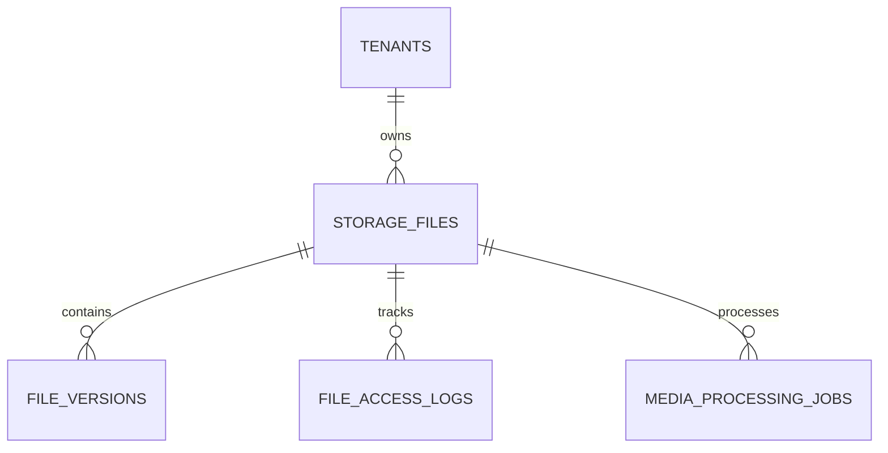

# File Storage Schema

**Document Version:** 1.0
**Project:** AI Voice Agent SaaS Platform
**Phase:** 05 - Database Schema
**Database Platform:** Supabase Storage + PostgreSQL
**Storage Types:** Documents, Audio, Media, Attachments
**Status:** Draft
**Last Updated:** 2026-07-23

---

# 1. Overview

This document defines the file storage database schema.

The storage system manages all uploaded and generated files used by the AI Voice Agent platform.

Supported files:

* Knowledge documents
* Call recordings
* Voice messages
* Agent assets
* Customer attachments
* Export files
* Generated reports

---

# 2. Storage Architecture

```text
User Upload

     |

     v

Supabase Storage

     |

     v

Storage Metadata Database

     |

 -------------------------

 |            |            |

RAG         Calls       Exports

Files       Audio       Reports
```

---

# 3. Storage Domain Entities

```text
File Storage System

├── storage_files

├── storage_buckets

├── file_versions

├── file_access_logs

├── media_processing_jobs

└── generated_files
```

---

# 4. Entity Relationship



---

# 5. Storage Bucket Model

Supabase Storage organizes files into buckets.

Recommended buckets:

```text
storage

├── knowledge-documents

├── call-recordings

├── agent-assets

├── customer-files

└── exports
```

---

# 6. Storage Buckets Table

```sql
CREATE TABLE storage_buckets (

    id UUID PRIMARY KEY DEFAULT gen_random_uuid(),

    tenant_id UUID NOT NULL,

    name TEXT NOT NULL,

    bucket_type TEXT,

    max_size_mb INTEGER,

    created_at TIMESTAMP DEFAULT now()

);
```

---

# 7. Bucket Types

```text
knowledge

audio

image

document

export

temporary
```

---

# 8. Storage Files Entity

## Purpose

Stores metadata about uploaded files.

The actual file is stored in Supabase Storage.

---

# 9. Storage Files Table

```sql
CREATE TABLE storage_files (

    id UUID PRIMARY KEY DEFAULT gen_random_uuid(),

    tenant_id UUID NOT NULL,

    bucket_id UUID,

    filename TEXT NOT NULL,

    file_path TEXT NOT NULL,

    mime_type TEXT,

    file_size BIGINT,

    checksum TEXT,

    status TEXT DEFAULT 'active',

    uploaded_by UUID,

    created_at TIMESTAMP DEFAULT now()

);
```

---

# 10. File Lifecycle

```text
UPLOADED

↓

PROCESSING

↓

AVAILABLE

↓

ARCHIVED

↓

DELETED
```

---

# 11. File Types

Supported:

```text
PDF

DOCX

TXT

CSV

JSON

MP3

WAV

MP4

PNG

JPG
```

---

# 12. File Versioning

Used for document updates.

Example:

```text
Pricing.pdf

Version 1

Version 2

Version 3
```

---

# 13. File Versions Table

```sql
CREATE TABLE file_versions (

    id UUID PRIMARY KEY DEFAULT gen_random_uuid(),

    file_id UUID NOT NULL,

    version_number INTEGER,

    checksum TEXT,

    storage_path TEXT,

    created_at TIMESTAMP DEFAULT now()

);
```

---

# 14. Knowledge Base File Relationship

Flow:

```text
Uploaded Document

↓

Storage File

↓

Document Record

↓

Text Extraction

↓

Chunks

↓

Embeddings
```

---

# 15. Call Recording Storage

Voice call recordings are stored separately.

Example:

```text
Call

 |

 +-- Customer Audio

 +-- Agent Audio

 +-- Mixed Recording
```

---

# 16. Call Recording Metadata

```sql
CREATE TABLE call_recordings (

    id UUID PRIMARY KEY DEFAULT gen_random_uuid(),

    tenant_id UUID NOT NULL,

    call_id UUID NOT NULL,

    storage_file_id UUID,

    duration_seconds INTEGER,

    format TEXT,

    created_at TIMESTAMP DEFAULT now()

);
```

---

# 17. Recording Processing Flow

```text
Call Completed

↓

Recording Uploaded

↓

Speech Processing

↓

Transcription

↓

AI Analysis

↓

Archive
```

---

# 18. Media Processing Jobs

Used for async processing.

Examples:

* Transcription
* Compression
* Conversion
* Analysis

---

Table:

```text
media_processing_jobs
```

---

Schema:

```sql
CREATE TABLE media_processing_jobs (

    id UUID PRIMARY KEY DEFAULT gen_random_uuid(),

    file_id UUID,

    job_type TEXT,

    status TEXT,

    result JSONB,

    created_at TIMESTAMP DEFAULT now()

);
```

---

# 19. Processing Job Types

```text
transcription

embedding

compression

thumbnail

summarization

sentiment_analysis
```

---

# 20. File Access Logging

Tracks file usage.

Examples:

* Download
* View
* Export
* Delete

---

Table:

```text
file_access_logs
```

---

Schema:

```sql
CREATE TABLE file_access_logs (

    id UUID PRIMARY KEY DEFAULT gen_random_uuid(),

    file_id UUID,

    user_id UUID,

    action TEXT,

    created_at TIMESTAMP DEFAULT now()

);
```

---

# 21. Generated Files

Stores AI-generated outputs.

Examples:

* Reports
* Summaries
* Export files

---

Table:

```text
generated_files
```

---

Schema:

```sql
generated_files

id UUID PRIMARY KEY

tenant_id UUID

type TEXT

storage_file_id UUID

created_at TIMESTAMP
```

---

# 22. Security Model

Required:

* Tenant isolation
* Signed URLs
* Access expiration
* Encryption
* Permission checks

---

# 23. Storage Security Flow

```text
User Request

↓

Permission Check

↓

Generate Signed URL

↓

Temporary Access

↓

Download File
```

---

# 24. Storage Retention

Example:

```text
Temporary Files

24 Hours


Call Recordings

90 Days


Knowledge Documents

Permanent


Exports

30 Days
```

---

# 25. Index Strategy

Recommended:

```sql
CREATE INDEX idx_storage_files_tenant

ON storage_files(tenant_id);


CREATE INDEX idx_recordings_call

ON call_recordings(call_id);
```

---

# 26. Future Extensions

Support:

* Object storage migration
* CDN delivery
* Automatic compression
* AI media analysis
* Multi-region storage

---

# 27. Related Documents

| Document                        | Purpose              |
| ------------------------------- | -------------------- |
| 10_RAG_Knowledge_Base_Schema.md | Document ingestion   |
| 07_Voice_Call_Schema.md         | Call recordings      |
| 18_Notification_Event_Schema.md | Export notifications |
| 37_Observability                | Storage monitoring   |

---

# 28. Conclusion

The File Storage Schema provides a unified storage layer for the AI Voice Agent SaaS platform.

It supports:

* Supabase Storage integration
* Knowledge documents
* Voice recordings
* Media processing
* Secure file management

---

**End of Document**
