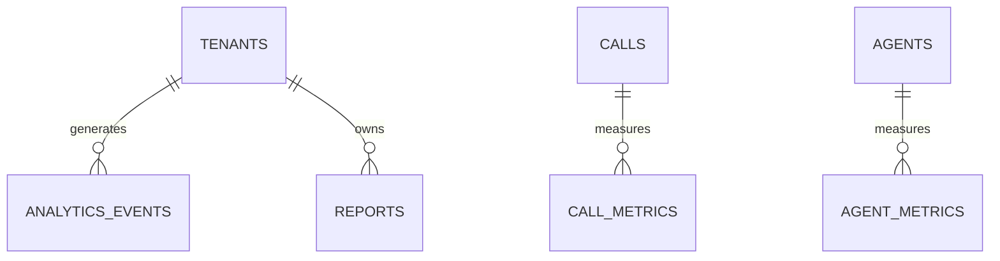

# Analytics & Reporting Schema

**Document Version:** 1.0
**Project:** AI Voice Agent SaaS Platform
**Phase:** 05 - Database Schema
**Database Platform:** Supabase PostgreSQL
**Analytics Architecture:** Operational + Business Intelligence
**Status:** Draft
**Last Updated:** 2026-07-23

---

# 1. Overview

This document defines the analytics and reporting database schema.

The analytics system collects operational and business metrics from the AI Voice Agent platform.

It provides insights into:

* Voice call performance
* Agent effectiveness
* Customer behavior
* AI quality metrics
* Revenue analytics
* Usage analytics
* System performance

---

# 2. Analytics Architecture

```text id="8x2m7q"
Application Events

        |

        v

Analytics Pipeline

        |

 ----------------------------

 |             |             |

Operational   Aggregation   Reporting

Tables        Jobs          Dashboards

        |

        v

Analytics Database
```

---

# 3. Analytics Domain Entities

```text id="5m9x2q"
Analytics System

├── analytics_events

├── call_metrics

├── agent_metrics

├── customer_metrics

├── usage_metrics

├── revenue_metrics

├── dashboard_configs

└── reports
```

---

# 4. Analytics Relationship Model



---

# 5. Analytics Events

Stores raw platform events.

Examples:

* Call started
* Call ended
* Tool executed
* Agent responded

---

Table:

```text id="3x8m5q"
analytics_events
```

---

Schema:

```sql id="9m2x7q"
CREATE TABLE analytics_events (

    id UUID PRIMARY KEY DEFAULT gen_random_uuid(),

    tenant_id UUID NOT NULL,

    event_type TEXT,

    entity_type TEXT,

    entity_id UUID,

    properties JSONB,

    created_at TIMESTAMP DEFAULT now()

);
```

---

# 6. Event Types

```text id="6q3m8x"
call.started

call.completed

agent.response

tool.executed

knowledge.retrieved

customer.created

payment.completed
```

---

# 7. Call Analytics

Measures voice agent performance.

Metrics:

* Duration
* Resolution
* Transfer rate
* Sentiment
* Cost

---

# 8. Call Metrics Table

```sql id="4x7m2q"
CREATE TABLE call_metrics (

    id UUID PRIMARY KEY DEFAULT gen_random_uuid(),

    call_id UUID NOT NULL,

    tenant_id UUID NOT NULL,

    duration_seconds INTEGER,

    resolution_status TEXT,

    transferred BOOLEAN,

    sentiment_score FLOAT,

    created_at TIMESTAMP DEFAULT now()

);
```

---

# 9. Call Performance Metrics

Example:

```text id="8m5x1q"
Total Calls

Average Duration

Successful Resolution %

Human Transfer %

Customer Satisfaction

```

---

# 10. Agent Performance Metrics

Measures AI agent quality.

Metrics:

* Response speed
* Accuracy
* Tool usage
* Completion rate

---

Table:

```text id="2q9m6x"
agent_metrics
```

---

Schema:

```sql id="5x3m8q"
agent_metrics

id UUID PRIMARY KEY

agent_id UUID

tenant_id UUID

total_calls INTEGER

success_rate FLOAT

average_response_time FLOAT

created_at TIMESTAMP
```

---

# 11. AI Quality Metrics

Tracks:

```text id="7m4q2x"
Accuracy

Latency

Hallucination Rate

Tool Success Rate

Escalation Rate
```

---

# 12. Customer Analytics

Tracks customer behavior.

Examples:

* Repeat callers
* Conversion
* Engagement

---

Table:

```text id="9x1m5q"
customer_metrics
```

---

Schema:

```sql id="3m8q7x"
customer_metrics

id UUID PRIMARY KEY

customer_id UUID

tenant_id UUID

total_interactions INTEGER

last_interaction TIMESTAMP

engagement_score FLOAT
```

---

# 13. Usage Analytics

Tracks platform consumption.

Metrics:

* Minutes
* Tokens
* Storage
* API requests

---

Table:

```text id="6x4m9q"
usage_metrics
```

---

Schema:

```sql id="8m2q5x"
usage_metrics

id UUID PRIMARY KEY

tenant_id UUID

metric_type TEXT

value DECIMAL

period DATE
```

---

# 14. Revenue Analytics

Tracks SaaS business metrics.

Metrics:

* MRR
* ARR
* Revenue
* Cost
* Margin

---

Table:

```text id="4m7x9q"
revenue_metrics
```

---

Schema:

```sql id="1x8m5q"
revenue_metrics

id UUID PRIMARY KEY

tenant_id UUID

metric_type TEXT

amount DECIMAL

period DATE
```

---

# 15. Dashboard Configuration

Stores user dashboards.

Examples:

* Executive dashboard
* Call center dashboard
* Agent dashboard

---

Table:

```text id="8q3m6x"
dashboard_configs
```

---

Schema:

```sql id="5m1x7q"
dashboard_configs

id UUID PRIMARY KEY

tenant_id UUID

name TEXT

layout JSONB

created_at TIMESTAMP
```

---

# 16. Reports

Stores generated reports.

Examples:

* Monthly usage report
* Call quality report
* Billing report

---

Table:

```text id="2x9m4q"
reports
```

---

Schema:

```sql id="7m3q8x"
reports

id UUID PRIMARY KEY

tenant_id UUID

report_type TEXT

parameters JSONB

generated_file_id UUID

created_at TIMESTAMP
```

---

# 17. Analytics Pipeline

```text id="9q5m2x"
Application Event

↓

Event Collector

↓

Analytics Tables

↓

Aggregation Jobs

↓

Dashboard
```

---

# 18. Aggregation Strategy

For large-scale data:

```text id="6m8x3q"
Raw Events

↓

Hourly Aggregation

↓

Daily Metrics

↓

Monthly Reports
```

---

# 19. Real-Time Analytics

Redis can provide:

* Live call counters
* Active sessions
* Current agent status

Example:

```text id="3x7m9q"
Active Calls: 125

Agents Online: 42

Queue Size: 18
```

---

# 20. Data Retention

Example:

```text id="5q1m8x"
Raw Events

90 Days


Aggregated Metrics

5 Years


Financial Data

7 Years
```

---

# 21. Multi-Tenant Security

Every analytics table requires:

```sql id="8m4x2q"
tenant_id UUID NOT NULL
```

Protection:

* RLS policies
* Tenant filtering
* Role permissions

---

# 22. Index Strategy

Recommended:

```sql id="1x6m9q"
CREATE INDEX idx_analytics_tenant

ON analytics_events(tenant_id);


CREATE INDEX idx_metrics_period

ON usage_metrics(period);
```

---

# 23. Future Extensions

Support:

* Data warehouse integration
* Snowflake/BigQuery exports
* AI analytics assistant
* Predictive analytics
* Custom BI dashboards

---

# 24. Related Documents

| Document                   | Purpose       |
| -------------------------- | ------------- |
| 07_Voice_Call_Schema.md    | Call data     |
| 16_Billing_Usage_Schema.md | Usage billing |
| 17_Audit_Log_Schema.md     | Events        |
| 37_Observability           | Monitoring    |

---

# 25. Conclusion

The Analytics & Reporting Schema provides business intelligence capabilities for the AI Voice Agent SaaS platform.

It enables:

* Operational dashboards
* AI performance analysis
* Revenue tracking
* Customer insights
* Enterprise reporting

---

**End of Document**
