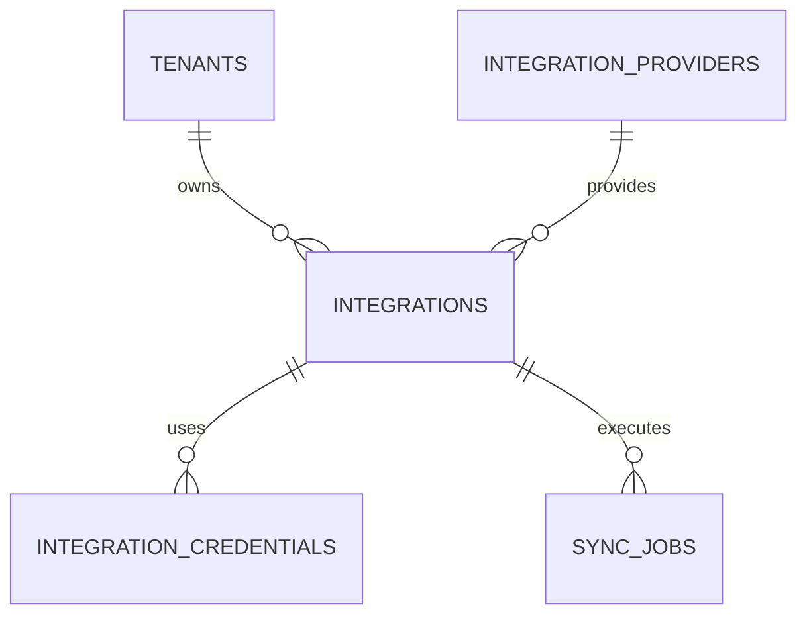

# Integration & Connector Schema

**Document Version:** 1.0
**Project:** AI Voice Agent SaaS Platform
**Phase:** 05 - Database Schema
**Database Platform:** Supabase PostgreSQL
**Architecture:** External Service Integration Layer
**Status:** Draft
**Last Updated:** 2026-07-23

---

# 1. Overview

This document defines the integration and connector database schema.

The integration layer manages external services required by the AI Voice Agent platform.

Supported integrations:

* Twilio PSTN/SIP
* LiveKit Voice Infrastructure
* OpenAI Models
* LangChain Services
* CRM Systems
* Calendar Systems
* Messaging Providers
* Custom APIs
* MCP Servers

---

# 2. Integration Architecture

```text
Tenant

 |

 v

Integration Service

 |

 --------------------------------

 |          |          |          |

Voice     AI        CRM       Custom

Providers Models    Systems   APIs

 |

 v

Credential Manager

 |

 v

External Services
```

---

# 3. Integration Domain Entities

```text
Integration System

├── integrations

├── integration_providers

├── integration_credentials

├── integration_settings

├── oauth_connections

├── api_endpoints

└── sync_jobs
```

---

# 4. Entity Relationship



---

# 5. Integration Providers

Defines supported external platforms.

Examples:

```text
Twilio

LiveKit

OpenAI

Google Calendar

Salesforce

HubSpot

Stripe

Custom API

MCP Server
```

---

# 6. Integration Providers Table

```sql
CREATE TABLE integration_providers (

    id UUID PRIMARY KEY DEFAULT gen_random_uuid(),

    name TEXT NOT NULL,

    category TEXT,

    documentation_url TEXT,

    created_at TIMESTAMP DEFAULT now()

);
```

---

# 7. Integration Categories

```text
voice

ai_model

crm

calendar

payment

communication

storage

analytics

custom
```

---

# 8. Integrations Table

Represents an enabled connection for a tenant.

Example:

```text
Tenant A

 |

Twilio Account

 |

Active
```

---

Schema:

```sql
CREATE TABLE integrations (

    id UUID PRIMARY KEY DEFAULT gen_random_uuid(),

    tenant_id UUID NOT NULL,

    provider_id UUID NOT NULL,

    name TEXT,

    status TEXT DEFAULT 'active',

    configuration JSONB,

    created_at TIMESTAMP DEFAULT now()

);
```

---

# 9. Integration Status

```text
pending

connected

active

error

disabled

expired
```

---

# 10. Integration Credentials

Stores encrypted credentials.

Examples:

* API Keys
* Tokens
* Secrets
* Account IDs

---

Table:

```text
integration_credentials
```

---

Schema:

```sql
CREATE TABLE integration_credentials (

    id UUID PRIMARY KEY DEFAULT gen_random_uuid(),

    integration_id UUID,

    credential_type TEXT,

    encrypted_value TEXT,

    created_at TIMESTAMP DEFAULT now()

);
```

---

# 11. Credential Types

```text
api_key

secret_key

oauth_token

refresh_token

account_sid

access_token
```

---

# 12. Twilio Integration

Stores:

* Account SID
* Auth token
* SIP configuration
* Phone numbers

Example:

```text
Tenant

 |

Twilio

 |

SIP Trunk

 |

Phone Number

 |

LiveKit
```

---

Configuration:

```json
{
 "account_sid":"ACxxxx",
 "sip_trunk":"trunk_id",
 "phone_number":"+123456789"
}
```

---

# 13. LiveKit Integration

Stores:

* Server URL
* API Key
* API Secret
* Room configuration

Example:

```json
{
 "url":"wss://livekit.example.com",
 "api_key":"key",
 "room_prefix":"tenant_agent"
}
```

---

# 14. OpenAI Integration

Stores:

* API credentials
* Model preferences
* Usage configuration

Example:

```json
{
 "models":[
   "gpt-4.1",
   "gpt-4o-mini"
 ],

 "embedding_model":"text-embedding"
}
```

---

# 15. LangChain / LangGraph Integration

Stores:

* Agent framework configuration
* Provider settings
* Runtime options

Example:

```json
{
 "framework":"langgraph",

 "checkpointing":true,

 "memory_enabled":true
}
```

---

# 16. CRM Connectors

Supported:

```text
Salesforce

HubSpot

Zoho

Custom CRM
```

Capabilities:

* Customer sync
* Contact sync
* Lead creation
* Activity logging

---

# 17. OAuth Connections

For services using OAuth.

Examples:

* Google Calendar
* Microsoft
* Salesforce

---

Table:

```text
oauth_connections
```

---

Schema:

```sql
CREATE TABLE oauth_connections (

    id UUID PRIMARY KEY DEFAULT gen_random_uuid(),

    integration_id UUID,

    access_token TEXT,

    refresh_token TEXT,

    expires_at TIMESTAMP,

    created_at TIMESTAMP DEFAULT now()

);
```

---

# 18. API Endpoints

Stores custom API connectors.

Example:

```text
Booking API

POST /appointments

GET /customers
```

---

Table:

```text
api_endpoints
```

---

Schema:

```sql
api_endpoints

id UUID PRIMARY KEY

integration_id UUID

method TEXT

endpoint_url TEXT

headers JSONB

created_at TIMESTAMP
```

---

# 19. Sync Jobs

Tracks external synchronization.

Examples:

* CRM sync
* Customer import
* Data export

---

Table:

```text
sync_jobs
```

---

Schema:

```sql
CREATE TABLE sync_jobs (

    id UUID PRIMARY KEY DEFAULT gen_random_uuid(),

    integration_id UUID,

    job_type TEXT,

    status TEXT,

    started_at TIMESTAMP,

    completed_at TIMESTAMP

);
```

---

# 20. Integration Health Monitoring

Track:

* Connection status
* API latency
* Failures
* Rate limits

Example:

```text
Twilio

Status: Healthy

Latency: 120ms

Errors: 0
```

---

# 21. Integration Event Flow

```text
Request

↓

Integration Router

↓

Credential Lookup

↓

External API Call

↓

Store Response

↓

Audit Event
```

---

# 22. Security Requirements

Required:

* Encrypt credentials
* Rotate secrets
* Audit access
* Limit permissions
* Validate tenant ownership

---

# 23. Multi-Tenant Isolation

Every integration belongs to:

```sql
tenant_id UUID NOT NULL
```

Security:

* Row Level Security
* Tenant validation
* Permission checks

---

# 24. Index Strategy

Recommended:

```sql
CREATE INDEX idx_integrations_tenant

ON integrations(tenant_id);


CREATE INDEX idx_provider_name

ON integration_providers(name);
```

---

# 25. Future Extensions

Support:

* Integration marketplace
* Plugin ecosystem
* Dynamic connectors
* AI-generated connectors
* Enterprise API gateway

---

# 26. Related Documents

| Document                          | Purpose              |
| --------------------------------- | -------------------- |
| 07_Voice_Call_Schema.md           | Twilio/LiveKit calls |
| 12_Agent_Tool_Execution_Schema.md | Tool integrations    |
| 18_Notification_Event_Schema.md   | Webhooks             |
| 30_OpenAPI_Specs                  | API contracts        |

---

# 27. Conclusion

The Integration & Connector Schema provides the foundation for connecting the AI Voice Agent platform with external ecosystems.

It enables:

* Twilio voice infrastructure
* LiveKit real-time communication
* OpenAI models
* CRM automation
* Secure third-party integrations

---

**End of Document**
