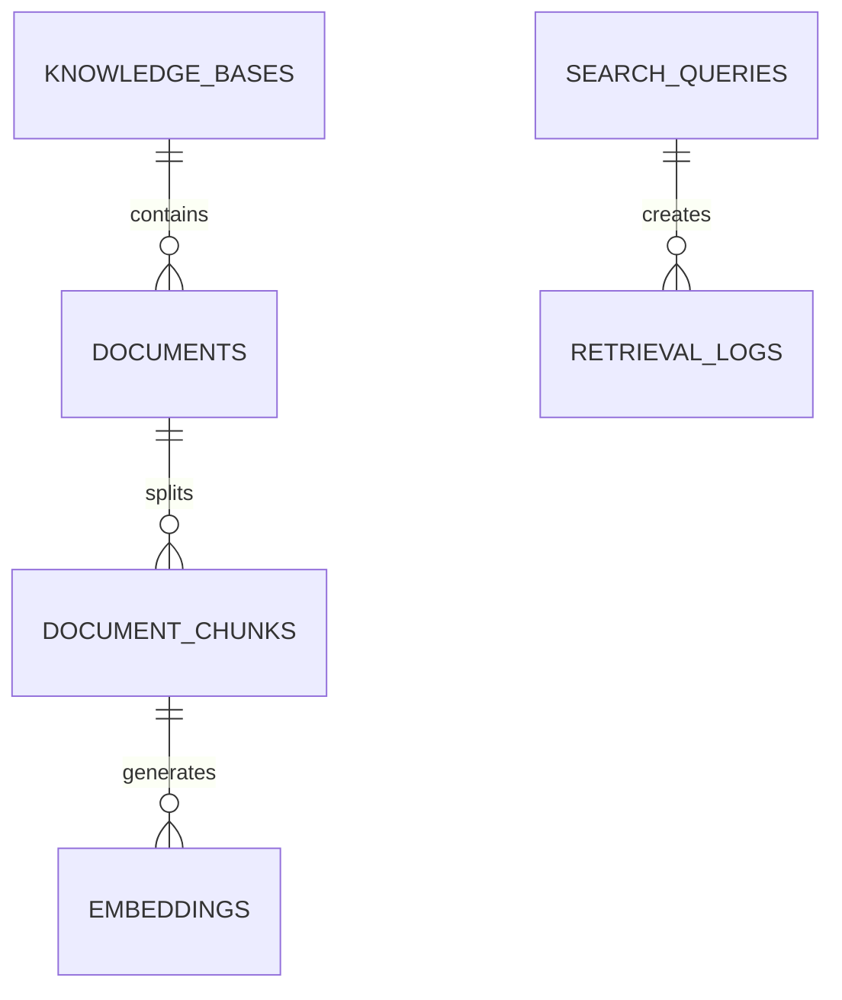

# Search & Vector Index Schema

**Document Version:** 1.0
**Project:** AI Voice Agent SaaS Platform
**Phase:** 05 - Database Schema
**Database Platform:** Supabase PostgreSQL + pgvector
**AI Architecture:** RAG + Semantic Search + Hybrid Retrieval
**Status:** Draft
**Last Updated:** 2026-07-23

---

# 1. Overview

This document defines the vector search and semantic indexing database schema.

The vector search system powers AI knowledge retrieval for voice agents.

It supports:

* Document embeddings
* Semantic search
* RAG retrieval
* Hybrid keyword + vector search
* Knowledge base indexing
* Context retrieval

---

# 2. RAG Architecture

```text id="7m3x8q"
User Question

      |

      v

AI Agent

      |

      v

Retriever

      |

 ---------------------

 |                   |

Vector Search     Keyword Search

(pgvector)        (PostgreSQL)

 |                   |

 ---------------------

      |

      v

Relevant Context

      |

      v

LLM Response
```

---

# 3. Vector Search Domain Entities

```text id="9x2m5q"
Vector System

├── knowledge_bases

├── documents

├── document_chunks

├── embeddings

├── vector_indexes

├── search_queries

└── retrieval_logs
```

---

# 4. Entity Relationship



---

# 5. PostgreSQL Vector Extension

Enable pgvector:

```sql id="8x2m1q"
CREATE EXTENSION IF NOT EXISTS vector;
```

---

# 6. Knowledge Bases

A knowledge base contains documents available to AI agents.

Examples:

```text id="3m7q9x"
Company Policies

Product Documentation

FAQs

Medical Guidelines

Support Articles
```

---

Table:

```text id="6q8m2x"
knowledge_bases
```

---

Schema:

```sql id="5x9m3q"
CREATE TABLE knowledge_bases (

    id UUID PRIMARY KEY DEFAULT gen_random_uuid(),

    tenant_id UUID NOT NULL,

    name TEXT NOT NULL,

    description TEXT,

    status TEXT DEFAULT 'active',

    created_at TIMESTAMP DEFAULT now()

);
```

---

# 7. Documents

Represents uploaded knowledge files.

Relationship:

```text id="2x7m8q"
File Storage

↓

Document

↓

Chunks

↓

Embeddings
```

---

Table:

```text id="9m4x1q"
documents
```

---

Schema:

```sql id="7x3m5q"
CREATE TABLE documents (

    id UUID PRIMARY KEY DEFAULT gen_random_uuid(),

    knowledge_base_id UUID,

    file_id UUID,

    title TEXT,

    content TEXT,

    metadata JSONB,

    created_at TIMESTAMP DEFAULT now()

);
```

---

# 8. Document Chunking

Large documents are split into smaller pieces.

Example:

```text id="5m2x9q"
Document

500 Pages

↓

Chunk 1

Chunk 2

Chunk 3

...

Chunk 500
```

---

Table:

```text id="8q4m6x"
document_chunks
```

---

Schema:

```sql id="1x7m3q"
CREATE TABLE document_chunks (

    id UUID PRIMARY KEY DEFAULT gen_random_uuid(),

    document_id UUID,

    chunk_index INTEGER,

    content TEXT,

    token_count INTEGER,

    metadata JSONB,

    created_at TIMESTAMP DEFAULT now()

);
```

---

# 9. Embedding Storage

Stores vector representations.

---

Table:

```text id="3q8m5x"
embeddings
```

---

Schema:

```sql id="6m1x9q"
CREATE TABLE embeddings (

    id UUID PRIMARY KEY DEFAULT gen_random_uuid(),

    chunk_id UUID,

    embedding VECTOR(1536),

    model TEXT,

    created_at TIMESTAMP DEFAULT now()

);
```

---

# 10. Embedding Models

Examples:

```text id="7x4m2q"
OpenAI

text-embedding-3-small

text-embedding-3-large


Local Models

BGE

E5

Nomic
```

---

# 11. Vector Similarity Search

Example query:

```sql id="4m8x3q"
SELECT

content,

1 - (embedding <=> query_vector)

AS similarity

FROM embeddings

ORDER BY embedding <=> query_vector

LIMIT 5;
```

---

# 12. Vector Index

For performance:

```sql id="9q2m6x"
CREATE INDEX embeddings_vector_idx

ON embeddings

USING ivfflat (embedding vector_cosine_ops);
```

---

# 13. Hybrid Search

Combines:

```text id="6x3m8q"
Semantic Search

+

Keyword Search

+

Metadata Filtering
```

---

Example:

```text id="5m9x1q"
Question:

"What is cancellation policy?"


Vector Search:

Find similar meaning


Keyword Search:

Find exact policy terms
```

---

# 14. Metadata Filtering

Example:

```json id="8m4x2q"
{
 "department":"billing",

 "language":"english",

 "document_type":"policy"
}
```

---

# 15. Search Queries

Tracks user retrieval requests.

---

Table:

```text id="2q7m5x"
search_queries
```

---

Schema:

```sql id="3x9m6q"
search_queries

id UUID PRIMARY KEY

tenant_id UUID

query TEXT

embedding VECTOR(1536)

created_at TIMESTAMP
```

---

# 16. Retrieval Logs

Tracks RAG performance.

Metrics:

* Retrieved chunks
* Similarity scores
* Latency

---

Table:

```text id="7m2x8q"
retrieval_logs
```

---

Schema:

```sql id="5x1m9q"
retrieval_logs

id UUID PRIMARY KEY

query_id UUID

chunk_id UUID

similarity_score FLOAT

created_at TIMESTAMP
```

---

# 17. RAG Retrieval Flow

```text id="4m7x9q"
User Question

↓

Create Query Embedding

↓

Search pgvector

↓

Rank Results

↓

Apply Filters

↓

Send Context To LLM

↓

Generate Answer
```

---

# 18. Redis Vector Cache

Recommended architecture:

```text id="8x3m5q"
PostgreSQL + pgvector

Permanent Knowledge Store


Redis

Hot Query Cache

Fast Retrieval
```

---

# 19. Multi-Tenant Isolation

Every vector record must maintain:

```sql id="6q1m8x"
tenant_id
```

Security:

* Tenant filtering
* RLS policies
* Knowledge access permissions

---

# 20. Index Strategy

Recommended:

```sql id="2x9m4q"
CREATE INDEX idx_documents_kb

ON documents(knowledge_base_id);


CREATE INDEX idx_chunks_document

ON document_chunks(document_id);
```

---

# 21. Performance Considerations

Optimize:

* Chunk size
* Embedding dimension
* Retrieval count
* Metadata filtering
* Cache strategy

---

# 22. Future Extensions

Support:

* Multi-modal embeddings
* Image search
* Audio embeddings
* Graph RAG
* Agent memory retrieval
* Enterprise knowledge federation

---

# 23. Related Documents

| Document                         | Purpose          |
| -------------------------------- | ---------------- |
| 10_RAG_Knowledge_Base_Schema.md  | Knowledge system |
| 11_AI_Memory_System_Schema.md    | Memory           |
| 19_File_Storage_Schema.md        | File storage     |
| 31_Agent_Runtime_Architecture.md | Runtime          |

---

# 24. Conclusion

The Search & Vector Index Schema provides the semantic intelligence layer of the AI Voice Agent platform.

It enables:

* RAG knowledge retrieval
* pgvector semantic search
* Hybrid search
* AI context generation
* Scalable knowledge management

---

**End of Document**
