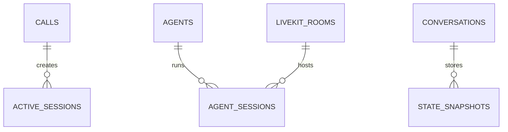

# Realtime State Schema

**Document Version:** 1.0
**Project:** AI Voice Agent SaaS Platform
**Phase:** 05 - Database Schema
**Database Platform:** Redis + PostgreSQL
**Realtime Infrastructure:** LiveKit + Agent Runtime
**Status:** Draft
**Last Updated:** 2026-07-23

---

# 1. Overview

This document defines the real-time state management schema for the AI Voice Agent platform.

The realtime state layer manages short-lived, high-speed operational data.

It supports:

* Active voice calls
* LiveKit rooms
* Agent sessions
* Conversation state
* Workflow state
* Presence tracking
* Real-time metrics
* Temporary memory

---

# 2. Realtime Architecture

```text
Incoming Call

      |

      v

Twilio SIP

      |

      v

LiveKit Room

      |

      v

AI Agent Runtime

      |

 ----------------------

 |          |           |

Redis   PostgreSQL   Events

State   History      Analytics

```

---

# 3. Storage Responsibility

| Storage        | Purpose                   |
| -------------- | ------------------------- |
| Redis          | Temporary realtime state  |
| PostgreSQL     | Permanent records         |
| LiveKit        | Audio/video session state |
| Object Storage | Recordings                |

---

# 4. Realtime Domain Entities

```text
Realtime System

├── active_sessions

├── agent_sessions

├── livekit_rooms

├── realtime_conversations

├── presence

├── state_snapshots

└── realtime_metrics
```

---

# 5. Entity Relationship



---

# 6. Redis Key Design

Recommended Redis naming:

```text
tenant:{tenant_id}:call:{call_id}

tenant:{tenant_id}:agent:{agent_id}

conversation:{conversation_id}:state

workflow:{run_id}:checkpoint

presence:{user_id}
```

---

# 7. Active Call State

Stores currently running calls.

Example:

```json
{
 "call_id":"123",

 "status":"connected",

 "agent":"booking_agent",

 "duration":120
}
```

---

Redis Key:

```text
active_call:{call_id}
```

---

# 8. Active Sessions Table

Permanent tracking of realtime sessions.

```sql
CREATE TABLE active_sessions (

    id UUID PRIMARY KEY DEFAULT gen_random_uuid(),

    tenant_id UUID NOT NULL,

    call_id UUID,

    session_type TEXT,

    status TEXT,

    started_at TIMESTAMP,

    ended_at TIMESTAMP

);
```

---

# 9. Session Types

```text
voice_call

chat

agent_execution

workflow

human_transfer
```

---

# 10. Session Lifecycle

```text
CREATED

↓

CONNECTING

↓

ACTIVE

↓

PAUSED

↓

COMPLETED

↓

FAILED
```

---

# 11. LiveKit Room Tracking

LiveKit manages realtime media sessions.

Database stores metadata only.

---

Table:

```text
livekit_rooms
```

---

Schema:

```sql
CREATE TABLE livekit_rooms (

    id UUID PRIMARY KEY DEFAULT gen_random_uuid(),

    tenant_id UUID NOT NULL,

    room_name TEXT UNIQUE,

    livekit_room_sid TEXT,

    status TEXT,

    created_at TIMESTAMP DEFAULT now()

);
```

---

# 12. LiveKit Room Lifecycle

```text
CREATED

↓

JOINED

↓

ACTIVE

↓

ENDED

↓

ARCHIVED
```

---

# 13. Agent Session State

Tracks AI agent execution.

Example:

```json
{
 "agent":"sales_agent",

 "current_task":"qualification",

 "state":"waiting_customer"
}
```

---

Table:

```text
agent_sessions
```

---

Schema:

```sql
CREATE TABLE agent_sessions (

    id UUID PRIMARY KEY DEFAULT gen_random_uuid(),

    agent_id UUID,

    room_id UUID,

    state JSONB,

    created_at TIMESTAMP DEFAULT now()

);
```

---

# 14. Conversation Realtime State

Temporary conversation context.

Example:

```json
{
 "intent":"booking",

 "customer_name":"John",

 "last_question":"price"
}
```

---

Redis:

```text
conversation:{id}:state
```

---

# 15. Workflow Runtime State

Used by LangGraph.

Example:

```json
{
 "node":"collect_information",

 "variables":{

 }
}
```

---

Redis:

```text
workflow:{run_id}:state
```

---

# 16. State Snapshots

Backup realtime state.

Used for:

* Recovery
* Debugging
* Replay

---

Table:

```text
state_snapshots
```

---

Schema:

```sql
CREATE TABLE state_snapshots (

    id UUID PRIMARY KEY DEFAULT gen_random_uuid(),

    session_id UUID,

    state JSONB,

    created_at TIMESTAMP DEFAULT now()

);
```

---

# 17. Presence Management

Tracks online users and agents.

Examples:

```text
Agent Operator

ONLINE


Supervisor

AWAY
```

---

Redis:

```text
presence:{user_id}
```

---

# 18. Presence States

```text
online

busy

away

offline
```

---

# 19. Realtime Metrics

Stores live counters.

Examples:

```text
Active Calls

Agents Available

Queue Length

Average Wait Time
```

---

Table:

```text
realtime_metrics
```

---

Schema:

```sql
CREATE TABLE realtime_metrics (

    id UUID PRIMARY KEY DEFAULT gen_random_uuid(),

    tenant_id UUID,

    metric_name TEXT,

    value NUMERIC,

    recorded_at TIMESTAMP DEFAULT now()

);
```

---

# 20. Realtime Event Flow

```text
Call Arrives

↓

Create LiveKit Room

↓

Create Agent Session

↓

Initialize Redis State

↓

Run LangGraph Workflow

↓

Update State

↓

Persist Final Result
```

---

# 21. Recovery Strategy

If agent crashes:

```text
Redis State

+

PostgreSQL Snapshot

+

LangGraph Checkpoint

=

Resume Session
```

---

# 22. Expiration Strategy

Redis TTL examples:

```text
Call State

24 Hours


Presence

5 Minutes


Temporary Context

1 Hour
```

---

# 23. Security Requirements

Required:

* Tenant isolation
* Encrypted sensitive state
* Access control
* Session validation
* Audit events

---

# 24. Performance Strategy

Optimize:

* Redis memory usage
* Key expiration
* State size
* Serialization format
* Connection pooling

---

# 25. Future Extensions

Support:

* Distributed agent workers
* Global presence system
* Multi-region realtime state
* Event sourcing
* Session replay

---

# 26. Related Documents

| Document                         | Purpose            |
| -------------------------------- | ------------------ |
| 07_Voice_Call_Schema.md          | Call records       |
| 13_Workflow_State_Schema.md      | Workflow execution |
| 22_Search_Vector_Index_Schema.md | RAG retrieval      |
| 31_Agent_Runtime_Architecture.md | Agent execution    |

---

# 27. Conclusion

The Realtime State Schema provides the high-performance runtime layer required for production AI voice agents.

It enables:

* LiveKit session management
* Redis state handling
* Real-time agent execution
* Conversation continuity
* Fault recovery

---

**End of Document**
