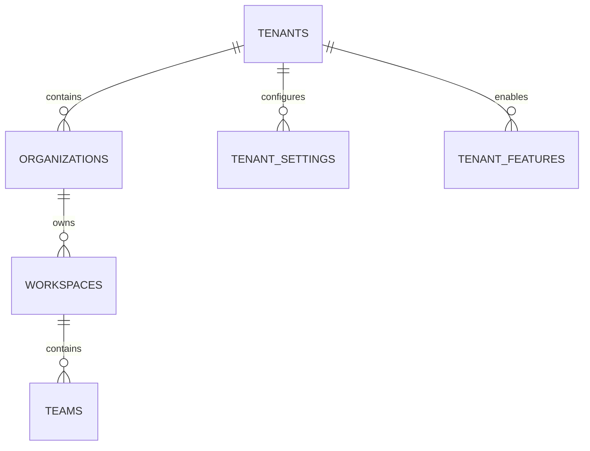

# Tenant & Organization Schema

**Document Version:** 1.0
**Project:** AI Voice Agent SaaS Platform
**Phase:** 05 - Database Schema
**Database Platform:** Supabase PostgreSQL
**Architecture:** Multi-Tenant SaaS Model
**Security Model:** Tenant Isolation + RLS
**Status:** Draft
**Last Updated:** 2026-07-23

---

# 1. Overview

This document defines the multi-tenant organization database schema.

The tenant system provides the foundation for SaaS isolation.

It manages:

* Customer organizations
* Workspaces
* Teams
* Tenant configuration
* Subscription ownership
* Resource isolation
* Enterprise hierarchy

---

# 2. Multi-Tenant Architecture

```text
AI Voice Agent Platform

             |

             v

       Tenant Layer

             |

 --------------------------------

 |              |               |

Company A    Company B       Company C

 |              |               |

Agents        Agents          Agents

Calls         Calls           Calls

Data          Data            Data
```

---

# 3. Tenant Model

The platform uses:

```text
Shared Database

+

Shared Schema

+

Tenant ID Isolation
```

Example:

```sql
tenant_id UUID
```

Every business table contains:

```sql
tenant_id NOT NULL
```

---

# 4. Tenant Domain Entities

```text
Tenant System

├── tenants

├── organizations

├── workspaces

├── teams

├── tenant_settings

├── tenant_domains

└── tenant_features
```

---

# 5. Entity Relationship



---

# 6. Tenants Table

## Purpose

Represents the SaaS customer account.

Examples:

* HVAC Company
* Medical Clinic
* Real Estate Agency
* Call Center

---

Schema:

```sql
CREATE TABLE tenants (

    id UUID PRIMARY KEY DEFAULT gen_random_uuid(),

    name TEXT NOT NULL,

    slug TEXT UNIQUE,

    status TEXT DEFAULT 'active',

    plan_id UUID,

    created_at TIMESTAMP DEFAULT now(),

    updated_at TIMESTAMP DEFAULT now()

);
```

---

# 7. Tenant Lifecycle

```text
TRIAL

↓

ACTIVE

↓

SUSPENDED

↓

CANCELLED

↓

ARCHIVED
```

---

# 8. Tenant Status

```text
trial

active

suspended

cancelled

archived
```

---

# 9. Organization Model

Large customers may have multiple organizations.

Example:

```text
Enterprise Customer

        |

 ------------------

 |                |

US Division    Canada Division
```

---

Table:

```text
organizations
```

---

Schema:

```sql
organizations

id UUID PRIMARY KEY

tenant_id UUID

name TEXT

description TEXT

created_at TIMESTAMP
```

---

# 10. Workspace Model

A workspace separates operational environments.

Examples:

```text
Company

 |

Workspaces

 |

Sales

Support

Medical
```

---

Table:

```text
workspaces
```

---

Schema:

```sql
CREATE TABLE workspaces (

    id UUID PRIMARY KEY DEFAULT gen_random_uuid(),

    organization_id UUID,

    name TEXT,

    created_at TIMESTAMP DEFAULT now()

);
```

---

# 11. Teams

Teams group users and agents.

Examples:

```text
Sales Team

Support Team

Booking Team
```

---

Table:

```text
teams
```

---

Schema:

```sql
teams

id UUID PRIMARY KEY

workspace_id UUID

name TEXT

description TEXT

created_at TIMESTAMP
```

---

# 12. Tenant Settings

Stores customer-specific configuration.

Examples:

* Default language
* Timezone
* Branding
* AI preferences

---

Table:

```text
tenant_settings
```

---

Schema:

```sql
CREATE TABLE tenant_settings (

    id UUID PRIMARY KEY DEFAULT gen_random_uuid(),

    tenant_id UUID,

    settings JSONB,

    created_at TIMESTAMP DEFAULT now()

);
```

---

# 13. Tenant Settings Example

```json
{
 "timezone":"America/New_York",

 "language":"English",

 "branding":{
   "logo":"company.png"
 }
}
```

---

# 14. Tenant Domains

Supports custom domains.

Example:

```text
app.customer.com
```

---

Table:

```text
tenant_domains
```

---

Schema:

```sql
tenant_domains

id UUID PRIMARY KEY

tenant_id UUID

domain TEXT

verified BOOLEAN

created_at TIMESTAMP
```

---

# 15. Tenant Feature Flags

Controls enabled features.

Examples:

```text
Voice Agent

RAG Knowledge

Analytics

Advanced Workflows
```

---

Table:

```text
tenant_features
```

---

Schema:

```sql
tenant_features

id UUID PRIMARY KEY

tenant_id UUID

feature_name TEXT

enabled BOOLEAN
```

---

# 16. Resource Ownership Model

All resources follow:

```text
Tenant

 |

Workspace

 |

Resource
```

Example:

```text
Tenant

 |

Workspace

 |

Voice Agent

 |

Conversation

 |

Call
```

---

# 17. Tenant Isolation Strategy

Every query must include:

```sql
WHERE tenant_id = current_tenant
```

---

Example:

```sql
SELECT *

FROM agents

WHERE tenant_id = 'tenant-id';
```

---

# 18. Supabase Row Level Security

Example:

```sql
CREATE POLICY tenant_access

ON agents

USING (

tenant_id = auth.jwt()->>'tenant_id'

);
```

---

# 19. Tenant Context Flow

```text
User Login

↓

JWT Created

↓

Tenant ID Added

↓

API Request

↓

Database Policy Check

↓

Tenant Data Returned
```

---

# 20. Enterprise Hierarchy

Supports:

```text
Enterprise

 |

Organization

 |

Workspace

 |

Team

 |

Users

 |

Agents
```

---

# 21. Tenant Limits

Controls resource usage.

Examples:

```text
Maximum Agents

Maximum Users

Monthly Minutes

Storage Limit
```

---

# 22. Index Strategy

Recommended:

```sql
CREATE INDEX idx_tenant_slug

ON tenants(slug);


CREATE INDEX idx_workspace_org

ON workspaces(organization_id);
```

---

# 23. Security Requirements

Required:

* Tenant isolation
* RLS policies
* Role permissions
* Audit logging
* Data encryption
* Resource ownership validation

---

# 24. Future Extensions

Support:

* White-label SaaS
* Multiple regions
* Enterprise hierarchy
* Dedicated databases
* Tenant migration tools

---

# 25. Related Documents

| Document                         | Purpose                |
| -------------------------------- | ---------------------- |
| 15_Authentication_User_Schema.md | User management        |
| 16_Billing_Usage_Schema.md       | Subscription ownership |
| 17_Audit_Log_Schema.md           | Security tracking      |
| 14_Customer_CRM_Schema.md        | Customer data          |

---

# 26. Conclusion

The Tenant & Organization Schema provides the foundation for a scalable enterprise SaaS architecture.

It enables:

* Multi-tenant isolation
* Enterprise accounts
* Workspace management
* Feature control
* Secure resource ownership

---

**End of Document**
